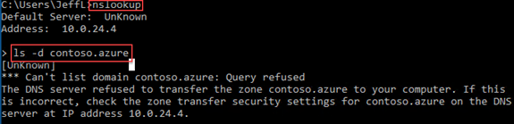
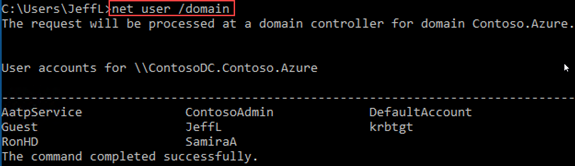
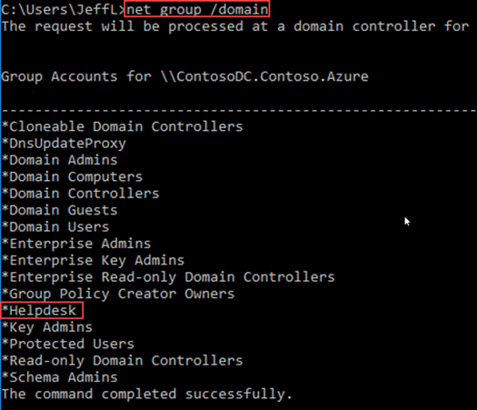
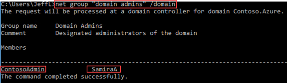
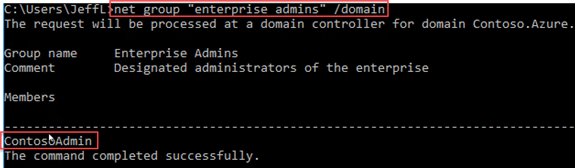
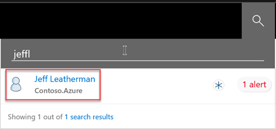
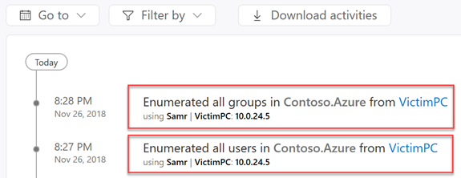
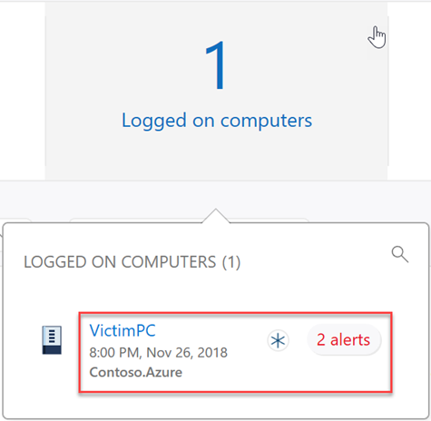
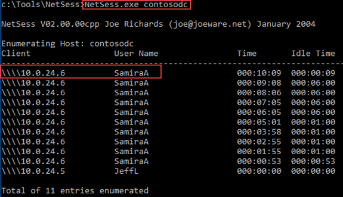

# Reconnaissance playbook

The second lab in this four part series for [!INCLUDE [Product long](includes/product-long.md)] security alerts is a reconnaissance playbook. The purpose of the [!INCLUDE [Product short](includes/product-short.md)] security alert lab is to illustrate **[!INCLUDE [Product short](includes/product-short.md)]**'s capabilities in identifying and detecting suspicious activities and potential attacks against your network. The playbook explains how to test against some of [!INCLUDE [Product short](includes/product-short.md)]'s *discrete* detections, and focuses on [!INCLUDE [Product short](includes/product-short.md)]'s *signature*-based capabilities. This playbook doesn't include alerts or detections based on advanced machine-learning, or user/entity based behavioral detections, as they require a learning period with real network traffic for up to 30 days. For more information about each lab in this series, see the [[!INCLUDE [Product short](includes/product-short.md)] security alert lab overview](playbook-lab-overview.md).

This playbook illustrates the threat detections and security alerts services of [!INCLUDE [Product short](includes/product-short.md)] for simulated attacks from common, real-world, publicly available hacking and attack tools.

In this lab you will:

> [!div class="checklist"]
>
> - Simulate network mapping reconnaissance
> - Simulate Directory Service reconnaissance
> - Simulate user and IP address (SMB) reconnaissance
> - Review the security alerts from the simulated reconnaissance in [!INCLUDE [Product short](includes/product-short.md)]

## Prerequisites

[A completed [!INCLUDE [Product short](includes/product-short.md)] security alert lab](playbook-setup-lab.md)

- We recommend following the lab setup instructions as closely as possible. The closer your lab is to the suggested lab setup, the easier it will be to follow the [!INCLUDE [Product short](includes/product-short.md)] testing procedures.

> [!WARNING]
> The third-party hacking tools in this lab are presented for research purposes only. Microsoft does **not** own these tools and Microsoft cannot and does not guarantee or warranty their behavior. They are subject to change without notice. These tools should be run in a test lab environment **only**.

## Simulate a Reconnaissance attack

Once an attacker gains presence in your environment, their reconnaissance campaign begins. At this phase, the attacker will typically spend time researching. They try to discover computers of interest, enumerate users and groups, gather important IPs, and map your organization's assets and weaknesses. Reconnaissance activities allow attackers to gain a thorough understanding and complete mapping of your environment for later use.

Reconnaissance attack testing methods:

- Network-mapping reconnaissance
- Directory Service reconnaissance
- User and IP Address (SMB) reconnaissance

## Network-mapping reconnaissance (DNS)

One of the first things an attacker will attempt is to try to get a copy of all DNS information. When successful, the attacker gains extensive information about your environment that potentially includes similar information about your other environments or networks.

[!INCLUDE [Product short](includes/product-short.md)] suppresses network-mapping reconnaissance activity from your **suspicious activity timeline** until an eight day learning period is completed. In the learning period, [!INCLUDE [Product short](includes/product-short.md)] learns what is normal and abnormal for your network. After the eight-day learning period, abnormal network-mapping reconnaissance events invoke the related security alert.

### Run nslookup from VictimPC

To test DNS reconnaissance, we'll use the native command-line tool, *nslookup*, to initiate a DNS zone transfer. DNS servers with correct configuration will refuse queries of this type and won't allow the zone transfer attempt.

Sign into **VictimPC**, using the compromised JeffL credentials. Run the following command:

```cmd
nslookup
```

Type **server** then the FQDN or IP address of the DC where the [!INCLUDE [Product short](includes/product-short.md)] sensor is installed.

```nslookup
server contosodc.contoso.azure
```

Let's try to transfer the domain.

```nslookup
ls -d contoso.azure
```

Replace contosodc.contoso.azure and contoso.azure with the FQDN of your [!INCLUDE [Product short](includes/product-short.md)] sensor and domain name respectively.

 

If **ContsoDC** is your first deployed sensor, wait 15 minutes to allow the database backend to finish deploying the necessary micro services.

### Network-mapping reconnaissance (DNS) Detected in Defender for Identity

Getting visibility of this type of attempt (failed or successful) is vital for domain threat protection. After recently installing the environment, you'll  need to go to the **Logical Activities** timeline to see the detected activity.

In the [!INCLUDE [Product short](includes/product-short.md)] Search, type **VictimPC**, then select it to view the timeline.

], high-level view](media/playbook-recon-nslookupdetection1.png)

Look for the "AXFR query" activity. [!INCLUDE [Product short](includes/product-short.md)] detects this type of reconnaissance against your DNS.

If you have a large number of activities, select **Filter by** and deselect all types except **DNS query**.

]](media/playbook-recon-nslookupdetection2.png)

If your security analyst determined this activity originated from a security scanner, the specific device can be excluded from further detection alerts. In the top-right area of the alert, select the three dots. Then, select **Close and exclude MySecurityScanner**. Ensuring this alert doesn't show up again when detected from "MySecurityScanner".

Detecting failures can be as insightful as detecting successful attacks against an environment. The [!INCLUDE [Product short](includes/product-short.md)] portal allows us to see the exact result of the actions done by a possible attacker. In our simulated DNS reconnaissance attack story, we, acting as attackers, were stopped from dumping the DNS records of the domain. Your SecOps team became aware of our attack attempt and which machine we used in our attempt from the [!INCLUDE [Product short](includes/product-short.md)] security alert.

## Directory Service Reconnaissance

Acting as an attacker, the next reconnaissance goal is an attempt to enumerate all users and groups in the Forest. [!INCLUDE [Product short](includes/product-short.md)] suppresses Directory Service enumeration activity from your Suspicious Activity timeline until a 30 day learning period is completed. In the learning period, [!INCLUDE [Product short](includes/product-short.md)] learns what is normal and abnormal for your network. After the 30 day learning period, abnormal Directory Service enumeration events invoke a security alert. During the 30 day learning period, you can see [!INCLUDE [Product short](includes/product-short.md)] detections of these activities using the activity timeline of an entity in your network. The [!INCLUDE [Product short](includes/product-short.md)] detections of these activities are shown in this lab.

To demonstrate a common Directory Service reconnaissance method, we'll use the native Microsoft binary, *net*. After our attempt, examining the Activity timeline of **JeffL**, our compromised user, will show [!INCLUDE [Product short](includes/product-short.md)] detecting this activity.

### Directory Service Enumeration via *net* from VictimPC

Any authenticated user or computer can potentially enumerate other users and groups in a domain. This enumeration ability is required for most applications to function properly. Our compromised user, **JeffL**, is an unprivileged domain account. In this simulated attack, we'll see exactly how even an unprivileged domain account can still provide valuable data points to an attacker.

1. From **VictimPC**, execute the following command:

    ```cmd
    net user /domain
    ```

    The output shows all users in the Contoso.Azure domain.

    

1. Let's try to enumerate all groups in the domain. Execute the following command:

    ```cmd
    net group /domain
    ```

    The output shows all groups in the Contoso.Azure domain. Notice the one Security Group that isn't a default group: **Helpdesk**.

    

1. Now, let's try to enumerate only the Domain Admins group. Execute the following command:

    ```cmd
    net group "Domain Admins" /domain
    ```

    

    Acting as an attacker, we've learned there are two members of the Domain Admins group: **SamiraA** and **ContosoAdmin** (built-in Administrator for the Domain Controller). Knowing no security boundary exists between our Domain and Forest, our next leap is to try to enumerate the Enterprise Admins.

1. To attempt to enumerate the Enterprise Admins, execute the following command:

    ```cmd
    net group "Enterprise Admins" /domain
    ```

    We learned that there's only one Enterprise Admin, ContosoAdmin. This information wasn't important since we already knew there isn't a security boundary between our Domain and the Forest.

    

With the information gathered in our reconnaissance, we now know about the Helpdesk Security Group. Although that information isn't interesting *yet*. We also know that **SamiraA** is a member of the Domain Admins group. If we can harvest SamiraA's credential, we can gain access the Domain Controller itself.

### Directory Service Enumeration Detected in Defender for Identity

If our lab had *real live activity for 30 days with [!INCLUDE [Product short](includes/product-short.md)] installed*, the activity we just did as **JeffL** would potentially be classified as abnormal. Abnormal activity would show up in the Suspicious Activity timeline. However, since we just installed the environment, we'll need to go to the Logical Activities timeline.

In the [!INCLUDE [Product short](includes/product-short.md)] Search, let's see what **JeffL**'s Logical Activity timeline looks like:



We can see when JeffL signed onto the VictimPC, using the Kerberos protocol. Additionally, we see that **JeffL**, from VictimPC, enumerated all the users in the domain.



Many activities are logged in the Logical Activity timeline making it a major capability to performing Digital Forensics and Incident Response (DFIR). You can even see activities when the initial detection wasn't from [!INCLUDE [Product short](includes/product-short.md)] but from Microsoft Defender for Endpoint, Microsoft 365, and others.

Taking a look at **ContosoDC's page**, we can also see the computers **JeffL** logged into.



We can also get Directory Data, including **JeffL**'s Memberships and Access Controls, all from within [!INCLUDE [Product short](includes/product-short.md)].

]](media/playbook-recon-dsenumeration-jeffvdirectorydata.png)

Now, our attention will be shift towards SMB Session Enumeration.

## User and IP Address reconnaissance (SMB)

Active Directory's **sysvol** folder is one of the, if not *the*, most important network share in the environment. Every computer and user must be able to access this particular network share to pull down Group Policies. An attacker can get a goldmine of information from enumerating who has active sessions with the sysvol folder.

Our next step is SMB Session Enumeration against the ContosoDC resource. We want to learn who else has sessions with the SMB share, and *from what IP*.

### Use JoeWare's NetSess.exe from VictimPC

Run JoeWare's **NetSess** tool against ContosoDC in context of an authenticated user, in this case, ContosoDC:

```cmd
NetSess.exe ContosoDC
```



We already know that SamiraA is a Domain Admin. This attack gave us SamiraA's IP address as 10.0.24.6. As an attacker, we learned exactly who we need to compromise. We also got the network location where that credential is logged in.

### User and IP Address reconnaissance (SMB) Detected in Defender for Identity

Now we can see what [!INCLUDE [Product short](includes/product-short.md)] detected for us:

] Detecting SMB reconnaissance](media/playbook-recon-smbrecon-detection1.png)

Not only are we alerted on this activity, we're also alerted on the exposed accounts and their respective IP addresses *at that point in time*. As the Security Operations Center (SOC), we don't just have the attempt and its status, but also what was sent back to the attacker. This information aids our investigation.

## Next steps

The next phase in the attack kill chain is typically an attempt at lateral movement.

> [!div class="nextstepaction"]
> [[!INCLUDE [Product short](includes/product-short.md)] Lateral Movement playbook](playbook-lateral-movement.md)

## Join the Community

Have more questions, or an interest in discussing [!INCLUDE [Product short](includes/product-short.md)] and related security with others? Join the [[Defender for Identity Community](https://aka.ms/MDIcommunity) today!
