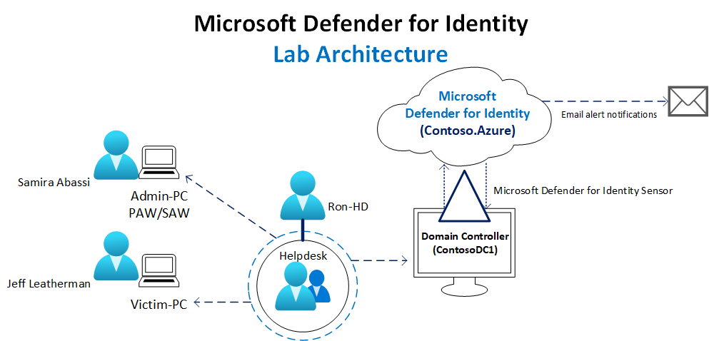
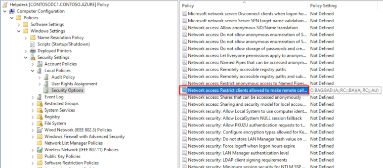
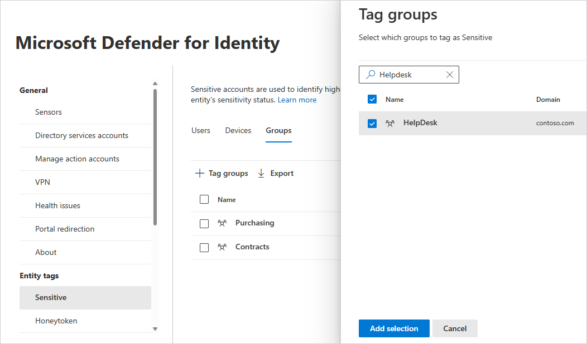
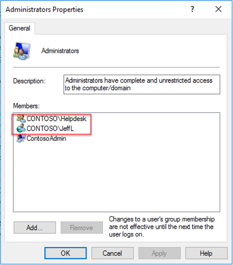
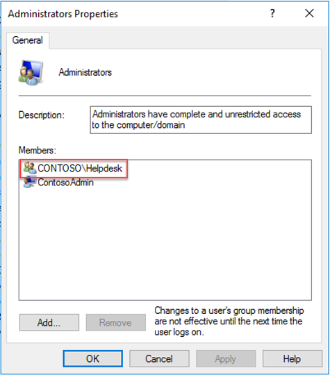

# Setup a Microsoft Defender for Identity security alert lab

The purpose of the Microsoft Defender for Identity Security Alert lab is to illustrate **Defender for Identity**'s capabilities in identifying and detecting suspicious activities and potential attacks against your network. This first lab in a four part series walks you through creating a lab environment for testing against Defender for Identity's *discrete* detections. The security alert lab focuses on Defender for Identity's *signature-based* capabilities. The lab doesn't include advanced machine-learning, user or entity-based behavioral detections since those detections require a learning period with real network traffic of up to 30 days. For more information about each lab in this series, see the [Defender for Identity security alert lab overview](playbook-lab-overview.md).

In this lab you will:

> [!div class="checklist"]
>
> - Set up your lab server and computers
> - Configure Active Directory with users and groups
> - Set up and configure Defender for Identity
> - Setup local policies for your server and computers
> - Mimic a helpdesk management scenario using a scheduled task

## Prerequisites

1. [A lab domain controller and two lab workstations](#servers-and-computers).
    - Go ahead and [hydrate Active Directory (AD) with users](#hydrate-active-directory-users-on-contosodc).

1. An [Defender for Identity instance](/defender-for-identity/deploy-defender-identity) that is [connected to AD](/defender-for-identity/directory-service-accounts).
1. [Download](/defender-for-identity/download-sensor) and [install the latest version of the Defender for Identity sensor](/defender-for-identity/install-sensor) on your lab's domain controller.
1. Familiarity with [Privileged Access Workstations](/security/compass/privileged-access-devices) and [SAMR policy](/windows/security/threat-protection/security-policy-settings/network-access-restrict-clients-allowed-to-make-remote-sam-calls).

## Recommendations

We recommend following the lab setup instructions as closely as possible. The closer your lab is to the suggested lab setup, the easier it will be to follow the Defender for Identity testing procedures. After the lab setup is complete, you'll be ready to perform actions with the suggested hacking research tools and review Defender for Identity's detections of these actions.

Your complete lab setup should look as similar as possible to the following diagram:



### Servers and computers

This table details the computers, and the configurations needed. IP addresses are provided for reference purposes only so you can easily follow along.

In the examples for these labs, the Forest NetBIOS name is **CONTOSO.AZURE**.

| FQDN | OS | IP | Purpose |
|------|-------|---------|--------------|
| ContosoDC.contoso.azure | Windows Server 2012 R2 | 10.0.24.4 | Domain Controller with the Defender for Identity Sensor installed locally |
| VictimPC.contoso.azure | Windows 10 | 10.0.24.5 |Victim's PC |
| AdminPC.contoso.azure | Windows 10  | 10.0.24.6 | Domain Admin's PC (sometimes referred to as "Secure Admin Workstation" or "Privileged Admin Workstation") |

### Active Directory users and groups

In this lab, there are three main users and one service account. The service account is for Defender for Identity and is used for both LDAP synchronization purposes and SAMR.

There's a "Helpdesk" Security Group (SG) of which Ron HelpDesk is a member. This SG mimics the Helpdesk. The SG is paired with a Group Policy Object that gives our Helpdesk members Local Admin rights on the respective computers. This setup is used to simulate a realistic administrative model in a production environment.

| Full | Full Name | SAMAccount | Purpose |
|--|--|--|
| Jeff Leatherman | JeffL | Soon to be a victim of an impressively effective phishing attack |
| Ron HelpDesk | RonHD | Ron is the "go-to-person" in Contoso's IT team. RonHD is a member of the "Helpdesk" security group. |
| Samira Abbasi | SamiraA | At Contoso, this user is our Domain Admin. |
| Defender for Identity Service | AATPService | Defender for Identity's service account | account |

## Defender for Identity base lab environment

To configure the base lab we'll add users and groups to Active Directory, edit a SAM policy, and a sensitive group in Defender for Identity.

### Hydrate Active Directory users on ContosoDC

To simplify the lab, we automated the process to create fictitious users and groups in Active Directory. This script is run as a prerequisite for this lab. You can use or modify the script to hydrate your lab's Active Directory environment. If you prefer not to use a script, you can do it manually.

As a Domain Admin, on ContosoDC, run the following to hydrate our Active Directory Users:

```powershell
# Store the user passwords as variables
$SamiraASecurePass = ConvertTo-SecureString -String 'NinjaCat123' -AsPlainText -Force
$ronHdSecurePass = ConvertTo-SecureString -String 'FightingTiger$' -AsPlainText -Force
$jefflSecurePass = ConvertTo-SecureString -String 'Password$fun' -AsPlainText -Force
$AATPService = ConvertTo-SecureString -String 'Password123!@#' -AsPlainText -Force

# Create new AD user SamiraA and add her to the domain admins group
New-ADUser -Name SamiraA -DisplayName "Samira Abbasi" -PasswordNeverExpires $true -AccountPassword $samiraASecurePass -Enabled $true
Add-ADGroupMember -Identity "Domain Admins" -Members SamiraA

# Create new AD user RonHD, create new Helpdesk SG, add RonHD to the Helpdesk SG
New-ADUser -Name RonHD -DisplayName "Ron Helpdesk" -PasswordNeverExpires $true -AccountPassword $ronHdSecurePass -Enabled $true
New-ADGroup -Name Helpdesk -GroupScope Global -GroupCategory Security
Add-ADGroupMember -Identity "Helpdesk" -Members "RonHD"

# Create new AD user JeffL
New-ADUser -Name JeffL -DisplayName "Jeff Leatherman" -PasswordNeverExpires $true -AccountPassword $jefflSecurePass -Enabled $true

# Take note of the "AATPService" user below which will be our service account for Defender for Identity.
# Create new AD user Defender for Identity Service

New-ADUser -Name AatpService -DisplayName "Azure ATP/ATA Service" -PasswordNeverExpires $true -AccountPassword $AATPService -Enabled $true
```

### Configure SAM-R capabilities from ContosoDC

To allow the Defender for Identity Service to perform SAM-R enumeration correctly and build Lateral Movement paths, you'll need to edit the SAM policy. A modification to Group Policy must be made to add the Defender for Identity service account in addition to the configured accounts listed in the **Network access** policy. Make sure to apply group policies to all computers **except domain controllers**.

1. Find your SAM policy under: **Policies \> Windows Settings \> Security Settings \> Local Policies \> Security Options\> "Network access: Restrict clients allowed to make remote calls to SAM"**_

    

1. Add the Defender for Identity service account, AATPService, to the list of approved accounts able to perform this action on your modern Windows systems.

    

### Add sensitive group to Defender for Identity

Adding the "Helpdesk" Security Group as a **Sensitive group** will enable you to use the Lateral Movement Graph feature of Defender for Identity. Tagging highly sensitive users and groups who aren't necessarily Domain Admins but do have privileges across many resources is a best practice.

1. In [Microsoft 365 Defender](https://security.microsoft.com/), go to **Settings** and then **Identities**.

    

1. Under **Entity tags**, select **Sensitive**.

    

1. Under **Groups**, select **Tag groups**. A pane will open with the groups you can select to tag. In this example, select the **Helpdesk** group.

    

1. After choosing your group, select **Add selection**.

### Defender for Identity Lab base setup checklist

At this point, you should have a base Defender for Identity lab. Defender for Identity should be ready to use and users are staged. Review the checklist to make sure that the base lab is complete.

| Step  | Action | Status |
|--|--|--|
| 1 | Defender for Identity Sensor installed on ContosoDC (prerequisite step) | ☐ |
| 2 | Users and groups are created in Active Directory | ☐ |
| 3 | Defender for Identity service account privileges configured correctly for SAMR | ☐ |
| 4 | Helpdesk security group added as a **Sensitive group** in Defender for Identity | ☐ |

## Set up the lab workstations

Once you verify your base Defender for Identity lab is set up, you can start the workstation configuration to prepare for the next three labs in this series. We'll hydrate our VictimPC and AdminPC to make this lab look active.

### VictimPC local policies

The next step for your lab is to complete the local policy setup. **VictimPC** has both JeffL and the Helpdesk Security Group as members of the local Administrators group. As in many organizations, JeffL is an Administrator on their own device, **VictimPC**.

As the local administrator, set up local policies by running the automated PowerShell script:

```powershell
# Add JeffL to local Administrators group on VictimPC
Add-LocalGroupMember -Group "Administrators" -Member "Contoso\JeffL"
# Add Helpdesk to local Administrators group on VictimPC
Add-LocalGroupMember -Group "Administrators" -Member "Contoso\Helpdesk"
```

Inspect the Administrators group on **VictimPC**, making sure it appears to have at least Helpdesk and JeffL as members:



### Simulate helpdesk support on VictimPC

To simulate a working and managed network, create a Scheduled Task on the **VictimPC** machine to run the "cmd.exe" process as **RonHD**.

1. From an **elevated PowerShell console** on VictimPC run the following code:

    ```powershell
    $action = New-ScheduledTaskAction -Execute 'cmd.exe'
    $trigger = New-ScheduledTaskTrigger -AtLogOn
    $runAs = 'Contoso\RonHD'
    $ronHHDPass = 'FightingTiger$'
    Register-ScheduledTask -TaskName "RonHD Cmd.exe - AATP SA Playbook" -Trigger $trigger -User $runAs -Password $ronHHDPass -Action $action
    ```

1. Sign in to the machine as **JeffL**. The Cmd.exe process will start in context of RonHD after sign-in, simulating Helpdesk managing the machine.

### Turn off antivirus on VictimPC

For testing purposes, turn off any antivirus solutions running in the lab environment. Doing so ensures we can focus on Defender for Identity during these exercises and not on antivirus evasion techniques.

Without turning off antivirus solutions first, you'll be unable to download some of the tools in the next section. Additionally, if antivirus is enabled after the attack tools are staged, you'll need to redownload the tools after disabling antivirus again.

### Stage common hacker tools

> [!WARNING]
> The following tools are presented for research purposes only. Microsoft does **not** own these tools and Microsoft cannot and does not guarantee or warranty their behavior. They are subject to change without notice. These tools should be run in a test lab environment **only**.

To run the Defender for Identity Security Alert playbooks, download and copy the following tools to **VictimPC**.

| Tool | URL |
|----|-----|
| Mimikatz | [GitHub - Mimikatz](https://github.com/gentilkiwi/mimikatz) |
| PowerSploit | [GitHub - PowerSploit](https://github.com/PowerShellMafia/PowerSploit) |
| PsExec | [PsExec documentation](/sysinternals/downloads/psexec) |
| NetSess | [JoeWare Tools](https://www.joeware.net/freetools) |

We thank the authors of these research tools for enabling the community to better understand cyber risks and impacts.

### AdminPC local policies

**AdminPC** needs **Helpdesk** added to the local Administrators group. Then, remove **Domain Admins** from the local Administrators group. This step makes sure that Samira, a Domain Admin, isn't an Administrator of AdminPC. This is a best practice in credential hygiene. Do this step manually or use the PowerShell script provided.

1. Add **Helpdesk** to **AdminPC** and *remove* 'Domain Admins' from the Local Admin Group by running the following PowerShell script:

    ```powershell
    # Add Helpdesk to local Administrators group
    Add-LocalGroupMember -Group "Administrators" -Member "Contoso\Helpdesk"
    # Remove Domain Admins from local Administrators group
    Remove-LocalGroupMember -Group "Administrators" -Member "Domain Admins"
    ```

1. After running the script, **Helpdesk** is located in the local **Administrators** > **Members** list of **AdminPC**.


### Simulate domain activities from AdminPC

Simulated domain activities are required from SamiraA. This step can be done manually, or use the PowerShell script provided. The PowerShell script accesses the domain controller every 5 minutes and will result in simulated network activity as Samira.

As **SamiraA**, execute the following script in a PowerShell prompt in AdminPC:

```powerShell
while ($true)
{
    Invoke-Expression "dir \\ContosoDC\c$"
    Start-Sleep -Seconds 300
}
```

### Workstation setup checklist

Review the checklist to make sure that the workstation setup is complete.

| Step | Action | Status |
|--|--|--|
| 1 | Add JeffL and Helpdesk as local administrators on VictimPC | ☐ |
| 2 | Create Scheduled Task running as RonHD on VictimPC | ☐ |
| 3 | Turn off antivirus solution on VictimPC | ☐ |
| 4 | Stage hacking tools on VictimPC | ☐ |
| 5 | Add Helpdesk and remove Domain Admins from AdminPC's local administrators group | ☐ |
| 6 | Run PowerShell script as Samira to simulate domain activities | ☐ |

## Mission accomplished

Your Defender for Identity lab is now ready to use. The methods used in this set up were chosen knowing that resources must be managed (by *something* or *someone*) and management requires local admin privileges. There are other ways to simulate a management workflow in the lab, such as:

- Logging in and out of VictimPC with RonHD's account
- Adding another version of a Scheduled Task
- An RDP session
- Executing a 'runas' in the Command Line

For best results, choose a simulation method that you can automate in your lab for consistency purposes.

## Next steps

Test your Defender for Identity lab environment using the Defender for Identity Security Alert playbooks for each phase of the cyber-attack kill chain starting with the reconnaissance phase.

> [!div class="nextstepaction"]
> [Defender for Identity Reconnaissance playbook](playbook-reconnaissance.md)

## Join the Community

Do you have more questions, or an interest in discussing Defender for Identity and related security with others? Join the [Defender for Identity Community](<https://techcommunity.microsoft.com/t5/Azure-Advanced-Threat-Protection/bd-p/AzureAdvancedThreatProtection>) today!
