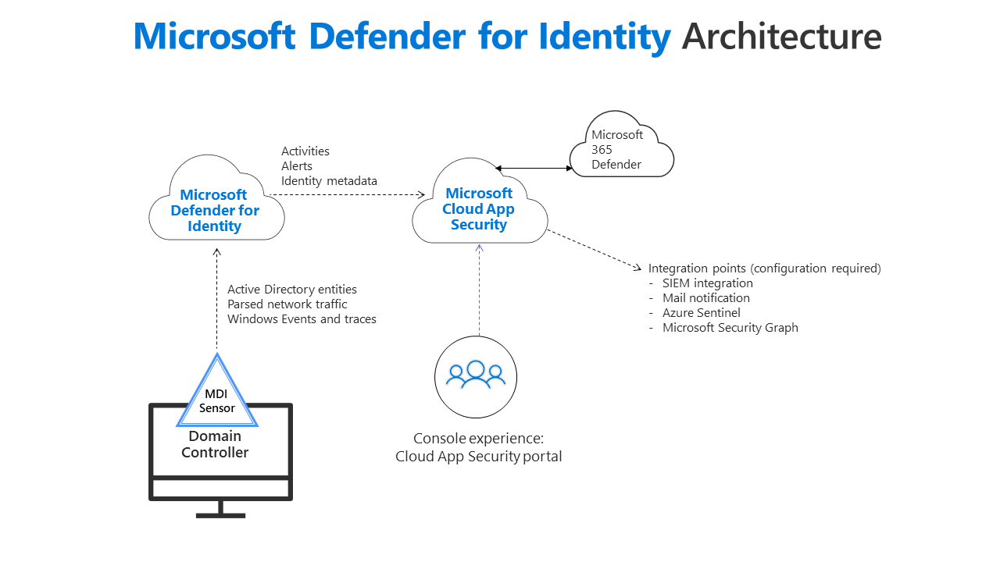

# Microsoft Defender for Identity prerequisites

This article describes the requirements for a successful deployment of Microsoft Defender for Identity in your environment.

>[!NOTE]
> For information on how to plan resources and capacity, see [Defender for Identity capacity planning](capacity-planning.md).

Defender for Identity is composed of the Defender for Identity cloud service, the Microsoft 365 Defender portal and the Defender for Identity sensor. For more information about each Defender for Identity component, see [Defender for Identity architecture](architecture.md).

Defender for Identity protects your on-premises Active Directory users and/or users synced to your Azure Active Directory (Azure AD). To protect an environment made up of only Azure AD users, see [Azure AD Identity Protection](/azure/active-directory/identity-protection/overview).

This article includes both [Defender for Identity sensor requirements](#defender-for-identity-sensor-requirements) and for [Defender for Identity standalone sensor requirements](#defender-for-identity-standalone-sensor-requirements). The Defender for Identity standalone sensor is installed on a dedicated server and requires port mirroring to be configured on the domain controller to receive network traffic.

## Before you start

This section lists information you should gather as well as accounts and network entity information you should have before starting Defender for Identity installation.

### Licensing

- Acquire a license for Enterprise Mobility + Security E5 (EMS E5/A5), Microsoft 365 E5 (M365 E5/A5/G5) or Microsoft 365 E5/A5/G5 Security directly via the [Microsoft 365 portal](https://www.microsoft.com/cloud-platform/enterprise-mobility-security-pricing) or use the Cloud Solution Partner (CSP) licensing model. Standalone Defender for Identity licenses are also available. For more information about license requirements, see [Licensing and privacy](/defender-for-identity/technical-faq#licensing-and-privacy).

### Accounts

- At least one Directory Service account with read access to all objects in the monitored domains. For instructions on how to create the Directory Service account, see [Directory Service account recommendations](directory-service-accounts.md).

### Permissions

- To create your Defender for Identity instance, you'll need an Azure AD tenant with at least one global/security administrator. Each Defender for Identity instance supports a multiple Active Directory forest boundary and Forest Functional Level (FFL) of Windows 2003 and above.

- You need to be a [global administrator or security administrator on the tenant](/azure/active-directory/users-groups-roles/directory-assign-admin-roles#available-roles) to access the Identity section on the Microsoft 365 Defender portal and be able to create the workspace.

For more information about required permissions, see [Role groups](role-groups.md).

## Microsoft 365 Defender portal requirements

Access Defender for Identity in the Microsoft 365 Defender portal using Microsoft Edge, Internet Explorer 11, or any HTML 5 compliant web browser.

## Defender for Identity firewall requirements

>[!NOTE]
>The network requirements for US Government offerings can be found at [Microsoft Defender for Identity for US Government offerings](us-govt-gcc-high.md).

- Verify that the servers you intend to install Defender for Identity sensors on are able to reach the Defender for Identity Cloud Service. They should be able to access `https://*your-instance-name*sensorapi.atp.azure.com`. For example, `https://*contoso-corp*sensorapi.atp.azure.com`. 
We recommend using a proxy server instead of allowing direct outbound connectivity to the Internet through port 443, and allowing the Defender for Identity sensors to access through that proxy only your dedicated Defender for Identity Cloud Service. For more information on proxy configuration, see [Configuring a proxy for Defender for Identity](configure-proxy.md).
 
To get your instance name, see the About page in the Identities settings section at <https://security.microsoft.com/settings/identities>.

    > [!NOTE]
    > - You can use ExpressRoute public peering and add the *Microsoft Defender for Identity* (12076:5220) service BGP community to your route filter, to route the network traffic destined to the Defender for Identity cloud services through your ExpressRoute. For more information, see [Service to BGP community value](/azure/expressroute/expressroute-routing#service-to-bgp-community-value)
    > - You can also use our Azure service tag (**AzureAdvancedThreatProtection**) to enable access to Defender for Identity. For more information about service tags, see [Virtual network service tags](/azure/virtual-network/service-tags-overview) or [download the service tags](https://www.microsoft.com/download/details.aspx?id=56519) file.

    

### Ports

The following table lists the minimum ports that the Defender for Identity sensor requires:

|Protocol|Transport|Port|From|To|
|------------|-------------|--------|-----------|---|
|**Internet ports**|||||
|SSL (\*.atp.azure.com)|TCP|443|Defender for Identity sensor|Defender for Identity cloud service|
|**Internal ports**|||||
|DNS|TCP and UDP|53|Defender for Identity sensor|DNS Servers|
|Netlogon (SMB, CIFS, SAM-R)|TCP/UDP|445|Defender for Identity sensor|All devices on network|
|RADIUS|UDP|1813|RADIUS|Defender for Identity sensor|
|**Localhost ports**\*|Required for Sensor Service updater||||
|SSL (localhost)|TCP|444|Sensor Service|Sensor Updater Service|
|**NNR ports**\*\*|||||
|NTLM over RPC|TCP|Port 135|Defender for Identity sensor|All devices on network|
|NetBIOS|UDP|137|Defender for Identity sensor|All devices on network|
|RDP|TCP|3389, only the first packet of Client hello|Defender for Identity sensor|All devices on network|

\* By default, localhost to localhost traffic is allowed unless a custom firewall policy blocks it.  
\*\* One of these ports is required, but we recommend opening all of them.

> [!NOTE]
> Defender for Identity sensors might create ICMP traffic between domain controllers as part of the LDAP connection keep-alive mechanism, but opening ICMP in the firewalls is not required.

## Defender for Identity Network Name Resolution (NNR) requirements

Network Name Resolution (NNR) is a main component of Defender for Identity functionality. To resolve IP addresses to computer names, Defender for Identity sensors look up the IP addresses using the following methods:

- NTLM over RPC (TCP Port 135)
- NetBIOS (UDP port 137)
- RDP (TCP port 3389) - only the first packet of **Client hello**
- Queries the DNS server using reverse DNS lookup of the IP address (UDP 53)

For the first three methods to work, the relevant ports must be opened inbound from the Defender for Identity sensors to devices on the network. To learn more about Defender for Identity and NNR, see [Defender for Identity NNR policy](nnr-policy.md).

For the best results, we recommend using all of the methods. If this isn't possible, you should use the DNS lookup method and at least one of the other methods.

## Defender for Identity sensor requirements

This section lists the requirements for the Defender for Identity sensor.

> [!NOTE]
> Starting June 15 2022, Microsoft no longer supports the Defender for Identity sensor on devices running Windows Server 2008 R2. We recommend that you identify any remaining Domain Controllers (DCs) or (AD FS) servers that are still running Windows Server 2008 R2 as an operating system and make plans to update them to a supported operating system.

### General

The Defender for Identity sensor supports installation on the different operating system versions, as described in the following table.

| Operating system version   | Server with Desktop Experience | Server Core | Nano Server    | Supported installations  |
| -------------------------- | ------------------------------ | ----------- | -------------- | ------------------------ |
| Windows Server 2012\*      | &#10004;                       | &#10004;    | Not applicable | Domain controller        |
| Windows Server 2012 R2\*   | &#10004;                       | &#10004;    | Not applicable | Domain controller        |
| Windows Server 2016        | &#10004;                       | &#10004;    | &#10060;       | Domain controller, AD FS |
| Windows Server 2019\**     | &#10004;                       | &#10004;    | &#10060;       | Domain controller, AD FS |
| Windows Server 2022        | &#10004;                       | &#10004;    | &#10060;       | Domain controller, AD FS |

\* Windows Server 2012 and Windows Server 2012 R2 will reach extended end of support on October 10, 2023. You should plan to upgrade those servers as Microsoft will no longer support the Defender for Identity sensor on devices running Windows Server 2012 and Windows Server 2012 R2.

\** Requires [KB4487044](https://support.microsoft.com/help/4487044/windows-10-update-kb4487044) or newer cumulative update. Sensors installed on Server 2019 without this update will be automatically stopped if the file version of the *ntdsai.dll* file in the system directory is older than *10.0.17763.316*.

The domain controller can be a read-only domain controller (RODC).

If you're installing on an AD FS farm, we recommend installing the sensor on each AD FS server, or at least on the primary node.

During installation, if .NET Framework 4.7 or later isn't installed, the .NET Framework 4.7 is installed and might require a reboot of the server. A reboot might also be required if there's a restart already pending. So when installing the sensors, consider scheduling a maintenance window for the domain controllers.

### Server specifications

The Defender for Identity sensor requires a minimum of 2 cores and 6 GB of RAM installed on the domain controller.

A minimum of 6 GB of disk space is required and 10 GB is recommended. This includes space needed for the Defender for Identity binaries, Defender for Identity logs, and performance logs.

For optimal performance, set the **Power Option** of the machine running the Defender for Identity sensor to **High Performance**.

Defender for Identity sensors can be deployed on domain controller or AD FS servers of various loads and sizes, depending on the amount of network traffic to and from the servers, and the amount of resources installed.

For Windows Server 2012, the Defender for Identity sensor isn't supported in a [Multi Processor Group](/windows/win32/procthread/processor-groups) mode. For more information about multi-processor group mode, see [troubleshooting](troubleshooting-known-issues.md#multi-processor-group-mode).

>[!NOTE]
> When running as a virtual machine, all memory is required to be allocated to the virtual machine at all times.

For more information about the Defender for Identity sensor hardware requirements, see [Defender for Identity capacity planning](capacity-planning.md).

### Time synchronization

The servers and domain controllers onto which the sensor is installed must have time synchronized to within five minutes of each other.

### Network adapters

The Defender for Identity sensor monitors the local traffic on all of the domain controller's network adapters.  
After deployment, use the Microsoft 365 Defender portal to modify which network adapters are monitored.

When you install the Defender for Identity sensor on a machine configured with a NIC teaming adapter and the Winpcap driver, you'll receive an installation error. If you want to install the Defender for Identity sensor on a machine configured with NIC teaming, make sure you replace the Winpcap driver with Npcap by following the [instructions here](/defender-for-identity/technical-faq#how-do-i-download-and-install-or-upgrade-the-npcap-driver).

### Windows Event logs

Defender for Identity detection relies on specific [Windows Event logs](configure-windows-event-collection.md#configure-event-collection) that the sensor parses from your domain controllers. For the correct events to be audited and included in the Windows Event log, your domain controllers require accurate Advanced Audit Policy settings. For more information about setting the correct policies, see, [Advanced audit policy check](configure-windows-event-collection.md). To [make sure Windows Event 8004 is audited](configure-windows-event-collection.md#configure-audit-policies) as needed by the service, review your [NTLM audit settings](/archive/blogs/askds/ntlm-blocking-and-you-application-analysis-and-auditing-methodologies-in-windows-7).

For sensors running on AD FS servers, configure the auditing level to **Verbose**. For information on how to configure the auditing level, see [Event auditing information for AD FS](/windows-server/identity/ad-fs/troubleshooting/ad-fs-tshoot-logging#event-auditing-information-for-ad-fs-on-windows-server-2016).

> [!NOTE]
> Using the Directory service user account, the sensor queries endpoints in your organization for local admins using SAM-R (network logon) in order to build the [lateral movement path graph](/defender-for-identity/understand-lateral-movement-paths). For more information, see [Configure SAM-R required permissions](/defender-for-identity/remote-calls-sam).

## Defender for Identity standalone sensor requirements

This section lists the requirements for the Defender for Identity standalone sensor.

> [!NOTE]
> Defender for Identity standalone sensors do not support the collection of Event Tracing for Windows (ETW) log entries that provide the data for multiple detections. For full coverage of your environment, we recommend deploying the Defender for Identity sensor on all your domain controllers.

When deploying the standalone sensor, it's necessary to forward [Windows events](configure-windows-event-collection.md#configure-event-collection) to Defender for Identity to further enhance Defender for Identity authentication-based detections, additions to sensitive groups, and suspicious service creation detections.  The Defender for Identity sensor receives these events automatically. In the Defender for Identity standalone sensor, these events can be received from your SIEM or by setting Windows Event Forwarding from your domain controller. Events collected provide Defender for Identity with additional information that isn't available via the domain controller network traffic.

### General standalone sensor requirements

The Defender for Identity standalone sensor supports installation on a server running Windows Server 2012 R2, Windows Server 2016, Windows Server 2019 and Windows Server 2022 (including Server Core).
The Defender for Identity standalone sensor can be installed on a server that is a member of a domain or workgroup.
The Defender for Identity standalone sensor can be used to monitor Domain Controllers with Domain Functional Level of Windows 2003 and above.

For your standalone sensor to communicate with the cloud service, port 443 in your firewalls and proxies to *your-instance-namesensorapi.atp.azure.com* must be open. See the [Defender for Identity firewall requirements](#defender-for-identity-firewall-requirements) section for more details.

For information on using virtual machines with the Defender for Identity standalone sensor, see [Configure port mirroring](configure-port-mirroring.md).

> [!NOTE]
> A minimum of 5 GB of disk space is required and 10 GB is recommended. This includes space needed for the Defender for Identity binaries, Defender for Identity logs, and performance logs.

### Server specifications for standalone sensors

For optimal performance, set the **Power Option** of the machine running the Defender for Identity standalone sensor to **High Performance**.

Defender for Identity standalone sensors can support monitoring multiple domain controllers, depending on the amount of network traffic to and from the domain controllers.

>[!NOTE]
> When running as a virtual machine, all memory is required to be allocated to the virtual machine at all times.

For more information about the Defender for Identity standalone sensor hardware requirements, see [Defender for Identity capacity planning](capacity-planning.md).

### Time synchronization for standalone sensors

The servers and domain controllers onto which the sensor is installed must have time synchronized to within five minutes of each other.

### Network adapters for standalone sensors

The Defender for Identity standalone sensor requires at least one Management adapter and at least one Capture adapter:

- **Management adapter** - used for communications on your corporate network. The sensor will use this adapter to query the DC it's protecting and performing resolution to machine accounts.

    This adapter should be configured with the following settings:

  - Static IP address including default gateway

  - Preferred and alternate DNS servers

  - The **DNS suffix for this connection** should be the DNS name of the domain for each domain being monitored.

    

    > [!NOTE]
    > If the Defender for Identity standalone sensor is a member of the domain, this may be configured automatically.

- **Capture adapter** - used to capture traffic to and from the domain controllers.

    > [!IMPORTANT]
    >
    > - Configure port mirroring for the capture adapter as the destination of the domain controller network traffic. For more information, see [Configure port mirroring](configure-port-mirroring.md). Typically, you need to work with the networking or virtualization team to configure port mirroring.
    > - Configure a static non-routable IP address (with /32 mask) for your environment with no default sensor gateway and no DNS server addresses. For example, 10.10.0.10/32. This ensures that the capture network adapter can capture the maximum amount of traffic and that the management network adapter is used to send and receive the required network traffic.

>[!NOTE]
>If you run Wireshark on Defender for Identity standalone sensor, restart the Defender for Identity sensor service after you've stopped the Wireshark capture. If you don't restart the sensor service, the sensor stops capturing traffic.

If you attempt to install the Defender for Identity sensor on a machine configured with a NIC Teaming adapter, you'll receive an installation error. If you want to install the Defender for Identity sensor on a machine configured with NIC teaming, see [Defender for Identity sensor NIC teaming issue](troubleshooting-known-issues.md#defender-for-identity-sensor-nic-teaming-issue).

### Ports for standalone sensors

The following table lists the minimum ports that the Defender for Identity standalone sensor requires configured on the management adapter:

|Protocol|Transport|Port|From|To|
|------------|-------------|--------|-----------|---|
|**Internet ports**||||
|SSL (\*.atp.azure.com)|TCP|443|Defender for Identity sensor|Defender for Identity cloud service|
|**Internal ports**||||
|LDAP|TCP and UDP|389|Defender for Identity sensor|Domain controllers|
|Secure LDAP (LDAPS)|TCP|636|Defender for Identity sensor|Domain controllers|
|LDAP to Global Catalog|TCP|3268|Defender for Identity sensor|Domain controllers|
|LDAPS to Global Catalog|TCP|3269|Defender for Identity sensor|Domain controllers|
|Kerberos|TCP and UDP|88|Defender for Identity sensor|Domain controllers|
|Netlogon (SMB, CIFS, SAM-R)|TCP and UDP|445|Defender for Identity sensor|All devices on network|
|Windows Time|UDP|123|Defender for Identity sensor|Domain controllers|
|DNS|TCP and UDP|53|Defender for Identity sensor|DNS Servers|
|Syslog (optional)|TCP/UDP|514, depending on configuration|SIEM Server|Defender for Identity sensor|
|RADIUS|UDP|1813|RADIUS|Defender for Identity sensor|
|**Localhost ports**\*|Required for Sensor Service updater||||
|SSL (localhost)|TCP|444|Sensor Service|Sensor Updater Service|
|**NNR ports**\*\*|||||
|NTLM over RPC|TCP|135|Defender for Identity sensor|All devices on network|
|NetBIOS|UDP|137|Defender for Identity sensor|All devices on network|
|RDP|TCP|3389, only the first packet of Client hello|Defender for Identity sensor|All devices on network|

\* By default, localhost to localhost traffic is allowed unless a custom firewall policy blocks it.  
\*\* One of these ports is required, but we recommend opening all of them.

> [!NOTE]
>
> - Using the Directory service user account, the sensor queries endpoints in your organization for local admins using SAM-R (network logon) in order to build the [lateral movement path graph](/defender-for-identity/understand-lateral-movement-paths). For more information, see [Configure SAM-R required permissions](/defender-for-identity/remote-calls-sam).

## Next steps

> [!div class="step-by-step"]
> [« Deploy Defender for Identity with Microsoft 365 Defender](deploy-defender-identity.md)
> [Plan capacity for Microsoft Defender for Identity »](capacity-planning.md)
