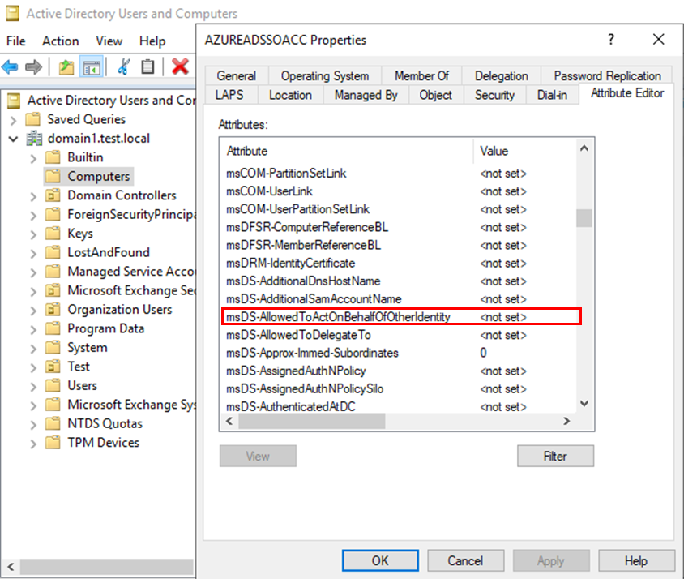

# Security assessment: Remove Resource Based Constrained Delegation for Microsoft Entra seamless SSO account

This article describes Microsoft Defender for Identity's Microsoft Entra Seamless Single sign-on (SSO) account with Resource Based Constrained Delegation (RBCD) applied security posture assessment report.

> [!NOTE]
> This security assessment will be available only if Microsoft Defender for Identity sensor is installed on servers running Microsoft Entra Connect services and Sign on method as part of Microsoft Entra Connect configuration is set to single sign-on and the SSO computer account exists. Learn more about Microsoft Entra seamless sign-on [here]([https://go.microsoft.com/fwlink/LinkID=829638]).
>

## Why might the Microsoft Entra seamless SSO computer account with RBCD configured be a risk?

Microsoft Entra seamless SSO automatically signs in users when they're using their corporate desktops that are connected to your corporate network. Seamless SSO provides users with easy access to your cloud-based applications without using any other on-premises components. Seamless SSO creates a computer account named AZUREADSSOACC in each Windows Server AD Forest in your on-premises Windows Server AD directory. If resource-based constrained delegation is configured on the AZUREADSSOACC computer account, an account with the delegation would be able to generate service tickets for the AZUREADSSOACC account on behalf of any user and impersonate any user in the Microsoft Entra tenant that is synchronized from AD.

## How do I use this security assessment to improve my hybrid organizational security posture?

1. Review the recommended action at [https://security.microsoft.com/securescore?viewid=actions](https://security.microsoft.com/securescore?viewid=actions)for Remove Resource Based Constrained Delegation for Microsoft Entra seamless SSO account.

1. Review the list of exposed entities to discover which of your Microsoft Entra SSO computer accounts have RBCD applied.

1. Evaluate if the RBCD configuration for the AZUREADSSOACC account is essential for your operations. If the delegation is not required for critical functionalities, it’s safer to remove it by ensuring that the `msDS-AllowedToActOnBehalfOfOtherIdentity` attribute on any AZUREADSSOACC account is empty – this is the normal state for this account:

> [!NOTE]
> While assessments are updated in near real time, scores and statuses are updated every 24 hours. While the list of impacted entities is updated within a few minutes of your implementing the recommendations, the status may still take time until it's marked as __Completed__.
## Next Steps

- [Learn more about Microsoft Secure Score](/microsoft-365/security/defender/microsoft-secure-score)

- [Learn more about Defender for Identity sensor for Microsoft Entra Connect](https://aka.ms/MdiSensorForMicrosoftEntraConnectInstallation) 
