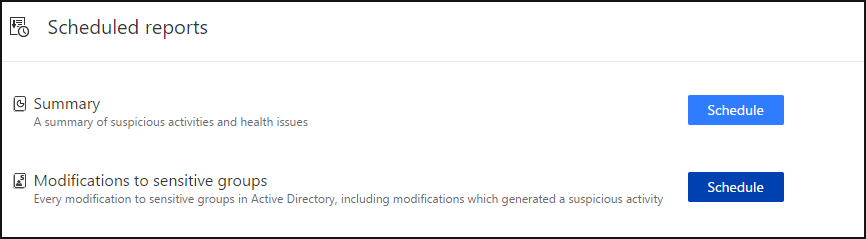

---
# required metadata

title: Working with Azure ATP Reports
description: Describes how you can generate reports in Azure ATP to monitor your network.
keywords:
author: shsagir
ms.author: shsagir
manager: rkarlin
ms.date: 11/26/2018
ms.topic: conceptual
ms.collection: M365-security-compliance
ms.service: azure-advanced-threat-protection
ms.assetid: 2c2d6b1a-fc8c-4ff7-b07d-64ce6159f84d

# optional metadata

#ROBOTS:
#audience:
#ms.devlang:
ms.reviewer: itargoet
ms.suite: ems
#ms.tgt_pltfrm:
#ms.custom:

---

# Azure ATP Reports

The Azure ATP reports section in the Azure ATP portal enables you to schedule or immediately generate and download reports that provide you with system and entity status information. From the reports feature, you can create reports about system health, security alerts and potential lateral movement paths detected in your environment.

To access the reports page, click the report icon in the menu bar: .
Available reports are: 

- **Summary report**: The Summary report presents a dashboard of the status in the system. You can view three tabs - one for a **Summary** of what was detected on your network, **Open suspicious activities** that lists the suspicious activities you should take care of, and **Open health issues** that lists Azure ATP health issues you should take care of. The suspicious activities listed are broken down by type, as are the health issues. 

- **Modification of sensitive groups**: This report lists every time a modification is made to sensitive groups (such as admins, or manually tagged accounts or groups). If you're using Azure ATP standalone sensors, in order to receive a full report about your sensitive groups, make sure that [events are forwarded from your domain controllers to the standalone sensors](configure-event-forwarding.md). 

- **Passwords exposed in cleartext**: Some services use the LDAP non-secure protocol to send account credentials in plain text. This can even happen for sensitive accounts. Attackers monitoring network traffic can catch and then reuse these credentials for malicious purposes. This report lists all source computer and account passwords detected by Azure ATP being sent in clear text. 

- **Lateral movement paths to sensitive accounts**: This report lists the sensitive accounts that are exposed via lateral movement paths. For more information, see [Lateral movement paths](use-case-lateral-movement-path.md). This report collects potential lateral movement paths that were detected in the report period you select. 

There are two ways to generate a report: either on demand or by scheduling a report to be sent to your email periodically.

To generate a report on demand:

1. In the Azure ATP portal menu bar, click the report icon in the menu bar: .

2. Under your selected report type, set the **From** and **To** dates and click **Download**. 
 

To set a scheduled report:
 
1. In the **Reports** page, click **Set scheduled reports**, or in the Azure ATP portal configuration page, under Notifications and Reports, click **Scheduled reports**.

   
 
   > [!NOTE]
   > By default, daily reports are designed to be sent shortly after midnight, UTC. Pick your own time by using the time selection option. 

2. Click **Schedule** next to your selected report type, to set the frequency and email address for delivery of the reports. The report frequency you select determines the information included in the report. To add email addresses, click the plus sign next to the email address field, enter the address and click **Save**.

   

## See Also
- [Azure ATP prerequisites](atp-prerequisites.md)
- [Azure ATP capacity planning](atp-capacity-planning.md)
- [Configure event collection](configure-event-collection.md)
- [Configuring Windows event forwarding](configure-event-forwarding.md)
- [Check out the Azure ATP forum!](https://aka.ms/azureatpcommunity)
