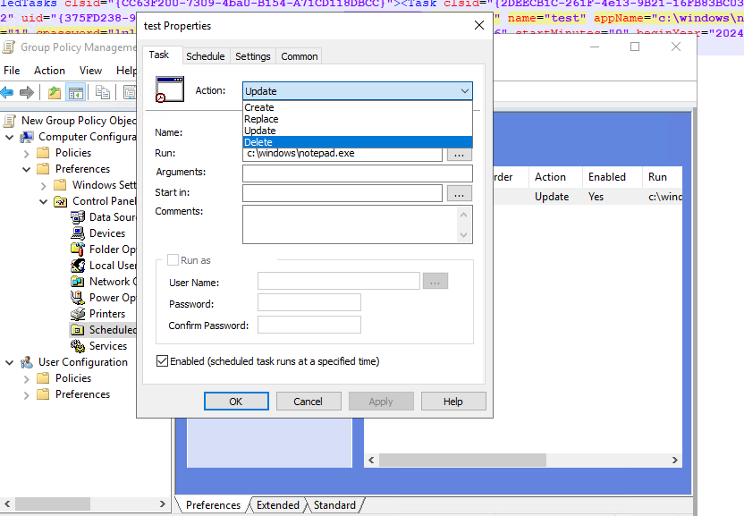

---
# Required metadata
# For more information, see https://review.learn.microsoft.com/en-us/help/platform/learn-editor-add-metadata?branch=main
# For valid values of ms.service, ms.prod, and ms.topic, see https://review.learn.microsoft.com/en-us/help/platform/metadata-taxonomies?branch=main

title: 'Security Assessment: Reversible passwords found in GPOs'
description: 'This recommendation lists any Group policy objects in your environment that contains password data.'
author:      LiorShapiraa # GitHub alias
ms.author: liorshapira
ms.service: microsoft-defender-for-identity
ms.topic: article
ms.date:     10/05/2024
---

# Security Assessment: Reversible passwords found in GPOs

This posture recommendation lists any Group policy objects in your environment that contains password data. 

### Why might Group policies objects that contain password data be a risk?

Group Policy Preferences (GPP) previously allowed administrators to include embedded credentials in domain policies. However, this feature was removed with the release of MS14-025 due to security concerns regarding the insecure storage of passwords. But files containing these credentials could still be present in the SYSVOL folder, which means that any domain user can access the files and decrypt the password using the publicly available AES key.   
To prevent potential exploitation by adversaries, it is recommended to remove any existing preferences that contain embedded credentials.

### Remediation Steps

In order to remove the preferences that contain passwords data, use Group Policy Management Console (GPMC) on a domain controller or from a client that has Remote Server Administration Tools (RSAT) installed. You can remove any preference following these steps: 

1. In GPMC, open the Group Policy reported in the Exposed entities tab.  

1. Navigate to the preference configuration that contains password data and delete the object. Click **Apply** and **OK** to save your changes.    
For example:  

1. Wait a Group Policy refresh cycle to allow changes to propagate to clients (usually up to 120 minutes) .

1. After changes are applied to all clients, delete the preference.  

1. Repeat steps 1 through 5 as needed to clean your whole environment.  

### Next steps

- [Learn more about Microsoft Secure Score](/microsoft-365/security/defender/microsoft-secure-score)

