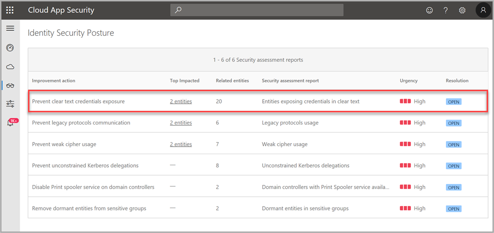
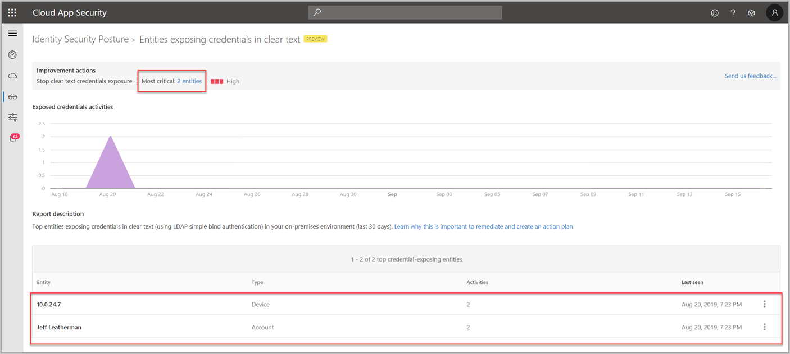

# Security assessment: Entities exposing credentials in clear text

## What information does the prevent clear text security assessment provide?

This security assessment monitors your traffic for any entities exposing credentials in clear text and alerts you to the current exposure risks (most impacted entities) in your organization with suggested remediation.

## Why is clear text credential exposure risky?

Entities exposing credentials in clear text are risky not only for the exposed entity in question, but for your entire organization.

The increased risk is because unsecure traffic such as LDAP simple-bind is highly susceptible to interception by attacker-in-the-middle attacks. These types of attacks result in malicious activities including credential exposure, in which an attacker can leverage credentials for malicious purposes.

## How do I use this security assessment to improve my organizational security posture?

1. Review the recommended action at <https://security.microsoft.com/securescore?viewid=actions>.

    
1. Research why those entities are using LDAP in clear text.
1. Remediate the issues and stop the exposure.
1. After confirming remediation, we recommend you require domain controller level LDAP signing. To learn more about LDAP server signing, see [Domain controller LDAP server signing requirements](/windows/security/threat-protection/security-policy-settings/domain-controller-ldap-server-signing-requirements).

> [!NOTE]
> This assessment is updated in near real time.

## Next steps

- [Learn more about Microsoft Secure Score](/microsoft-365/security/defender/microsoft-secure-score)
- [Check out the [!INCLUDE [Product short](includes/product-short.md)] forum!](<https://aka.ms/MDIcommunity>)
