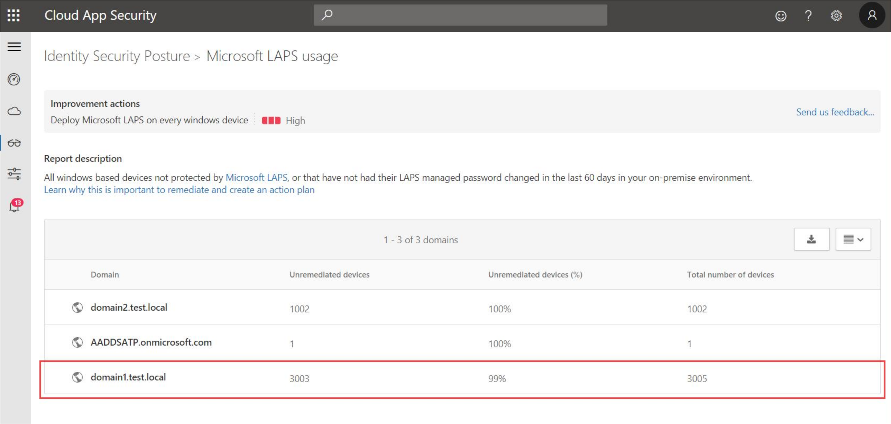
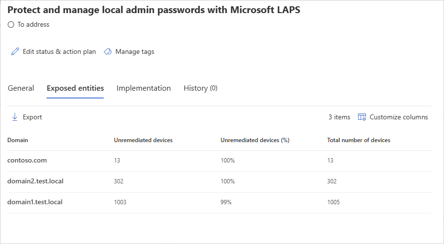
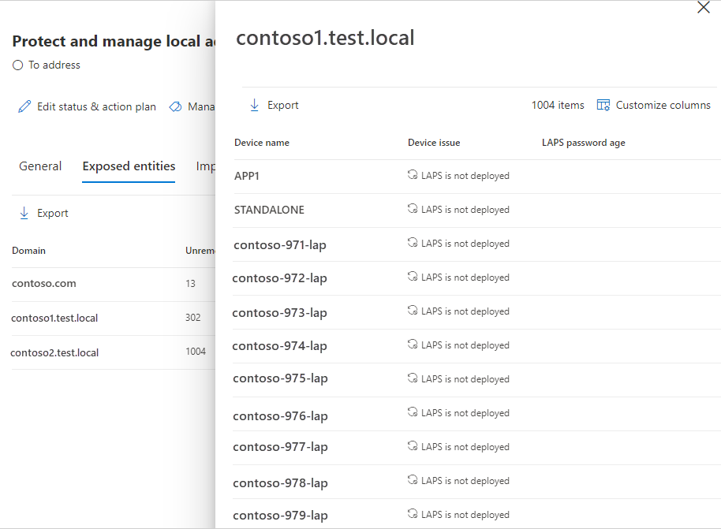

---

title: Microsoft LAPS usage assessment
description: This article provides an overview of Microsoft Defender for Identity's Microsoft LAPS usage identity security posture assessment report.
ms.date: 01/29/2023
ms.topic: how-to
---

# Security assessment: Microsoft LAPS usage

## What is Microsoft LAPS?

Microsoft's "Local Administrator Password Solution" (LAPS) provides management of local administrator account passwords for domain-joined computers. Passwords are randomized and stored in Active Directory (AD), protected by ACLs, so only eligible users can read it or request its reset.

This security assesment supports [legacy Microsoft LAPS](https://www.microsoft.com/en-us/download/details.aspx?id=46899) only.

## What risk does not implementing LAPS pose to an organization?

LAPS provide a solution to the issue of using a common local account with an identical password on every computer in a domain. LAPS resolve this issue by setting a different, rotated random password for the common local administrator account on every computer in the domain.

LAPS simplifies password management while helping customers implement additional recommended defenses against cyberattacks. In particular, the solution mitigates the risk of lateral escalation that results when customers use the same administrative local account and password combination on their computers. LAPS stores the password for each computer's local administrator account in AD, secured in a confidential attribute in the computer's corresponding AD object. The computer can update its own password data in AD, and domain administrators can grant read access to authorized users or groups, such as workstation helpdesk administrators.

## How do I use this security assessment?

1. Review the recommended action at <https://security.microsoft.com/securescore?viewid=actions> to discover which of your domains have some (or all) compatible Windows devices that aren't protected by LAPS, or that haven't had their LAPS managed password changed in the last 60 days.

    

1. For domains that are partially protected, select the relevant row to view the list of devices not protected by LAPS in that domain.

    

    > [!NOTE]
    > If the entire domain is not protected with LAPS, you won't see the list of all the unprotected devices.

1. Take appropriate action on those devices by downloading, installing and configuring or troubleshooting [Microsoft LAPS](https://go.microsoft.com/fwlink/?linkid=2104282) using the documentation provided in the download.

    

> [!NOTE]
> This assessment is updated every 24 hours.

## See Also

- [Learn more about Microsoft Secure Score](/microsoft-365/security/defender/microsoft-secure-score)
- [Check out the Defender for Identity forum!](<https://aka.ms/MDIcommunity>)
