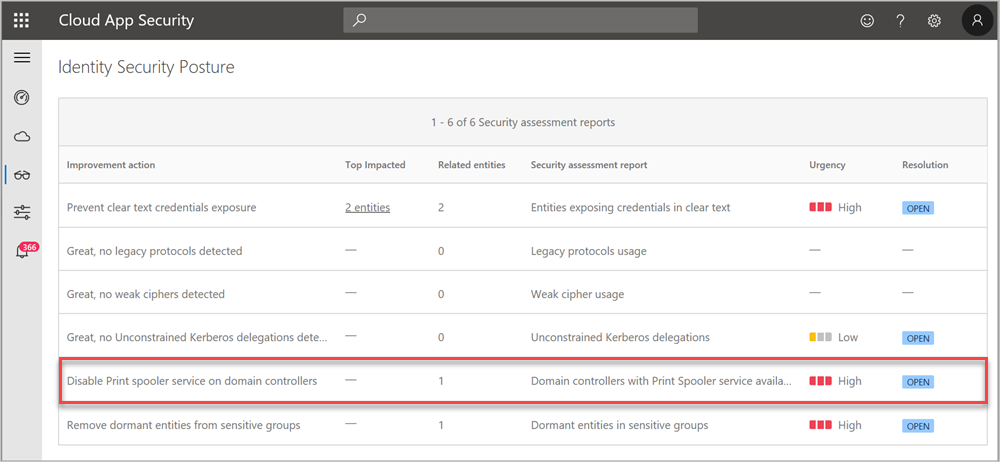
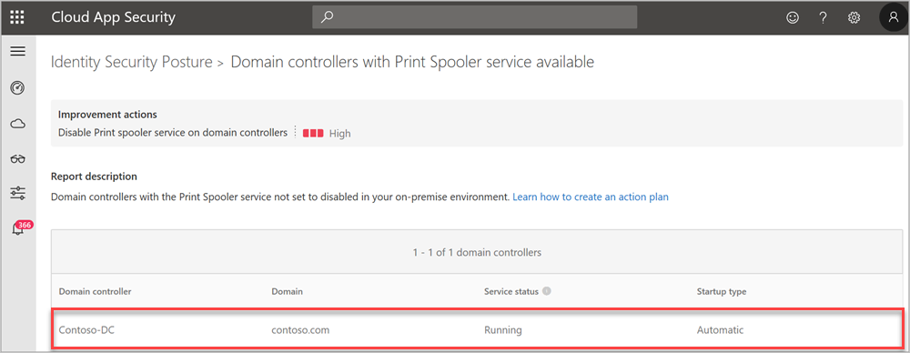

# Security assessment: Domain controllers with the print spooler service available

## What is the print spooler service?

Print spooler is a software service that manages printing processes. The spooler accepts print jobs from computers and makes sure that printer resources are available. The spooler also schedules the order in which print jobs are sent to the print queue for printing. In the early days of personal computers, users had to wait until files printed before performing other actions. Thanks to modern print spoolers, printing now has minimal impact on overall user productivity.

## What risks does the **Print spooler** service on domain controllers introduce?

While seemingly harmless, any authenticated user can remotely connect to a domain controllers print spooler service, and request an update on new print jobs. Also, users can tell the domain controller to send the notification to the system with [unconstrained delegation](/defender-for-identity/security-assessment-unconstrained-kerberos). These actions test the connection and expose the domain controller computer account credential (**Print spooler** is owned by SYSTEM).

Due to the possibility for exposure, domain controllers and Active Directory admin systems need to have the **Print spooler** service disabled. The recommended way to do this is using a Group Policy Object (GPO).

While this security assessment focuses on domain controllers, any server is potentially at risk to this type of attack.

> [!NOTE]
>
> - Make sure to investigate your **Print spooler** settings, configurations, and dependencies before disabling this service and preventing active printing workflows.
> - The domain controller role [adds a thread to the spooler service](/windows-server/security/windows-services/security-guidelines-for-disabling-system-services-in-windows-server#print-spooler) that is responsible for performing print pruning – removing the stale print queue objects from the Active Directory. Therefore, the security recommendation to disable the **Print spooler** service is a trade-off between security and the ability to perform print pruning. To address the issue, you should consider periodically pruning stale print queue objects.

## How do I use this security assessment?

1. Review the recommended action at <https://security.microsoft.com/securescore?viewid=actions> to discover which of your domain controllers has the **Print spooler** service enabled.

    
1. Take appropriate action on the at-risk domain controllers and actively remove the Print spooler service either manually, through GPO or other types of remote commands.

> [!NOTE]
> This assessment is updated in near real time.

## Remediation

Fix this specific issue by disabling the Print Spooler service on all servers that don't require it.

## Next steps

- [Learn more about Microsoft Secure Score](/microsoft-365/security/defender/microsoft-secure-score)
- [Check out the Defender for Identity forum!](<https://aka.ms/MDIcommunity>)
