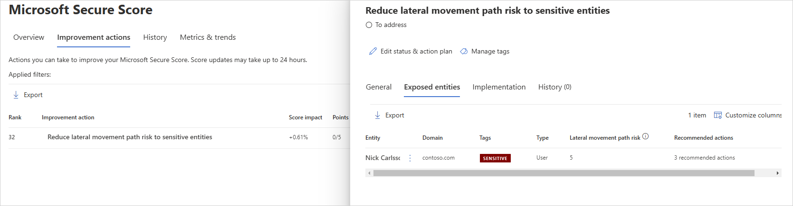

# Security assessment: Riskiest lateral movement paths (LMP)

## What are Risky lateral movement paths?

Microsoft Defender for Identity continuously monitors your environment to identify **sensitive** accounts with the riskiest lateral movement paths that expose a security risk, and reports on these accounts to assist you in managing your environment. Paths are considered risky if they have three or more non-sensitive accounts that can expose the **sensitive** account to credential theft by malicious actors.

Learn more about LMP:

- [Defender for Identity Lateral Movement Paths (LMPs)](/defender-for-identity/classic-use-case-lateral-movement-path)
- [MITRE ATT&CK Lateral Movement](https://attack.mitre.org/tactics/TA0008/)

## What risk do risky lateral movement paths pose?

Organizations that fail to secure their **sensitive** accounts leave the door unlocked for malicious actors.

Malicious actors, much like thieves, often look for the easiest and quietest way into any environment. Sensitive accounts with risky lateral movement paths are windows of opportunities for attackers and can expose risks.

For example, the riskiest paths are more readily visible to attackers and, if compromised, can give an attacker access to your organization's most sensitive entities.

## How do I use this security assessment?

1. Review the recommended action at <https://security.microsoft.com/securescore?viewid=actions> to discover which of your **sensitive** accounts have risky LMPs.

    
1. Take appropriate action:
    - Remove the entity from the group as specified in the recommendation.
    - Remove the local administrator permissions for the entity from the device specified in the recommendation.

    > [!NOTE]
    > This assessment is updated every 24 hours, so wait 24 hours and then check that the recommendation no longer appears in the list.

## See Also

- [Learn more about Microsoft Secure Score](/microsoft-365/security/defender/microsoft-secure-score)
- [Check out the Defender for Identity forum!](<https://aka.ms/MDIcommunity>)
