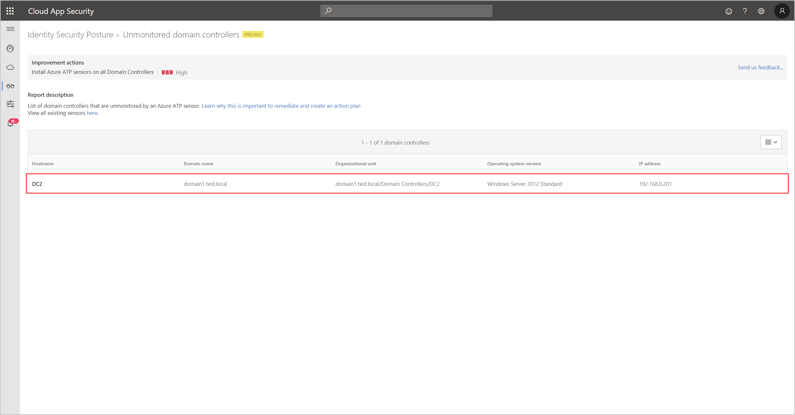

# Security assessment: Unmonitored domain controllers

## What are unmonitored domain controllers?

An essential part of the [!INCLUDE [Product long](includes/product-long.md)] solution requires that its sensors are deployed on all organizational domain controllers, providing a comprehensive view for all user activities from every device.

For this reason, [!INCLUDE [Product short](includes/product-short.md)] continuously monitors your environment to identify domain controllers without an installed [!INCLUDE [Product short](includes/product-short.md)] sensor, and reports on these unmonitored servers to assist you in managing full coverage of your environment.

## What risk do unmonitored domain controllers pose to an organization?

In order to operate at maximum efficiency, all domain controllers must be monitored with [!INCLUDE [Product short](includes/product-short.md)] sensors. Organizations that fail to remediate unmonitored domain controllers, reduce visibility into their environment and potentially expose their assets to malicious actors.

## How do I use this security assessment?

1. Review the recommended action at <https://security.microsoft.com/securescore?viewid=actions> to discover which of your domain controllers are unmonitored.

    
1. Take appropriate action on those domain controllers by [installing and configuring monitoring sensors](/defender-for-identity/sensor-settings#domain-controller-status).

> [!NOTE]
> This assessment is updated in near real time.

## See Also

- [Monitoring your domain controller coverage](/defender-for-identity/sensor-settings)
- [Check out the [!INCLUDE [Product short](includes/product-short.md)] forum!](<https://aka.ms/MDIcommunity>)
