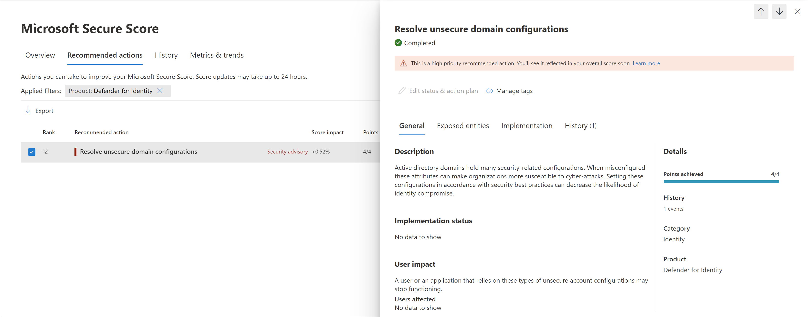

# Security assessment: Unsecure domain configurations

## What are unsecure domain configurations?

Microsoft Defender for Identity continuously monitors your environment to identify domains with configurations values that expose a security risk, and reports on these domains to assist you in protecting your environment.

## What risk do unsecure domain configurations pose?

Organizations that fail to secure their domain configurations leave the door unlocked for malicious actors.

Malicious actors, much like thieves, often look for the easiest and quietest way into any environment. Domains configured with unsecure configurations are windows of opportunity for attackers and can expose risks.

For example, if LDAP signing isn't enforced, an attacker can compromise domain accounts. This is especially risky if the account has privileged access to other resources, as with the [KrbRelayUp attack](https://www.microsoft.com/security/blog/2022/05/25/detecting-and-preventing-privilege-escalation-attacks-leveraging-kerberos-relaying-krbrelayup/).

## How do I use this security assessment?

1. Review the recommended action at <https://security.microsoft.com/securescore?viewid=actions> to discover which of your domains have unsecure configurations.
    
1. Take appropriate action on these domains by modifying or removing the relevant configurations.

> [!NOTE]
>
> - This assessment is updated in near real time.

## Remediation

Use the remediation appropriate to the relevant configurations as described in the following table.

| Recommended action | Remediation | Reason |
| --- | --- | --- |
|**Enforce LDAP Signing policy to "Require signing"** | We recommend you require domain controller level LDAP signing. To learn more about LDAP server signing, see [Domain controller LDAP server signing requirements](/windows/security/threat-protection/security-policy-settings/domain-controller-ldap-server-signing-requirements). | Unsigned network traffic is susceptible to man-in-the-middle attacks.
| **Set ms-DS-MachineAccountQuota to "0"**             | Set the [MS-DS-Machine-Account-Quota](/windows/win32/adschema/a-ms-ds-machineaccountquota) attribute to "0". | Limiting the ability of non-privileged users to register devices in the domain. For more information about this particular property and how it affects device registration, see [Default limit to number of workstations a user can join to the domain](/troubleshoot/windows-server/identity/default-workstation-numbers-join-domain). |

## Next steps

- [Learn more about Microsoft Secure Score](/microsoft-365/security/defender/microsoft-secure-score)
- [Check out the Defender for Identity forum!](<https://aka.ms/MDIcommunity>)
