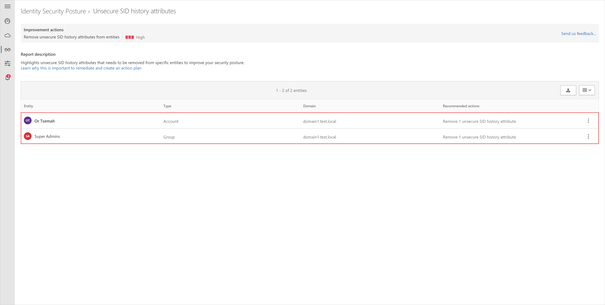

# Security assessment: Unsecure SID History attributes

## What is an unsecure SID History attribute?

SID History is an attribute that supports [migration scenarios](/previous-versions/windows/it-pro/windows-server-2003/cc779590(v=ws.10)). Every user account has an associated [Security IDentifier (SID)](/windows/win32/secauthz/security-identifiers) which is used to track the security principal and the access the account has when connecting to resources. SID History enables access for another account to effectively be cloned to another and is extremely useful to ensure users retain access when moved (migrated) from one domain to another.

The assessment checks for accounts with SID History attributes which Microsoft Defender for Identity profiles to be risky.

## What risk does unsecure SID History attribute pose?

Organizations that fail to secure their account attributes leave the door unlocked for malicious actors.

Malicious actors, much like thieves, often look for the easiest and quietest way into any environment. Accounts configured with an unsecure SID History attribute are windows of opportunities for attackers and can expose risks.

For example, a non-sensitive account in a domain can contain the Enterprise Admin SID in its SID History from another domain in the Active Directory forest, thus "elevating" access for the user account to an effective Domain Admin in all domains in the forest. Also, if you have a forest trust without SID Filtering enabled (also called Quarantine), it's possible to inject a SID from another forest and it will be added to the user token when authenticated and used for access evaluations.

## How do I use this security assessment?

1. Review the recommended action at <https://security.microsoft.com/securescore?viewid=actions> to discover which of your accounts have an unsecure SID History attribute.

    
1. Take appropriate action to remove SID History attribute from the accounts using PowerShell using the following steps:

    1. Identify the SID in the SIDHistory attribute on the account.

        ```powershell
        Get-ADUser -Identity <account> -Properties SidHistory | Select-Object -ExpandProperty SIDHistory
        ```

    2. Remove the SIDHistory attribute using the SID identified earlier.

        ```powershell
        Set-ADUser -Identity <account> -Remove @{SIDHistory='S-1-5-21-...'}
        ```

> [!NOTE]
> This assessment is updated in near real time.

## See Also
- [Learn more about Microsoft Secure Score](/microsoft-365/security/defender/microsoft-secure-score)
- [Check out the Defender for Identity forum!](<https://aka.ms/MDIcommunity>)
