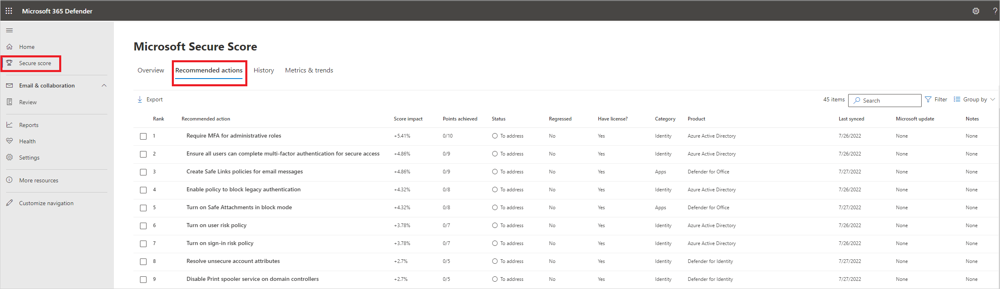

# Microsoft Defender for Identity's security posture assessments

Typically, organizations of all sizes have limited visibility into whether or not their on-premises apps and services could introduce a security vulnerability to their organization. The problem of limited visibility is especially true regarding use of unsupported or outdated components.

While your company may invest significant time and effort on hardening identities and identity infrastructure (such as Active Directory, Active Directory Connect) as an on-going project, it's easy to remain unaware of common misconfigurations and use of legacy components that represent one of the greatest threat risks to your organization. Microsoft security research reveals that most identity attacks utilize common misconfigurations in Active Directory and continued use of legacy components (such as NTLMv1 protocol) to compromise identities and successfully breach your organization. To combat this effectively, Microsoft Defender for Identity now offers proactive identity security posture assessments to detect and recommend actions across your on-premises Active Directory configurations.

## What do Defender for Identity's security posture assessments provide?

- Detections and contextual data on known exploitable components and misconfigurations, along with relevant paths for remediation.
- Defender for Identity detects not only suspicious activities, but also actively monitors your on-premises identities and identity infrastructure for weak spots, using the existing Defender for Identity sensor.
- Accurate assessment reports of your current organization security posture, enabling quick response and effect monitoring in a continuous cycle.

## How do I get started?

### Access

Defender for Identity security assessments are available using the [Microsoft Secure Score dashboard](/microsoft-365/security/defender/microsoft-secure-score). The assessments are available in the **Identity** category in Microsoft Secure Score.

### What is Microsoft Secure Score?

Microsoft Secure Score is a measurement of an organization's security posture, with a higher number indicating more recommended actions taken. It can be found at <https://security.microsoft.com/securescore> in the [Microsoft 365 Defender portal](/microsoft-365/security/defender/microsoft-365-defender).

### Licensing

A Defender for Identity license is required.

### Identity security posture assessments

Defender for Identity offers the following identity security posture assessments. Each assessment is a downloadable report with instructions for use and tools for building an action plan to remediate or resolve.

### Assessment reports

- [Domain controllers with Print Spooler service available](/defender-for-identity/security-assessment-print-spooler)
- [Dormant entities in sensitive groups](/defender-for-identity/security-assessment-dormant-entities)
- [Entities exposing credentials in clear text](/defender-for-identity/security-assessment-clear-text)
- [Microsoft LAPS usage](/defender-for-identity/security-assessment-laps)
- [Legacy protocols usage](/defender-for-identity/security-assessment-legacy-protocols)
- [Riskiest lateral movement paths (LMP)](/defender-for-identity/security-assessment-riskiest-lmp)
- [Unmonitored domain controllers](/defender-for-identity/security-assessment-unmonitored-domain-controller)
- [Unsecure account attributes](/defender-for-identity/security-assessment-unsecure-account-attributes)
- [Unsecure domain configurations](/defender-for-identity/security-assessment-unsecure-domain-configurations)
- [Unsecure Kerberos delegation](/defender-for-identity/security-assessment-unconstrained-kerberos)
- [Unsecure SID History attributes](/defender-for-identity/security-assessment-unsecure-sid-history-attribute)
- [Weak cipher usage](/defender-for-identity/security-assessment-weak-cipher)

To access identity security posture assessments:

1. Open the [Microsoft Secure Score dashboard](https://security.microsoft.com/securescore).
1. Select the **Recommended actions** tab. You can search for a particular recommended action, or filter the results (for example, by the category **Identity**).

    

1. For more details, select the assessment.

    

## Next steps

- [Learn more about Microsoft Secure Score](/microsoft-365/security/defender/microsoft-secure-score)
- [Check out the Defender for Identity forum!](<https://aka.ms/MDIcommunity>)
