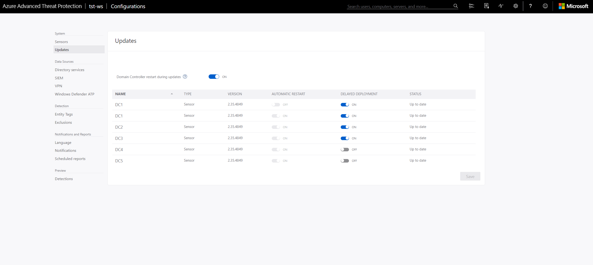

# Manage Microsoft Defender for Identity sensors

This article explains how to configure and monitor Microsoft Defender for Identity sensors in [Microsoft 365 Defender](/microsoft-365/security/defender/overview-security-center).

>[!IMPORTANT]
>As part of the convergence with Microsoft 365 Defender, some options and details have changed from their location in the Defender for Identity portal. Please read the details below to discover where to find both the familiar and new features.

## View Defender for Identity sensor settings and status

1. In [Microsoft 365 Defender](https://security.microsoft.com), go to **Settings** and then **Identities**.

    

1. Select the **Sensors** page, which displays all of your Defender for Identity sensors. For each sensor, you'll see its name, its domain membership, the version number, if updates should be delayed, the service status, update status, health status, the number of health issues, and when the sensor was created.

    [](media/sensor-page.png#lightbox)

    >[!NOTE]
    >In the Defender for Identity portal, the sensor settings and health information were in separate locations. Note that in Microsoft 365 Defender they're now on the same page.

1. If you select **Filters**, you can choose which filters will be available. Then with each filter, you can choose which sensors to display.

    [](media/sensor-filters.png#lightbox)

    

1. If you select one of the sensors, a pane will display with information about the sensor and its health status.

    [](media/sensor-details.png#lightbox)

1. If you select any of the health issues, you'll get a pane with more details about them. If you choose a closed issue, you can reopen it from here.

    

1. If you select **Manage sensor**, a pane will open where you can configure the sensor details.

    

    

1. In the **Sensors** page, you can export your list of sensors to a .csv file by selecting **Export**.

    

## Updating your sensors

Keeping your [!INCLUDE [Product long](includes/product-long.md)] sensors up-to-date, provides the best possible protection for your organization.

The [!INCLUDE [Product long](includes/product-long.md)] service is typically updated a few times a month with new detections, features, and  performance improvements. Typically these updates include a corresponding minor update to the sensors. [!INCLUDE [Product short](includes/product-short.md)] sensors and corresponding updates never have write permissions to your domain controllers. Sensor update packages only control the [!INCLUDE [Product short](includes/product-short.md)] sensor and sensor detection capabilities.

## Defender for Identity sensor update types

[!INCLUDE [Product short](includes/product-short.md)] sensors support two kinds of updates:

- Minor version updates:
  - Frequent
  - Requires no MSI install, and no registry changes
  - Restarted: [!INCLUDE [Product short](includes/product-short.md)] sensor services
  - Not restarted: Domain controller services and server OS

- Major version updates:
  - Rare
  - Contains significant changes
  - Restarted: [!INCLUDE [Product short](includes/product-short.md)] sensor services
  - Possible restart required: Domain controller services and server OS

> [!NOTE]
>
> - Control automatic sensor restarts (for **major** updates) in the [!INCLUDE [Product short](includes/product-short.md)] portal configuration page.
> - [!INCLUDE [Product short](includes/product-short.md)] sensor always reserves at least 15% of the available memory and CPU available on the domain controller where it is installed. If the [!INCLUDE [Product short](includes/product-short.md)] service consumes too much memory, the service is automatically stopped and restarted by the [!INCLUDE [Product short](includes/product-short.md)] sensor updater service.

## Delayed sensor update

Given the rapid speed of ongoing [!INCLUDE [Product short](includes/product-short.md)] development and release updates, you may decide to define a subset group of your sensors as a delayed update ring, allowing for a gradual sensor update process. [!INCLUDE [Product short](includes/product-short.md)] enables you to choose how your sensors are updated and set each sensor as a **Delayed update** candidate.

Sensors not selected for delayed update are updated automatically, each time the [!INCLUDE [Product short](includes/product-short.md)] service is updated. Sensors set to **Delayed update** are updated on a delay of 72 hours, following the official release of each service update.

The **delayed update** option enables you to select specific sensors as an automatic update ring, on which all updates are rolled out automatically, and set the rest of your sensors to update on delay, giving you time to confirm that the automatically updated sensors were successful.

> [!NOTE]
> If an error occurs and a sensor does not update, open a support ticket. To further harden your proxy to only communicate with your instance, see [Proxy configuration](configure-proxy.md).
Authentication between your sensors and the Azure cloud service uses strong, certificate-based mutual authentication.

Each update is tested and validated on all supported operating systems to cause minimal impact to your network and operations.

To set a sensor to delayed update:

1. From the [!INCLUDE [Product short](includes/product-short.md)] portal, click on the settings icon and select **Configuration**.
1. Click on the **Updates** tab.
1. In the table row next to each sensor you want to delay, set the **Delayed update** slider to **On**.
1. Click **Save**.

## Sensor update process

Every few minutes, [!INCLUDE [Product short](includes/product-short.md)] sensors check whether they have the latest version. After the [!INCLUDE [Product short](includes/product-short.md)] cloud service is updated to a newer version, the [!INCLUDE [Product short](includes/product-short.md)] sensor service starts the update process:

1. [!INCLUDE [Product short](includes/product-short.md)] cloud service updates to the latest version.
1. [!INCLUDE [Product short](includes/product-short.md)] sensor updater service learns that there is an updated version.
1. Sensors that are not set to **Delayed update** start the update process on a sensor by sensor basis:
    1. [!INCLUDE [Product short](includes/product-short.md)] sensor updater service pulls the updated version from the cloud service (in cab file format).
    1. [!INCLUDE [Product short](includes/product-short.md)] sensor updater validates the file signature.
    1. [!INCLUDE [Product short](includes/product-short.md)] sensor updater service extracts the cab file to a new folder in the sensor's installation folder. By default it is extracted to *C:\Program Files\Azure Advanced Threat Protection Sensor\<version number>*
    1. [!INCLUDE [Product short](includes/product-short.md)] sensor service points to the new files extracted from the cab file.
    1. [!INCLUDE [Product short](includes/product-short.md)] sensor updater service restarts the [!INCLUDE [Product short](includes/product-short.md)] sensor service.
        > [!NOTE]
        > Minor sensor updates install no MSI, changes no registry values or any system files. Even a pending restart does not impact a sensor update.
    1. Sensors run based on the newly updated version.
    1. Sensor receives clearance from the Azure cloud service. You can verify sensor status in the **Updates** page.
    1. The next sensor starts the update process.

1. 72 hours after the [!INCLUDE [Product short](includes/product-short.md)] cloud service is updated, sensors selected for **Delayed update** start their update process according to the same update process as automatically updated sensors.



For any sensor that fails to complete the update process, a relevant health alert is triggered, and is sent as a notification.


### Silently update the Defender for Identity sensor

Use the following command to silently update the [!INCLUDE [Product short](includes/product-short.md)] sensor:

**Syntax**:

```cmd
"Azure ATP sensor Setup.exe" [/quiet] [/Help] [NetFrameworkCommandLineArguments="/q"]
```

**Installation options**:

> [!div class="mx-tableFixed"]
>
> |Name|Syntax|Mandatory for silent installation?|Description|
> |-------------|----------|---------|---------|
> |Quiet|/quiet|Yes|Runs the installer displaying no UI and no prompts.|
> |Help|/help|No|Provides help and quick reference. Displays the correct use of the setup command including a list of all options and behaviors.|
> |NetFrameworkCommandLineArguments="/q"|NetFrameworkCommandLineArguments="/q"|Yes|Specifies the parameters for the .Net Framework installation. Must be set to enforce the silent installation of .Net Framework.|

**Examples**:

To update the [!INCLUDE [Product short](includes/product-short.md)] sensor silently:

```cmd
"Azure ATP sensor Setup.exe" /quiet NetFrameworkCommandLineArguments="/q"
```

## See Also

- [Configure event forwarding](configure-event-forwarding.md)
- [[!INCLUDE [Product short](includes/product-short.md)] prerequisites](prerequisites.md)
- [Check out the [!INCLUDE [Product short](includes/product-short.md)] forum!](<https://aka.ms/MDIcommunity>)
