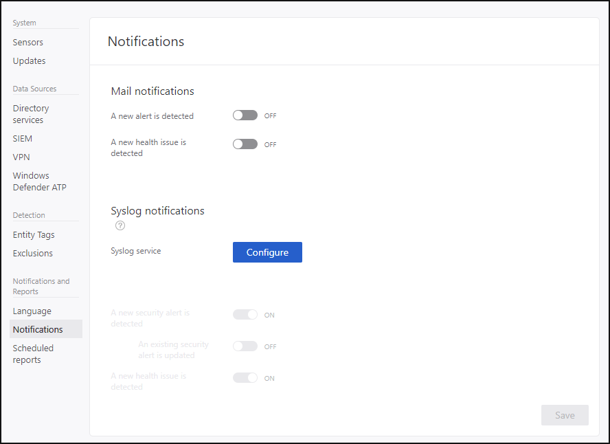

---
# required metadata

title: Set Azure Threat Protection notifications | Microsoft Docs
description: Describes how to set ATP alerts so you are notified when suspicious activities are detected.
keywords:
author: rkarlin
ms.author: rkarlin
manager: mbaldwin
ms.date: 11/7/2017
ms.topic: article
ms.prod:
ms.service: advanced-threat-analytics
ms.technology:
ms.assetid: 4308f03e-b2a7-4e38-a750-540ff94faa81

# optional metadata

#ROBOTS:
#audience:
#ms.devlang:
ms.reviewer: bennyl
ms.suite: ems
#ms.tgt_pltfrm:
#ms.custom:

---

*Applies to: Azure Threat Protection*

# Set ATP Notifications
ATP can notify you when it detects a suspicious activity, either by email or by using ATP event forwarding and forwarding the event to your SIEM/syslog server. Before selecting which notifications you want to receive, you have to [set up your email server and your Syslog server](setting-syslog-email-server-settings.md).

> [!NOTE]
> -   Email notifications include a link that takes the user directly to the suspicious activity that was detected. The host name portion of the link is taken from the setting of the ATP Console URL on the Azure ATP cloud service page. By default, the ATP Console URL is the IP address selected during the installation  of the Azure ATP cloud service. If you are going to configure email notifications, it is recommended to use an FQDN as the ATP Console URL.
> -   Notifications are sent from the Azure ATP cloud service to either the SMTP server and the Syslog server.

To receive notifications, set the following parameters:

1. In the ATP Console, select the settings option on the toolbar and select **Configuration**.

2. Click **Notifications**.
3. Under **Mail notifications**, specify which notifications should be sent via email - they can be sent for new alerts and new health issues. 
 
 >	[!NOTE]
 >   Email alerts for suspicious activities are only sent when the suspicious activity is created.

3. Under **Syslog notifications**, specify which notifications should be sent to your Syslog server - new security alerts, updated security alerts, and new health issues.
5. Click **Save**.

## See Also
[Check out the ATP forum!](https://social.technet.microsoft.com/Forums/security/home?forum=mata)
