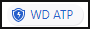

---
# required metadata

title: Azure ATP security alert guide | Microsoft Docs
d|Description: This article provides a list of the security alerts issued by Azure ATP and steps for remediation.
keywords:
author: mlottner
ms.author: mlottner
manager: mbaldwin
ms.date: 10/28/2018
ms.topic: conceptual
ms.prod:
ms.service: azure-advanced-threat-protection
ms.technology:
ms.assetid: ca5d1c7b-11a9-4df3-84a5-f53feaf6e561

# optional metadata

#ROBOTS:
#audience:
#ms.devlang:
ms.reviewer: itargoet
ms.suite: ems
#ms.tgt_pltfrm:
#ms.custom:

---

*Applies to: Azure Advanced Threat Protection*

# Azure Advanced Threat Protection security alert guide

Following proper investigation, all Azure ATP security alerts can be classified as:

-   **True positive**: A malicious action detected by Azure ATP.

-   **Benign true positive**: An action detected by Azure ATP that is real but not malicious, such as a penetration test.

-   **False positive**: A false alarm, meaning the activity didn’t happen.

For more information on how to work with Azure ATP security alerts, see [Working with security alerts](working-with-suspicious-activities.md).

## Brute force attack using LDAP simple bind

**Description**

>[!NOTE]
> The main difference between **Suspicious authentication failures** and this detection is that in this detection, Azure ATP can determine whether different passwords were in use.

In a brute-force attack, an attacker attempts to authenticate with many different passwords for different accounts until a correct password is found for at least one account. Once found, an attacker can log in using that account.

In this detection, an alert is triggered when Azure ATP detects a massive number of simple bind authentications. This can be either *horizontally* with a small set of passwords across many users; or *vertically”* with a large set of passwords on just a few users; or any combination of these two options.

**Investigation**

1. If there are many accounts involved, click **Download details** to view the list in an Excel spreadsheet.

2. Click on the alert to go to its dedicated page. Check if any login attempts ended with a successful authentication. The attempts would appear as **Guessed accounts** on the right side of the infographic. If yes, are any of the **Guessed accounts** normally used from the source computer? If yes, **Suppress** the suspicious activity.

3. If there are no **Guessed accounts**, are any of the **Attacked accounts** normally used from the source computer? If yes, **Suppress** the suspicious activity.

**Remediation**

[Complex and long passwords](https://docs.microsoft.com/windows/device-security/security-policy-settings/password-policy) provide the necessary first level of security against brute-force attacks.

## Encryption downgrade activity

**Description**

Encryption downgrade is a method of weakening Kerberos by downgrading the encryption level of different fields of the protocol that are usually encrypted using the highest level of encryption. A weakened encrypted field can be an easier target to offline brute force attempts. Various attack methods utilize weak Kerberos encryption cyphers. In this detection, Azure ATP learns the Kerberos encryption types used by computers and users, and alerts you when a weaker cypher is used that: (1) is unusual for the source computer and/or user; and (2) matches known attack techniques.

There are three detection types:

1.  Skeleton Key – is malware that runs on domain controllers and allows authentication to the domain with any account without knowing its password. This malware often uses weaker encryption algorithms to hash the user's passwords on the domain  controller. In this detection, the encryption method of the KRB_ERR message from the domain controller to the account asking for a ticket was downgraded compared to the previously learned behavior.

2.  Golden Ticket – In a [Golden Ticket](#golden-ticket) alert, the encryption method of the TGT field of TGS_REQ (service request) message from the source computer was downgraded compared to the previously learned behavior. This is not based on a time anomaly (as in the other Golden Ticket detection). In addition, there was no Kerberos authentication request associated with the previous service request detected by ATP.

3.  Overpass-the-Hash – An attacker can use a weak stolen hash in order to create a strong ticket, with a Kerberos AS request. In this detection, the AS_REQ message encryption type from the source computer was downgraded compared to the previously learned behavior (that is, the computer was using AES).

**Investigation**

First check the description of the alert, to see which of the three detection types listed above you’re dealing with. For further information, download the Excel spreadsheet.

1.	Skeleton Key – You can check if Skeleton Key has affected your domain controllers by using [the scanner written by the Azure ATP team](https://gallery.technet.microsoft.com/Aorato-Skeleton-Key-24e46b73). If the scanner finds malware on 1 or more of your domain controllers, it is a true positive.

2.	Golden Ticket – In the excel spreadsheet, go to the network activity tab. You will see that the relevant downgraded field is **Request Ticket Encryption Type**, and **Source Computer Supported Encryption Types** contains stronger encryption methods.

  a. Check the resource accessed by those tickets, if there is one resource they are all accessing, validate it, make sure it is a valid resource they supposed to access. In addition, verify if the target resource supports strong encryption methods. You can check this in Active Directory by checking the attribute msDS-SupportedEncryptionTypes, of the resource service account.
  
  b. Check the source computer and account, or if there are multiple source computers and accounts check if they have something in common. For example, all of your marketing personnel use a specific app that might be causing the alert to be triggered. There are cases in which a custom application that is rarely used, is authenticating using a lower encryption cipher. Check if there are any such custom apps on the source computer. If so, it is probably a benign true positive and can be suppressed.
  

3.	Overpass-the-Hash – In the excel spreadsheet, go to the network activity tab. You will see that the relevant downgraded field is **Encrypted Timestamp Encryption Type** and **Source Computer Supported Encryption Types** contains stronger encryption methods.

  a. There are cases in which this alert might be triggered when users log in using smartcards if the smartcard configuration was changed recently. Check if there were changes like this for the account(s) involved. If so, this is probably a benign true positive and can be suppressed.
  b. Check the resource accessed by those tickets, if there is one resource they are all accessing, validate it, make sure it is a valid resource they supposed to access. In addition, verify if the target resource supports strong encryption methods. You can check this in Active Directory by checking the attribute msDS-SupportedEncryptionTypes, of the resource service account.

**Remediation**

1.  Skeleton Key – Remove the malware. For more information, see [Skeleton Key Malware Analysis](https://www.virusbulletin.com/virusbulletin/2016/01/paper-digital-bian-lian-face-changing-skeleton-key-malware).

2.  Golden Ticket – Follow the instructions of the [Golden Ticket](#golden-ticket) suspicious activities.   
    Also, because creating a Golden Ticket requires domain admin rights, implement [Pass the hash recommendations](https://www.microsoft.com/download/details.aspx?id=36036).

3.  Overpass-the-Hash – If the involved account is not sensitive, then reset the password of that account. This prevents the attacker from creating new Kerberos tickets from the password hash, although the existing tickets can still be used until they expire. If it’s a sensitive account, you should consider resetting the KRBTGT account twice as in the Golden Ticket suspicious activity. Resetting the KRBTGT twice invalidates all Kerberos tickets in this domain so plan before doing so. See guidance in [KRBTGT Account Password Reset Scripts now available for customers](https://blogs.microsoft.com/microsoftsecure/2015/02/11/krbtgt-account-password-reset-scripts-now-available-for-customers/). Also see using the [Reset the KRBTGT account password/keys
    tool](https://gallery.technet.microsoft.com/Reset-the-krbtgt-account-581a9e51). Since this is a lateral movement technique, follow the best practices of [Pass the hash recommendations](https://www.microsoft.com/download/details.aspx?id=36036).

## Honeytoken activity

**Description**

Honeytoken accounts are decoy accounts set up to identify and track malicious activity that involves these accounts. Honeytoken accounts should be left unused, while having an attractive name to lure attackers (for example,
SQL-Admin). Any activity from them might indicate malicious behavior.

For more information on honeytoken accounts, see [Install Azure ATP - Step 7](install-atp-step7.md).

**Investigation**

1.  Check whether the owner of the source computer used the Honeytoken account to authenticate, using the method described in the suspicious activity page (for example, Kerberos, LDAP, NTLM).

2.  Browse to the source computer(s) profile page(s) and check which other accounts authenticated from them. Check with the owners of those accounts if they used the Honeytoken account.

3.  This could be a non-interactive login, so make sure to check for applications or scripts that are running on the source computer.

If after performing steps 1 through 3, if there’s no evidence of benign use, assume this is malicious.

**Remediation**

Make sure Honeytoken accounts are used only for their intended purpose, otherwise they might generate many alerts.

## Identity theft using Pass-the-Hash attack

**Description**

Pass-the-Hash is a lateral movement technique in which attackers steal a user’s NTLM hash from one computer and use it to gain access to another computer. 

**Investigation**

Was the hash used from a computer that the targeted user owns or regularly uses? If yes, this is a false positive. If not, it is probably a true positive.

**Remediation**

1. If the involved account is not sensitive, then reset the password of that account. This prevents the attacker from creating new Kerberos tickets from the password hash, although the existing tickets can still be used until they
expire. 

2. If it’s a sensitive account, you should consider resetting the KRBTGT account twice as in the Golden Ticket suspicious activity. Resetting the KRBTGT twice invalidates all Kerberos tickets in this domain so plan before doing so. See
the guidance in [KRBTGT Account Password Reset Scripts now available for customers](https://blogs.microsoft.com/microsoftsecure/2015/02/11/krbtgt-account-password-reset-scripts-now-available-for-customers/), also see using the [Reset the KRBTGT account password/keys tool](https://gallery.technet.microsoft.com/Reset-the-krbtgt-account-581a9e51). Since this is a lateral movement technique, follow the best practices of [Pass the hash recommendations](https://www.microsoft.com/download/details.aspx?id=36036).

## Identity theft using Pass-the-Ticket attack

**Description**

Pass-the-Ticket is a lateral movement technique in which attackers steal a Kerberos ticket from one computer and use it to gain access to another computer by reusing the stolen ticket. In this detection, a Kerberos ticket is seen used on two (or more) different computers.

**Investigation**

1. Click the **Download details** button to view the full list of IP addresses involved. Does the IP address of one or both computers belong to a subnet that is allocated from an undersized DHCP pool, for example, VPN or WiFi? Is the IP address shared? For example, by a NAT device? Are one or more of the source IP addresses not being resolved by the sensor? (this could indicate that the proper ports from the sensor to the devices are not properly opened.) If the answer to any of these questions is yes, then it is a false positive.

2. Is there a custom application that forwards tickets on behalf of users? If so, it is a benign true positive.

**Remediation**

1. If the involved account is not sensitive, then reset the password of that account. This prevents the attacker from creating new Kerberos tickets from the password hash, although the existing tickets can still be used until they expire.  

2. If it’s a sensitive account, you should consider resetting the KRBTGT account twice as in the Golden Ticket suspicious activity. Resetting the KRBTGT twice invalidates all Kerberos tickets in this domain so plan before doing so. See the guidance in [KRBTGT Account Password Reset Scripts now available for customers](https://blogs.microsoft.com/microsoftsecure/2015/02/11/krbtgt-account-password-reset-scripts-now-available-for-customers/), also see using the [Reset the KRBTGT account password/keys
tool](https://gallery.technet.microsoft.com/Reset-the-krbtgt-account-581a9e51).  Since this is a lateral movement technique, follow the best practices in [Pass the hash recommendations](https://www.microsoft.com/download/details.aspx?id=36036).

## Kerberos golden ticket

**Description**

Attackers with domain admin rights can compromise the [KRBTGT account](https://technet.microsoft.com/library/dn745899(v=ws.11).aspx#Sec_KRBTGT). Using the KRBTGT account, they can create a Kerberos ticket granting ticket (TGT) that provides authorization to any resource and set the ticket expiration to any arbitrary time. This fake TGT is called a "goldentTicket" and allows attackers to achieve persistency in the network.

In this detection, an alert is triggered when a Kerberos ticket granting ticket is used for more than the allowed time permitted as specified in the [Maximum lifetime for user ticket](https://technet.microsoft.com/library/jj852169(v=ws.11).aspx), this is a **time anomaly** golden ticket attack, or by a nonexistent account, this is a **nonexistent account** golden ticket attack.

**Investigation**

- **Time anomaly**
   1.	Was there any recent (within the last few hours) change made to the Maximum lifetime for user ticket setting in group policy? Check for the specific value and see if it is lower than the time the ticket was used for. If yes, then Close the alert (it was a false positive).
   2.	Is the Azure ATP sensor involved in this alert a virtual machine? If yes, did it recently resume from a saved state? If yes, then Close this alert.
   3.	If the answer to the above questions is no, assume this is malicious.

- **Nonexistent account - New** 
   1.	Ask the following questions:
         - Is the user is a known and valid domain user? If yes, then Close the alert (it was a false positive).
         - Has the user been recently added? If yes, then Close the alert, the change may not have been synchronized yet.
         - Has the user been recently deleted from AD? If yes, then Close the alert.
   2.	If the answer to the above questions is no, assume this is malicious.

1. For both types of golden ticket attacks, click on the source computer to go to its **Profile** page. Check what happened around the time of the activity and look for unusual activities including who was logged in, which resources were accessed? 

2.	Are all the users who were logged into the computer supposed to be logged into? What are their privileges? 

3.	Are those users supposed to have access to these resources? 
If you enabled Windows Defender ATP integration, click the Windows Defender ATP badge .
 
 4. To further investigate the machine, in Windows Defender ATP, check which processes and alerts occurred around the time of the alert.

**Remediation**

Change the Kerberos Ticket Granting Ticket (KRBTGT) password twice according to the guidance in [KRBTGT Account Password Reset Scripts now available for customers](https://blogs.microsoft.com/microsoftsecure/2015/02/11/krbtgt-account-password-reset-scripts-now-available-for-customers/), using the [Reset the KRBTGT account password/keys
tool](https://gallery.technet.microsoft.com/Reset-the-krbtgt-account-581a9e51). Resetting the KRBTGT twice invalidates all Kerberos tickets in this domain so plan before doing so. Also, because creating a Golden Ticket requires domain admin rights, implement [Pass the hash recommendations](https://www.microsoft.com/download/details.aspx?id=36036).

## Malicious Data Protection Private Information Request

**Description**

The Data Protection API (DPAPI) is used by Windows to securely protect passwords saved by browsers, encrypted files, and other sensitive data. Domain controllers hold a backup master key that can be used to decrypt all secrets encrypted with
DPAPI on domain-joined Windows machines. Attackers can use that master key to decrypt any secrets protected by DPAPI on all domain-joined machines.
In this detection, an alert is triggered when the DPAPI is used to retrieve the backup master key.

**Investigation**

1. Is the source computer running an organization-approved advanced security scanner against Active Directory?

2. If yes and it should always be doing so, **Close and exclude** the suspicious activity.

3. If yes and it should not do this, **Close** the suspicious activity.

**Remediation**

To use DPAPI, an attacker needs domain admin rights. Implement [Pass the hash recommendations](https://www.microsoft.com/download/details.aspx?id=36036).

## Malicious replication of directory services

**Description**

Active Directory replication is the process by which changes that are made on one domain controller are synchronized with all other domain controllers. Given necessary permissions, attackers can initiate a replication request, allowing them to retrieve the data stored in Active Directory, including password hashes.

In this detection, an alert is triggered when a replication request is initiated from a computer that is not a domain controller.

**Investigation**

> [!NOTE]
> If you have domain controllers on which Azure ATP sensors are not installed, those domain controllers are not covered by Azure ATP. In this case, if you deploy a new domain controller on an unregistered or unprotected domain controller, it may not be identified by Azure ATP as a domain controller at first. It is highly recommended to install the Azure ATP sensor on every domain controller to get full coverage.

1. Is the computer in question a domain controller? For example, a newly promoted domain controller that had replication issues. If yes, **Close** the suspicious activity. 
2.	Is the computer in question supposed to be replicating data from Active Directory? For example, Azure AD Connect or network performance monitoring devices. If yes, **Close and exclude** the suspicious activity.
3. Is the IP from which the replication request was sent a NAT or a proxy? If yes, check if there is a new domain controller behind the device or if other suspicious activities have occurred from it. 

4. Click on the source computer or account to go to its profile page. Check what happened around the time of the replication, searching for unusual activities, such as: who was logged in, which resources where accessed. If you enabled Windows Defender ATP integration, click the Windows Defender ATP badge  to further investigate the machine. In Windows Defender ATP you can see which processes and alerts occurred around the time of the alert. 

**Remediation**

Validate the following permissions: 

- Replicate directory changes   

- Replicate directory changes all  

For more information, see [Grant Active Directory Domain Services permissions for profile synchronization in SharePoint Server 2013](https://technet.microsoft.com/library/hh296982.aspx).
You can leverage [AD ACL Scanner](https://blogs.technet.microsoft.com/pfesweplat/2013/05/13/take-control-over-ad-permissions-and-the-ad-acl-scanner-tool/) or create a Windows PowerShell script to determine who in the domain has these permissions.

## Privilege escalation using forged authorization data

**Description**

Known vulnerabilities in older versions of Windows Server allow attackers to manipulate the Privileged Attribute Certificate (PAC), a field in the Kerberos ticket that contains a user authorization data (in Active Directory this is group membership), granting attackers additional privileges.

**Investigation**

1. Click on the alert to get to its details page.

2. Is the destination computer (under the **ACCESSED** column) patched with MS14-068 (domain controller) or MS11-013 (server)? If yes, **Close** the suspicious activity (it is a false positive).

3. If not, does the source computer run (under the **FROM** column) an OS/application known to modify the PAC? If yes, **Suppress** the suspicious activity (it is a benign true positive).

4. If the answer was no to the above two questions, assume this is malicious.

**Remediation**

Make sure all domain controllers with operating systems up to Windows Server 2012 R2 are installed with [KB3011780](https://support.microsoft.com/help/2496930/ms11-013-vulnerabilities-in-kerberos-could-allow-elevation-of-privilege) and
all member servers and domain controllers up to 2012 R2 are up-to-date with KB2496930. For more information, see [Silver PAC](https://technet.microsoft.com/library/security/ms11-013.aspx) and [Forged PAC](https://technet.microsoft.com/library/security/ms14-068.aspx).

## Reconnaissance using account enumeration

**Description**

In account enumeration reconnaissance, an attacker uses a dictionary with thousands of user names, or tools such as KrbGuess to attempt to guess user names in your domain. The attacker makes Kerberos requests using these names in order to try to find a valid username in your domain. If a guess successfully determines a username, the attacker gets the Kerberos error **Preauthentication required** instead of **Security principal unknown**. 

In this detection, Azure ATP can detect where the attack came from, the total number of guess attempts and how many were matched. If there are too many unknown users, Azure ATP detects it as a suspicious activity. 

**Investigation**

1. Click on the alert to get to its details page. 

2. Should this host machine query the domain controller as to whether accounts exist (for example, Exchange servers)?   
Is there a script or application running on the host that could generate this behavior?   
If the answer to either of these questions is yes, **Close** the suspicious activity (it is a benign true positive) and exclude that host from the suspicious activity.

3. Download the details of the alert in an Excel spreadsheet to conveniently see the list of account attempts, divided into existing and non-existing accounts. If you look at the non existing accounts sheet in the spreadsheet and the accounts look familiar, they may be disabled accounts or employees who left the company. In this case, it is unlikely that the attempt is coming from a dictionary. Most likely, it's an application or script that is checking to see which accounts still exist in Active Directory, meaning that it's a benign true positive.

3. If the names are largely unfamiliar, did any of the guess attempts match existing account names in Active Directory? If there are no matches, the attempt was futile, but you should pay attention to the alert to see if it gets updated over time.

4. If any of the guess attempts match existing account names, the attacker knows of the existence of accounts in your environment and can attempt to use brute force to access your domain using the discovered user names. Check the guessed account names for additional suspicious activities. Check to see if any of the matched accounts are sensitive accounts.

**Remediation**

[Complex and long passwords](https://docs.microsoft.com/windows/device-security/security-policy-settings/password-policy) provide the necessary first level of security against brute-force attacks.

## Reconnaissance using directory services queries

**Description**

Directory services reconnaissance is used by attackers to map the directory structure and target privileged accounts for later steps in an attack. The Security Account Manager Remote (SAM-R) protocol is one of the methods used to query the directory to perform such mapping.

In this detection, no alerts would be triggered in the first month after Azure ATP is deployed. During the learning period, Azure ATP profiles which SAM-R queries are made from which computers, both enumeration and individual queries of sensitive accounts.

**Investigation**

1. Click on the alert to get to its details page. Check which queries were performed (for example, Enterprise admins, or Administrator) and whether or not they were successful.

2. Are such queries supposed to be made from the source computer in question?

3. If yes and the alert gets updated, **Suppress** the suspicious activity.

4. If yes and it should not do this anymore, **Close** the suspicious activity.

5. If there’s information on the involved account: are such queries supposed to be made by that account or does that account normally log in to the source computer?

 - If yes and the alert gets updated, **Suppress** the suspicious activity.

 - If yes and it should not do this anymore, **Close** the suspicious activity.

 - If the answer was no to all of the above, assume this is malicious.

6. If there is no information about the account that was involved, you can go to the endpoint and check which account was logged in at the time of the alert.

**Remediation**

Harden your environment against this technique using the following process:
1. Is the computer running a vulnerability scanning tool?  
2. Investigate whether the specific queried users and groups in the attack are privileged or high value accounts (that is, CEO, CFO, IT management, etc.).  If so, look at other activity on the endpoint as well and monitor computers that the queried accounts are logged into, as they are probably targets for lateral movement.

## Reconnaissance using DNS

**Description**

Your DNS server contains a map of all the computers, IP addresses, and services in your network. This information is used by attackers to map your network structure and target interesting computers for later steps in their attack.

There are several query types in the DNS protocol. Azure ATP detects the AXFR (Transfer) request originating from non-DNS servers.

**Investigation**

1. Is the source machine (**Originating from…**) a DNS server? If yes, then this is probably a false positive. To validate, click on the alert to get to its details page. In the table, under **Query**, check which domains were queried. Are these existing domains? If yes, then **Close** the suspicious activity (it is a false positive). In addition, make sure UDP port 53 is open between Azure ATP standalone sensor and the source computer to prevent future false positives.

2. Is the source machine running a security scanner? If yes, **Exclude the entities** in ATP, either directly with **Close and exclude** or via the **Exclusion** page (under **Configuration** – available for Azure ATP admins).

3. If the answer to all the preceding questions is no, keep investigating focusing on the source computer. Click on the source computer to go to its profile page. Check what happened around the time of the request, searching for unusual activities, such as: who was logged in, which resources where accessed. If you enabled Windows Defender ATP integration, click the Windows Defender ATP badge  to further investigate the machine. In Windows Defender ATP you can see which processes and alerts occurred around the time of the alert. 

**Remediation**

Securing an internal DNS server to prevent reconnaissance using DNS from occurring can be accomplished by disabling or restricting zone transfers only to specified IP addresses. For more information on restricting zone transfers, see [Restrict Zone Transfers](https://technet.microsoft.com/library/ee649273(v=ws.10).aspx).
Modifying zone transfers is one task among a checklist that should be addressed for [securing your DNS servers from both internal and external attacks](https://technet.microsoft.com/library/cc770432(v=ws.11).aspx).

## Reconnaissance using SMB Session Enumeration

**Description**

Server Message Block (SMB) enumeration enables attackers to get information about where users recently logged on. Once attackers have this information, they can move laterally in the network to get to a specific sensitive account.

In this detection, an alert is triggered when an SMB session enumeration is performed against a domain controller, because this should not happen.

**Investigation**

1. Click on the alert to get to its details page. Check which account/s performed the operation and which accounts were exposed, if any.

 - Is there some kind of security scanner running on the source computer? If yes, **Close and exclude** the suspicious activity.

2. Check which involved user/s performed the operation. Do they normally log into the source computer or are they administrators who should perform such actions?  

3. If yes and the alert gets updated, **Suppress** the suspicious activity.  

4. If yes and it should not do this anymore, **Close** the suspicious activity.

5. If the answer to all the above is no, assume this is malicious.

**Remediation**

Use the [Net Cease tool](https://gallery.technet.microsoft.com/Net-Cease-Blocking-Net-1e8dcb5b) to harden your environment against this attack.

## Remote code execution attempt - enhanced

**Description**

Attackers who compromise administrative credentials or use a zero-day exploit can execute remote commands on your domain controller. This can be used for gaining persistency, collecting information, denial of service (DOS) attacks or any other reason. Azure ATP detects PSexec,  Remote WMI and PowerShell connections.

**Investigation**

1. This is common for administrative workstations and IT team members and service accounts that perform administrative tasks against the domain controllers. If this is this the case, and the alert gets updated since the same admin and/or computer are performing the task, then **Suppress** the alert.

2. Is the **computer** in question allowed to perform this remote execution against your domain controller?

 - Is the **account** in question allowed to perform this remote execution against your domain controller?

 - If the answer to both questions is *yes*, then **Close** the alert.

3. If the answer to either questions is no, then this should be considered a true positive. Try to find the source of the attempt by checking computer and account profiles. Click on the source computer or account to go to its profile page. Check what happened around the time of these attempts, searching for unusual activities, such as: who was logged in, which resources where accessed. If you enabled Windows Defender ATPintegration, click the Windows Defender ATP badge  to further investigate the machine. In Windows Defender ATPyou can see which processes and alerts occurred around the time of the alert. 

**Remediation**

1. Restrict remote access to domain controllers from non-Tier 0 machines.

2. Implement [privileged access](https://technet.microsoft.com/windows-server-docs/security/securing-privileged-access/securing-privileged-access) to allow only hardened machines to connect to domain controllers for admins.

> [!NOTE]
> Remote code execution attempt alerts are supported by ATP sensors only. 

## Suspicious authentication failures

**Description**

In a brute-force attack, an attacker attempts to authenticate with many different passwords for different accounts until a correct password is found for at least one account. Once found, an attacker can log in using that account.

In this detection, an alert is triggered when many authentication failures using Kerberos or NTLM occurred, this can be either horizontally with a small set of passwords across many users; or vertically with a large set of passwords on just a few users; or any combination of these two options. The minimum period before an alert can be triggered is one week.

**Investigation**

1.	Click **Download details** to view the full information in an Excel spreadsheet. You can get the following information: 
   -	List of the attacked accounts
   -	List of guessed accounts in which login attempts ended with successful authentication
   -	If the authentication attempts were performed using NTLM, you will see relevant event activities 
   -	If the authentication attempts were performed using Kerberos, you will see relevant  network activities

2.	Click on the source computer to go to its profile page. Check what happened around the time of these attempts, searching for unusual activities, such as: who was logged in, which resources where accessed. If you enabled Windows Defender ATP integration, click the Windows Defender ATP badge  to further investigate the machine. In Windows Defender ATP you can see which processes and alerts occurred around the time of the alert. 

3.	If the authentication was performed using NTLM, and you see that the alert occurs many times, and there is not enough information available about the server which the source machine tried to access, you should enable **NTLM auditing** on the involved domain controllers. To do this, turn on event 8004. This is the NTLM authentication event that includes information about the source computer, user account and **server** which the source machine tried to access. After you know which server sent the authentication validation, you should investigate the server by checking its events such as 4624 to better understand the authentication process. 

**Remediation**

[Complex and long passwords](https://docs.microsoft.com/windows/device-security/security-policy-settings/password-policy) provide the necessary first level of security against brute-force attacks.

## Suspicious communication over DNS - preview

**Description**

The DNS protocol in most organizations is typically not monitored and rarely blocked for malicious activity. This enables an attacker on a compromised machine to abuse the DNS protocol. Malicious communication over DNS can be used for data exfiltration, command and control, and/or evading corporate network restrictions.

**Investigation**
> [!NOTE]
> *Suspicious communication over DNS* security alerts list the suspected domain. New domains, or domains recently added that are not yet known or recognized by Azure ATP but are known to or part of your organization can be closed. 

1.	Some legitimate companies use DNS for regular communication. Check if the registered query domain belongs to a trusted source such as your antivirus provider. If the domain is known and trusted and DNS queries are permitted, the alert can be closed, and the domain can be [excluded](excluding-entities-from-detections.md) from future alerts. 
2.	 If the registered query domain is not trusted, identify the process creating the request on the source machine. Use [Process Monitor](https://docs.microsoft.com/en-us/sysinternals/downloads/procmon) to assist with this task.
3.	Determine when the suspicious activity begin? Were any new programs deployed or installed (AV?) in the organization? Are there other alerts from the same time?
4.	Click on the source computer to access its profile page. Check what happened around the time of the DNS query, searching for unusual activities, such as who was logged in, and which resources were used. If you already enabled Windows Defender ATP integration, click the Windows Defender ATP badge  to further investigate the machine. Using Windows Defender ATP you can see which processes and alerts occurred around the time of the alert.

**Remediation**
If the registered query domain is not trusted after your investigation, we recommend blocking the destination domain to avoid all future communication. 

## Suspicious domain controller promotion (potential DCShadow attack)

**Description**

A domain controller shadow (DCShadow) attack is an attack designed to change directory objects using malicious replication. This attack can be performed from any machine by creating a rogue domain controller using a replication process.
 
DCShadow uses RPC and LDAP to:
1. Register the machine account as a domain controller (using domain admin rights), and
2. Perform replication (using the granted replication rights) over DRSUAPI and send changes to directory objects.
 
In this detection, an alert is triggered when a machine in the network is trying to register as a rogue domain controller. 

**Investigation**
 
1. Is the computer in question a domain controller? For example, a newly promoted domain controller that had replication issues. If yes, **Close** the suspicious activity.
2. Is the computer in question supposed to be replicating data from Active Directory? For example, Azure AD Connect. If yes, **Close and exclude** the suspicious activity.
3. Click on the source computer or account to go to its profile page. Check what happened around the time of the replication, searching for unusual activities, such as: who was logged in, to which resources and what is the computer’s operating system?
   1. Are all the users who were logged into the computer supposed to be logged into it? What are their privileges? Do they have permission to promote a server to domain controller? (are they domain admins)?
   2. Are the users supposed to access these resources?
   3. Does the computer run Windows Server OS (or Windows/Linux)? A non-server machine is not supposed to replicate data.
If you enabled Windows Defender ATP integration, click the Windows Defender ATP badge  to further investigate the machine. In Windows Defender ATP you can see which processes and alerts occurred around the time of the alert.

4. Look at the Event Viewer to see [Active Directory events that it records in the directory services log](https://docs.microsoft.com/previous-versions/windows/it-pro/windows-2000-server/cc961809(v=technet.10)/). You can use the log to monitor changes in Active Directory. By default, Active Directory only records critical error events, but if this alert recurs, enable this audit on the relevant domain controller for further investigation.

**Remediate**

Check who in your organization has the following permissions: 
- Replicate directory changes 
- Replicate directory changes all 
 
 
For more information, see [Grant Active Directory Domain Services permissions for profile synchronization in SharePoint Server 2013](https://technet.microsoft.com/library/hh296982.aspx). 

You can leverage [AD ACL Scanner](https://blogs.technet.microsoft.com/pfesweplat/2013/05/13/take-control-over-ad-permissions-and-the-ad-acl-scanner-tool/) or create a Windows PowerShell script to determine who in the domain has these permissions.
 
> [!NOTE]
> Suspicious domain controller promotion (potential DCShadow attack) alerts are supported by ATP sensors only. 

## Suspicious modification of sensitive groups

**Description**

Attackers add users to highly privileged groups. They do so to gain access to more resources and to gain persistency. The detection relies on profiling the group modification activities of users, and alerting when an abnormal addition to a sensitive group is seen. Profiling is continuously performed by Azure ATP. The minimum period before an alert can be triggered is one month per each domain controller.

For a definition of sensitive groups in Azure ATP, see [Working with the sensitive accounts](sensitive-accounts.md).

The detection relies on [events audited on domain controllers](configure-event-collection.md).
To make sure your domain controllers audit the needed events.

**Investigation**

1. Is the group modification legitimate?  Legitimate group modifications that rarely occur, and were not learned as “normal”, might cause an alert, which would be considered a benign true positive.

2. If the added object was a user account, check which actions the user account took after being added to the admin group. Go to the user’s page in Azure ATP to get more context. Were there any other suspicious activities associated with the account before or after the addition took place? Download the **Sensitive group modification** report to see what other modifications were made and by whom during the same time period.

**Remediation**

Minimize the number of users who are authorized to modify sensitive groups.

Set up [Privileged Access Management for Active Directory](https://docs.microsoft.com/microsoft-identity-manager/pam/privileged-identity-management-for-active-directory-domain-services) if applicable.

## Suspicious replication request (potential DCShadow attack) 

**Description** 

Active Directory replication is the process by which changes that are made on one domain controller are synchronized with other domain controllers. Given necessary permissions, attackers can grant rights for their machine account, allowing them to impersonate a domain controller. The attackers will strive to initiate a malicious replication request, allowing them to change Active Directory objects on a genuine domain controller, which might give the attackers persistence in the domain.
In this detection, an alert is triggered when a suspicious replication request is generated against a genuine domain controller protected by Azure ATP. The behavior is indicative of techniques used in domain controller shadow attacks.

**Investigation** 
 
1. Is the computer in question a domain controller? For example, a newly promoted domain controller that had replication issues. If yes, **Close** the suspicious activity.
2. Is the computer in question supposed to be replicating data from Active Directory? For example, Azure AD Connect. If yes, **Close and exclude** the suspicious activity.
3. Click on the source computer to go to its profile page. Check what happened **around the time** of the replication, searching for unusual activities, such as: who was logged in, which resources were used and what is the computer’s operating system?

   1.  Are all the users who were logged into the computer supposed to be logged into it? What are their privileges? Do they have permission to preform replications (are they domain admins)?
   2.  Are the users supposed to access these resources?
   3. Does the computer run Windows Server OS (or Windows/Linux)? A non-server machine is not supposed to replicate data.
If you enabled Windows Defender ATP integration, click the Windows Defender ATP badge  to further investigate the machine. In Windows Defender ATP you can see which processes and alerts occurred around the time of the alert.
1. Look at the Event Viewer to see [Active Directory events that it records in the directory services log](https://docs.microsoft.com/previous-versions/windows/it-pro/windows-2000-server/cc961809(v=technet.10)/). You can use the log to monitor changes in Active Directory. By default, Active Directory only records critical error events, but if this alert recurs, enable this audit on the relevant domain controller for further investigation.

**Remediation**

Check who in your organization has the following permissions: 
- Replicate directory changes 
- Replicate directory changes all 

To do this, you can leverage [AD ACL Scanner](https://blogs.technet.microsoft.com/pfesweplat/2013/05/13/take-control-over-ad-permissions-and-the-ad-acl-scanner-tool/) or create a Windows PowerShell script to determine who in the domain has these permissions.

> [!NOTE]
> Suspicious replication request (potential DCShadow attack) alerts are supported by ATP sensors only. 

## Suspicious service creation

**Description**

A suspicious service has been created on a domain controller in your organization. This alert relies on event 7045 in order to identify this suspicious activity. 

**Investigation**

1. If the computer in question is an administrative workstation, or a computer on which IT team members and service accounts perform administrative tasks, this may be a false positive and you may need to **Suppress** the alert and add it to the Exclusions list if necessary.

2. Is the service something you recognize on this computer?

 - Is the **account** in question allowed to install this service?

 - If the answer to both questions is *yes*, then **Close** the alert or add it to the Exclusions list.

3. If the answer to either questions is *no*, then this should be considered a true positive.

**Remediation**

- Implement less-privileged access on domain machines to allow only specific users the right to create new services.

## Suspicious VPN connection 

**Description**

Azure ATP learns the entity behavior for users VPN connections over a sliding period of one month. 

The VPN-behavior model is based on the following activities: the machines the users logged in to and the locations the users connect from. 

An alert is opened when there is a deviation from the user’s behavior based on machine learning algorithm.

**Investigation**

1.	Is the user in question supposed to be performing these operations?
2.	Consider the following cases as potential false positives: a user who changed his location, a user that is traveling and connect from a new device.

**Remediation**

1.	Consider resetting the password of that user. This prevents the attacker from creating new VPN connections using the old credentials.
2.	Consider blocking this user from connecting through VPN.

## Unusual protocol implementation

**Description**

Attackers use tools that implement various protocols (SMB, Kerberos, NTLM) in non-standard ways. While this type of network traffic is accepted by Windows without warnings, Azure ATP is able to recognize potential malicious intent. The behavior is indicative of techniques such as Over-Pass-the-Hash and brute force, as well as exploits used by advanced ransomware, for example, WannaCry.

**Investigation**

Identify the protocol that is unusual – from the Suspicious activity time line,  click on the suspicious activity to get to its details page; the protocol appears above the arrow: Kerberos or NTLM.

- **Kerberos**: This will often be triggered if a hacking tool such as Mimikatz has been used, potentially performing an Overpass-the-Hash attack. Check if the source computer is running an application that implements its own Kerberos stack, not in accordance with the Kerberos RFC. If that is the case, it is a benign true positive and you can **Close** the alert. If the alert keeps being triggered, and it is still the case, you can **Suppress** the alert.

- **NTLM**: Could be either WannaCry or tools such as Metasploit, Medusa, and Hydra.  

To determine whether this is a WannaCry attack, perform the following steps:

1. Check if the source computer is running an attack tool such as Metasploit, Medusa, or Hydra.

2. If no attack tools are found, check if the source computer is running an application that implements its own NTLM or SMB stack.

3. Click on the source computer to go to its profile page. Check what happened around the time of the alert, searching for unusual activities, such as: who was logged in, which resources where accessed. If you enabled Windows Defender ATP integration, click the Windows Defender ATP badge  to further investigate the machine. In Windows Defender ATP you can see which processes and alerts occurred around the time of the alert.

**Remediation**

Patch all your machines, especially applying security updates.

1. [Disable SMBv1](https://blogs.technet.microsoft.com/filecab/2016/09/16/stop-using-smb1/)

2. [Remove WannaCry](https://support.microsoft.com/help/890830/remove-specific-prevalent-malware-with-windows-malicious-software-remo)

3. WanaKiwi can decrypt the data in the hands of some ransom software, but only if the user has not restarted or turned off the computer. For more information, see [Wanna Cry Ransomware](https://answers.microsoft.com/en-us/windows/forum/windows_10-security/wanna-cry-ransomware/5afdb045-8f36-4f55-a992-53398d21ed07?auth=1)

> [!NOTE]
> To disable a security alert, contact support.

## See Also
- [Working with suspicious activities](working-with-suspicious-activities.md)
- [Check out the Azure ATP forum!](https://aka.ms/azureatpcommunity)
