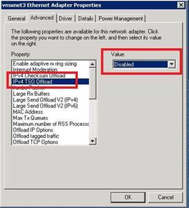
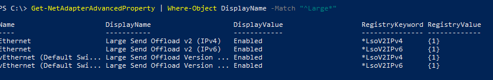
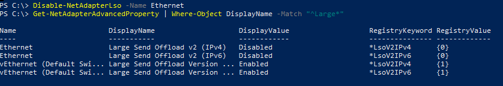
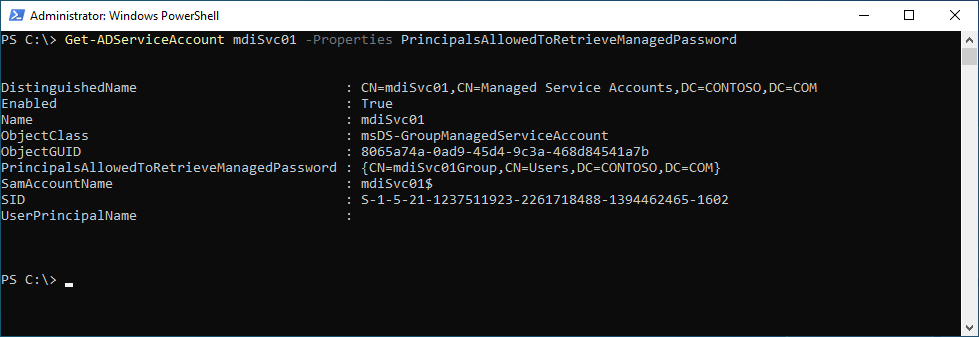

# Troubleshooting Microsoft Defender for Identity known issues

## Sensor failure communication error

If you receive the following sensor failure error:

System.Net.Http.HttpRequestException:
An error occurred while sending the request. ---> System.Net.WebException:
Unable to connect to the remote server --->
System.Net.Sockets.SocketException: A connection attempt failed because the
connected party did not properly respond after a period of time, or established
connection failed because connected host has failed to respond...

**Resolution:**

Make sure that communication isn't blocked for localhost, TCP port 444. To learn more about Microsoft Defender for Identity prerequisites, see [ports](prerequisites.md#ports).

## Deployment log location

The Defender for Identity deployment logs are located in the temp directory of the user who installed the product. In the default installation location, it can be found at: **C:\Users\Administrator\AppData\Local\Temp** (or one directory above **%temp%**). For more information, see [Troubleshooting Defender for Identity using logs](troubleshooting-using-logs.md).

## "Stop legacy protocols communication" recommended action always marked as "Completed"

The existing "Stop legacy protocols communication" recommended action as part of the Microsoft Secure Score is always marked as completed.  
Due to an error, NTLM v1 authentication activities aren't profiled correctly. As a result, the recommended action to remediate them is marked as completed.

**Resolution:**  
We're working to correctly profile the relevant activities as NTLM v1 authentication.

## Proxy authentication problem presents as a licensing error

If during sensor installation you receive the following error:  **The sensor failed to register due to licensing issues.**

**Deployment log entries:**

`[1C60:1AA8][2018-03-24T23:59:13]i000: 2018-03-25 02:59:13.1237 Info  InteractiveDeploymentManager ValidateCreateSensorAsync returned [validateCreateSensorResult=LicenseInvalid]]`
`[1C60:1AA8][2018-03-24T23:59:56]i000: 2018-03-25 02:59:56.4856 Info  InteractiveDeploymentManager ValidateCreateSensorAsync returned [validateCreateSensorResult=LicenseInvalid]]`
`[1C60:1AA8][2018-03-25T00:27:56]i000: 2018-03-25 03:27:56.7399 Debug SensorBootstrapperApplication Engine.Quit [deploymentResultStatus=1602 isRestartRequired=False]]`
`[1C60:15B8][2018-03-25T00:27:56]i500: Shutting down, exit code: 0x642`

**Cause:**

In some cases, when communicating via a proxy, during authentication it might respond to the Defender for Identity sensor with error 401 or 403 instead of error 407. The Defender for Identity sensor interprets error 401 or 403 as a licensing issue and not as a proxy authentication issue.

**Resolution:**

Ensure that the sensor can browse to *.atp.azure.com through the configured proxy without authentication. For more information, see [Configure proxy to enable communication](configure-proxy.md).

## Proxy authentication problem presents as a connection error

If during sensor installation you receive the following error: **The sensor failed to connect to service.**

**Cause:**

The issue can be caused when the trusted root certification authorities certificates required by Defender for Identity are missing.

**Resolution:**

Run the following PowerShell cmdlet to verify that the required certificates are installed.

In the following example, use the "DigiCert Baltimore Root" certificate for all customers. In addition, use the "DigiCert Global Root G2" certificate for commercial customers or use the "DigiCert Global Root CA" certificate for US Government GCC High customers, as indicated.

```powershell
# Certificate for all customers
Get-ChildItem -Path "Cert:\LocalMachine\Root" | where { $_.Thumbprint -eq "D4DE20D05E66FC53FE1A50882C78DB2852CAE474"} | fl

# Certificate for commercial customers
Get-ChildItem -Path "Cert:\LocalMachine\Root" | where { $_.Thumbprint -eq "df3c24f9bfd666761b268073fe06d1cc8d4f82a4"} | fl

# Certificate for US Government GCC High customers
Get-ChildItem -Path "Cert:\LocalMachine\Root" | where { $_.Thumbprint -eq "a8985d3a65e5e5c4b2d7d66d40c6dd2fb19c5436"} | fl
```

Output for certificate for all customers:

```Output
Subject      : CN=Baltimore CyberTrust Root, OU=CyberTrust, O=Baltimore, C=IE
Issuer       : CN=Baltimore CyberTrust Root, OU=CyberTrust, O=Baltimore, C=IE
Thumbprint   : D4DE20D05E66FC53FE1A50882C78DB2852CAE474
FriendlyName : DigiCert Baltimore Root
NotBefore    : 5/12/2000 11:46:00 AM
NotAfter     : 5/12/2025 4:59:00 PM
Extensions   : {System.Security.Cryptography.Oid, System.Security.Cryptography.Oid, System.Security.Cryptography.Oid}
```

Output for certificate for commercial customers certificate:

```Output
Subject      : CN=DigiCert Global Root G2, OU=www.digicert.com, O=DigiCert Inc, C=US
Issuer       : CN=DigiCert Global Root G2, OU=www.digicert.com, O=DigiCert Inc, C=US
Thumbprint   : DF3C24F9BFD666761B268073FE06D1CC8D4F82A4
FriendlyName : DigiCert Global Root G2
NotBefore    : 01/08/2013 15:00:00
NotAfter     : 15/01/2038 14:00:00
Extensions   : {System.Security.Cryptography.Oid, System.Security.Cryptography.Oid, System.Security.Cryptography.Oid}
```

Output for certificate for US Government GCC High customers:

```Output
Subject      : CN=DigiCert Global Root CA, OU=www.digicert.com, O=DigiCert Inc, C=US
Issuer       : CN=DigiCert Global Root CA, OU=www.digicert.com, O=DigiCert Inc, C=US
Thumbprint   : A8985D3A65E5E5C4B2D7D66D40C6DD2FB19C5436
FriendlyName : DigiCert
NotBefore    : 11/9/2006 4:00:00 PM
NotAfter     : 11/9/2031 4:00:00 PM
Extensions   : {System.Security.Cryptography.Oid, System.Security.Cryptography.Oid, System.Security.Cryptography.Oid, System.Security.Cryptography.Oid}
```

If you don't see the expected output, use the following steps:

1. Download the following certificates to the Server Core machine. For all customers, download the [Baltimore CyberTrust root](https://cacerts.digicert.com/BaltimoreCyberTrustRoot.crt) certificate.

    In addition:

    - For commercial customers, download the [DigiCert Global Root G2](https://cacerts.digicert.com/DigiCertGlobalRootG2.crt) certificate
    - For US Government GCC High customers, download the [DigiCert Global Root CA](https://cacerts.digicert.com/DigiCertGlobalRootCA.crt) certificate

1. Run the following PowerShell cmdlet to install the certificate.

    ```powershell
    # For all customers, install certificate
    Import-Certificate -FilePath "<PATH_TO_CERTIFICATE_FILE>\bc2025.crt" -CertStoreLocation Cert:\LocalMachine\Root

    # For commercial customers, install certificate
    Import-Certificate -FilePath "<PATH_TO_CERTIFICATE_FILE>\DigiCertGlobalRootG2.crt" -CertStoreLocation Cert:\LocalMachine\Root

    # For US Government GCC High customers, install certificate
    Import-Certificate -FilePath "<PATH_TO_CERTIFICATE_FILE>\DigiCertGlobalRootCA.crt" -CertStoreLocation Cert:\LocalMachine\Root
    ```

## Silent installation error when attempting to use PowerShell

If during silent sensor installation you attempt to use PowerShell and receive the following error:

```powershell
"Azure ATP sensor Setup.exe" "/quiet" NetFrameworkCommandLineArguments="/q" Acce ... Unexpected token '"/quiet"' in expression or statement."
```

**Cause:**

Failure to include the ./ prefix required to install when using PowerShell causes this error.

**Resolution:**

Use the complete command to successfully install.

```powershell
./"Azure ATP sensor Setup.exe" /quiet NetFrameworkCommandLineArguments="/q" AccessKey="<Access Key>"
```

## Defender for Identity sensor NIC teaming issue

When you install the Defender for Identity sensor on a machine configured with a NIC teaming adapter and the Winpcap driver, you receive an installation error. If you want to install the Defender for Identity sensor on a machine configured with NIC teaming, make sure you replace the Winpcap driver with Npcap by following the [instructions here](/defender-for-identity/technical-faq#how-do-i-download-and-install-or-upgrade-the-npcap-driver).

## Multi Processor Group mode

For Windows Operating systems 2008R2 and 2012, the Defender for Identity sensor isn't supported in a Multi Processor Group mode.

Suggested possible workarounds:

- If hyper threading is on, turn it off. This may reduce the number of logical cores enough to avoid needing to run in **Multi Processor Group** mode.

- If your machine has less than 64 logical cores and is running on an HP host, you may be able to change the **NUMA Group Size Optimization** BIOS setting from the default of **Clustered** to **Flat**.

## VMware virtual machine sensor issue

If you have a Defender for Identity sensor on VMware virtual machines, you might receive the health alert **Some network traffic is not being analyzed**. This can happen because of a configuration mismatch in VMware.

To resolve the issue:

On the Guest OS, set the following to **Disabled** in the virtual machine's NIC configuration: **IPv4 TSO Offload**.



Use the following command to check if Large Send Offload (LSO) is enabled or disabled:

`Get-NetAdapterAdvancedProperty | Where-Object DisplayName -Match "^Large*"`



If LSO is enabled, use the following command to disable it:

`Disable-NetAdapterLso -Name {name of adapter}`



> [!NOTE]
>
> - Depending on your configuration, these actions might cause a brief loss of network connectivity.
> - You may need to restart your machine for these changes to take effect.
> - These steps may vary depending on your VMWare version. Check VMWare documentation for information about how to disable LSO/TSO for your VMWare version.

## Sensor failed to retrieve group managed service account (gMSA) credentials

If you receive the following health alert: **Directory services user credentials are incorrect**

**Sensor log entries:**

`2020-02-17 14:01:36.5315 Info ImpersonationManager CreateImpersonatorAsync started [UserName=account_name Domain=domain1.test.local IsGroupManagedServiceAccount=True]`
`2020-02-17 14:01:36.5750 Info ImpersonationManager CreateImpersonatorAsync finished [UserName=account_name Domain=domain1.test.local IsSuccess=False]`

**Sensor Updater log entries:**

`2020-02-17 14:02:19.6258 Warn GroupManagedServiceAccountImpersonationHelper GetGroupManagedServiceAccountAccessTokenAsync failed GMSA password could not be retrieved [errorCode=AccessDenied AccountName=account_name DomainDnsName=domain1.test.local]`

The sensor failed to retrieve the password of the gMSA account.

### Cause 1

The domain controller hasn't been granted permission to retrieve the password of the gMSA account.

**Resolution 1**:

Validate that the computer running the sensor has been granted permissions to retrieve the password of the gMSA account. For more information, see [Granting the permissions to retrieve the gMSA account's password](directory-service-accounts.md#granting-the-permissions-to-retrieve-the-gmsa-accounts-password).

### Cause 2

The sensor service runs as *LocalService* and performs impersonation of the Directory Service account.

If the user rights assignment policy **Log on as a service** is configured for this domain controller, impersonation fails unless the gMSA account is granted the **Log on as a service** permission.

**Resolution 2**:

Configure **Log on as a service** for the gMSA accounts, when the user rights assignment policy **Log on as a service** is configured on the affected domain controller. For more information, see [Verify that the gMSA account has the required rights (if needed)](directory-service-accounts.md#verify-that-the-gmsa-account-has-the-required-rights-if-needed).

### Cause 3

If the domain controller Kerberos ticket was issued before the domain controller was added to the security group with the proper permissions, this group won't be part of the Kerberos ticket. So it can't retrieve the password of the gMSA account.

**Resolution 3**:

Do one of the following to resolve this issue:

- Reboot the domain controller.
- Purge the Kerberos ticket, forcing the domain controller to request a new Kerberos ticket. From an administrator command prompt on the domain controller, run the following command:

    `klist -li 0x3e7 purge`

- Assign the permission to retrieve the gMSA's password to a group the domain controller is already a member of, such as the Domain Controllers group.

## Sensor service fails to start

**Sensor log entries:**

`Warn DirectoryServicesClient CreateLdapConnectionAsync failed to retrieve group managed service account password. [DomainControllerDnsName=DC1.CONTOSO.LOCAL Domain=contoso.local UserName=AATP_gMSA]`

**Cause:**

The domain controller hasn't been given rights to access the password of the gMSA account.

**Resolution:**

Verify that the domain controller has been given rights to access the password. You should have a Security Group in Active Directory that contains the domain controller(s), AD FS server(s) and standalone sensors computer accounts included. If a Security Group doesn't exist, we recommend that you create one.

You can use the following command to check if a computer account or security group has been added to the parameter. Replace *mdiSvc01* with the name you created.

```powershell
Get-ADServiceAccount mdiSvc01 -Properties PrincipalsAllowedToRetrieveManagedPassword
```

The results should look like this:



In this example, we can see that a group named *mdiSvc01Group* has been added. If the domain controller or the security group hasn't been added, you can use the following commands to add it. Replace *mdiSvc01* with the name of gMSA, and replace *DC1* with the name of the domain controller, or *mdiSvc01Group* with the name of the security group.

```powershell
# To set the specific domain controller only:
$specificDC = Get-ADComputer -Identity DC1
Set-ADServiceAccount mdiSvc01 -PrincipalsAllowedToRetrieveManagedPassword $specificDC


# To set a security group that contains the relevant computer accounts:
$group = Get-ADGroup -Identity mdiSvc01Group
Set-ADServiceAccount mdiSvc01 -PrincipalsAllowedToRetrieveManagedPassword $group
```

If the domain controller or security group is already added, but you're still seeing the error, you can try the following steps:

- **Option 1**: Reboot the server to sync the recent changes
- **Option 2**:
    1. Set the **AATPSensor** and **AATPSensorUpdater** services to Disabled
    1. Stop the **AATPSensor** and **AATPSensorUpdater** services
    1. Cache service account to server using the command: `Install-ADServiceAccount gMSA_AccountName`
    1. Set the **AATPSensor** and **AATPSensorUpdater** services to Automatic
    1. Start the **AATPSensorUpdater** service

## Access to the registry key 'Global' is denied

The sensor service fails to start, and the sensor log contains an entry similar to:

`2021-01-19 03:45:00.0000 Error RegistryKey System.UnauthorizedAccessException: Access to the registry key 'Global' is denied.`

**Cause:**

The gMSA configured for this domain controller or AD FS server doesn't have permissions to the performance counter's registry keys.

**Resolution:**

Add the gMSA to the **Performance Monitor Users** group on the server.

## Report downloads can't contain more than 300,000 entries

Defender for Identity doesn't support report downloads that contain more than 300,000 entries per report. Reports render as incomplete if more than 300,000 entries are included.

**Cause:**

This is an engineering limitation.

**Resolution:**

No known resolution.

## Sensor fails to enumerate event logs

If you observe a limited number, or lack of, security event alerts or logical activities within the Defender for Identity console but no health issues are triggered.

**Sensor log entries:**

`Error EventLogException System.Diagnostics.Eventing.Reader.EventLogException: The handle is invalid
   at void System.Diagnostics.Eventing.Reader.EventLogException.Throw(int errorCode)
   at object System.Diagnostics.Eventing.Reader.NativeWrapper.EvtGetEventInfo(EventLogHandle handle, EvtEventPropertyId enumType)
   at string System.Diagnostics.Eventing.Reader.EventLogRecord.get_ContainerLog()`

**Cause:**

A Discretionary Access Control List is limiting access to the required event logs by the Local Service account.

**Resolution:**

Ensure that the Discretionary Access Control List (DACL) includes the following entry (this is the SID of the AATPSensor service).

`(A;;0x1;;;S-1-5-80-818380073-2995186456-1411405591-3990468014-3617507088)`

Check if the DACL for the Security Event Log was configured by a GPO:

`Policies > Administrative Templates > Windows Components > Event Log Service > Security > Configure log access`

Append the entry above to the existing policy. Run `C:\Windows\System32\wevtutil.exe gl security` afterwards to verify that the entry was added.

The local Defender for Identity logs should now display:

`Info WindowsEventLogReader EnableEventLogWatchers EventLogWatcher enabled [name=Security]`

## ApplyInternal failed two way SSL connection to service error

If during the sensor installation you receive the following error: **ApplyInternal failed two way SSL connection to service** and the sensor log contains an entry similar to:

``2021-01-19 03:45:00.0000 Error CommunicationWebClient+\<SendWithRetryAsync\>d__9`1``
ApplyInternal failed two way SSL connection to service.
The issue can be caused by a proxy with SSL inspection enabled.
[_workspaceApplicationSensorApiEndpoint=Unspecified/contoso.atp.azure.com:443 Thumbprint=7C039DA47E81E51F3DA3DF3DA7B5E1899B5B4AD0]`

**Cause:**

The issue can be caused when the **SystemDefaultTlsVersions** or **SchUseStrongCrypto** registry values aren't set to their default value of 1.

**Resolution:**

Verify the **SystemDefaultTlsVersions** and **SchUseStrongCrypto** registry values are set to 1:

```reg

Windows Registry Editor Version 5.00

[HKEY_LOCAL_MACHINE\SOFTWARE\WOW6432Node\Microsoft\.NETFramework\v4.0.30319] 
"SystemDefaultTlsVersions"=dword:00000001
"SchUseStrongCrypto"=dword:00000001
 
[HKEY_LOCAL_MACHINE\SOFTWARE\Microsoft\.NETFramework\v4.0.30319]
 
"SystemDefaultTlsVersions"=dword:00000001
"SchUseStrongCrypto"=dword:00000001
```

<a name="problem-installing-the-sensor-on-windows-server-2019-with-kb5009557-installed"></a>

## Problem installing the sensor on Windows Server 2019 with KB5009557 installed, or on a server with hardened EventLog permissions

Installing the sensor may fail with the error message:

`System.UnauthorizedAccessException: Attempted to perform an unauthorized operation.`

**Resolution:**

There are two possible workarounds for this issue:

1. Install the sensor with PSExec:

    ```cmd
    psexec -s -i "C:\MDI\Azure ATP Sensor Setup.exe"
    ```

1. Install the sensor with a Scheduled Task configured to run as **LocalSystem**. The command-line syntax to use is mentioned in [Defender for Identity sensor silent installation](install-sensor.md#defender-for-identity-sensor-silent-installation).

## Sensor installation fails due to certificate management client

If the sensor installation fails, and the Microsoft.Tri.Sensor.Deployment.Deployer.log file contains an entry similar to:

`2022-07-15 03:45:00.0000 Error IX509CertificateRequestCertificate2 Deployer failed [arguments=128Ve980dtms0035h6u3Bg==] System.Runtime.InteropServices.COMException (0x80090008): CertEnroll::CX509CertificateRequestCertificate::Encode: Invalid algorithm specified. 0x80090008 (-2146893816 NTE_BAD_ALGID)`

**Cause:**

The issue can be caused when a certificate management client such as Entrust Entelligence Security Provider (EESP) is preventing the sensor installation from creating a self-signed certificate on the machine.

**Resolution:**

Uninstall the certificate management client, install the Defender for Identity sensor, and then reinstall the certificate management client.

>[!NOTE]
>
>The self-signed certificate is renewed every 2 years, and the auto-renewal process might fail if the certificate management client prevents the self-signed certificate creation.
> This will cause the sensor to stop communicating with the backend, which will require a sensor reinstallation using the workaround mentioned above.

## Sensor installation fails due to network connectivity issues

If the sensor installation fails with an error code of 0x80070643, and the installation log file contains an entry similar to:

`[22B8:27F0][2016-06-09T17:21:03]e000: Error 0x80070643: Failed to install MSI package.`

**Cause:**

The issue can be caused when the installation process can't access the Defender for Identity cloud services for the sensor registration.

**Resolution:**

Ensure that the sensor can browse to \*.atp.azure.com directly or through the configured proxy. If needed, set the proxy server settings for the installation using the command line:

`"Azure ATP sensor Setup.exe" [ProxyUrl="http://proxy.internal.com"] [ProxyUserName="domain\proxyuser"] [ProxyUserPassword="ProxyPassword"]`

For more information, see [Configure proxy server using the command line](configure-proxy.md#configure-proxy-server-using-the-command-line).

## Sensor service could not run and remains in Starting state

The following errors will appear in the **System log** in **Event viewer**:

- The Open procedure for service ".NETFramework" in DLL "C:\Windows\system32\mscoree.dll" failed with error code Access is denied. Performance data for this service won't be available.
- The Open procedure for service "Lsa" in DLL "C:\Windows\System32\Secur32.dll" failed with error code Access is denied. Performance data for this service will not be available.
- The Open procedure for service "WmiApRpl" in DLL "C:\Windows\system32\wbem\wmiaprpl.dll" failed with error code "The device is not ready". Performance data for this service won't be available.

The Microsoft.TriSensorError.log will contain an error similar to this:

`Microsoft.Tri.Sensor.DirectoryServicesClient.TryCreateLdapConnectionAsync(DomainControllerConnectionData domainControllerConnectionData, bool isGlobalCatalog, bool isTraversing)
2021-07-13 14:56:20.2976 Error DirectoryServicesClient Microsoft.Tri.Infrastructure.ExtendedException: Failed to communicate with configured domain controllers
at new Microsoft.Tri.Sensor.DirectoryServicesClient(IConfigurationManager`

**Cause:**

NT Service\All Services don't have the right to log on as a service.

**Resolution:**

Add Domain Controller Policy with the logon as a service, as explained in the note under [Verify that the gMSA account has the required rights (if needed)](directory-service-accounts.md#verify-that-the-gmsa-account-has-the-required-rights-if-needed).

## Your workspace wasn't created because a security group with the same name already exists in Azure Active Directory

**Cause:**

The issue can come up when a Defender for Identity workspace license expires and is deleted when the retention period has ended, but the Azure AD groups weren't deleted.

**Resolution:**

1. Go to the [Azure portal](https://portal.azure.com/) -> [Azure Active Directory](https://portal.azure.com/#view/Microsoft_AAD_IAM/ActiveDirectoryMenuBlade/~/Overview) -> [Groups](https://portal.azure.com/#view/Microsoft_AAD_IAM/GroupsManagementMenuBlade/~/AllGroups)
1. Rename the following three groups (where workspaceName is the name of your workspace), by adding to them a " - old" suffix:
   - "Azure ATP workspaceName Administrators" -> "Azure ATP workspaceName Administrators - old"
   - "Azure ATP workspaceName Viewers" -> "Azure ATP workspaceName Viewers - old"
   - "Azure ATP workspaceName Users" -> "Azure ATP workspaceName Users - old"
1. Then you can go back in the [Microsoft 365 Defender portal](https://security.microsoft.com), to the [Settings](https://security.microsoft.com/securitysettings) -> [Identities](https://security.microsoft.com/settings/identities) section to create the new workspace for Defender for Identity.

## See also

- [Defender for Identity prerequisites](prerequisites.md)
- [Defender for Identity capacity planning](capacity-planning.md)
- [Configure event collection](configure-event-collection.md)
- [Configuring Windows event forwarding](configure-event-forwarding.md)
- [Check out the Defender for Identity forum!](<https://aka.ms/MDIcommunity>)
