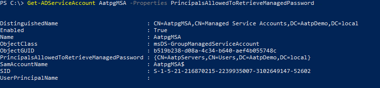

# Troubleshooting Microsoft Defender for Identity Known Issues

## Sensor failure communication error

If you receive the following sensor failure error:

System.Net.Http.HttpRequestException:
An error occurred while sending the request. ---> System.Net.WebException:
Unable to connect to the remote server --->
System.Net.Sockets.SocketException: A connection attempt failed because the
connected party did not properly respond after a period of time, or established
connection failed because connected host has failed to respond...

**Resolution:**

Make sure that communication isn't blocked for localhost, TCP port 444. To learn more about [!INCLUDE [Product long](includes/product-long.md)] prerequisites, see [ports](prerequisites.md#ports).

## Deployment log location

The [!INCLUDE [Product short](includes/product-short.md)] deployment logs are located in the temp directory of the user who installed the product. In the default installation location, it can be found at: C:\Users\Administrator\AppData\Local\Temp (or one directory above %temp%). For more information, see [Troubleshooting [!INCLUDE [Product short](includes/product-short.md)] using logs](troubleshooting-using-logs.md)

## Proxy authentication problem presents as a licensing error

If during sensor installation you receive the following error:  **The sensor failed to register due to licensing issues.**

**Deployment log entries:**

[1C60:1AA8][2018-03-24T23:59:13]i000: 2018-03-25 02:59:13.1237 Info  InteractiveDeploymentManager ValidateCreateSensorAsync returned [validateCreateSensorResult=LicenseInvalid]]
[1C60:1AA8][2018-03-24T23:59:56]i000: 2018-03-25 02:59:56.4856 Info  InteractiveDeploymentManager ValidateCreateSensorAsync returned [validateCreateSensorResult=LicenseInvalid]]
[1C60:1AA8][2018-03-25T00:27:56]i000: 2018-03-25 03:27:56.7399 Debug SensorBootstrapperApplication Engine.Quit [deploymentResultStatus=1602 isRestartRequired=False]]
[1C60:15B8][2018-03-25T00:27:56]i500: Shutting down, exit code: 0x642

**Cause:**

In some cases, when communicating via a proxy, during authentication it might respond to the [!INCLUDE [Product short](includes/product-short.md)] sensor with error 401 or 403 instead of error 407. The [!INCLUDE [Product short](includes/product-short.md)] sensor will interpret error 401 or 403 as a licensing issue and not as a proxy authentication issue.

**Resolution:**

Ensure that the sensor can browse to *.atp.azure.com through the configured proxy without authentication. For more information, see [Configure proxy to enable communication](configure-proxy.md).

## Proxy authentication problem presents as a connection error

If during sensor installation you receive the following error: **The sensor failed to connect to service.**

**Cause:**

The issue can be caused when the trusted root certification authorities certificates required by Defender for Identity are missing.

**Resolution:**

Run the following PowerShell cmdlet to verify that the required certificates are installed.

In the following example, use the "DigiCert Baltimore Root" certificate for all customers. In addition, use the "DigiCert Global Root G2" certificate for commercial customers or use the "DigiCert Global Root CA" certificate for US Government GCC High customers, as indicated.

```powershell
# Certificate for all customers
Get-ChildItem -Path "Cert:\LocalMachine\Root" | where { $_.Thumbprint -eq "D4DE20D05E66FC53FE1A50882C78DB2852CAE474"} | fl

# Certificate for commercial customers
Get-ChildItem -Path "Cert:\LocalMachine\Root" | where { $_.Thumbprint -eq "df3c24f9bfd666761b268073fe06d1cc8d4f82a4"} | fl

# Certificate for US Government GCC High customers
Get-ChildItem -Path "Cert:\LocalMachine\Root" | where { $_.Thumbprint -eq "a8985d3a65e5e5c4b2d7d66d40c6dd2fb19c5436"} | fl
```

Output for certificate for all customers:

```Output
Subject      : CN=Baltimore CyberTrust Root, OU=CyberTrust, O=Baltimore, C=IE
Issuer       : CN=Baltimore CyberTrust Root, OU=CyberTrust, O=Baltimore, C=IE
Thumbprint   : D4DE20D05E66FC53FE1A50882C78DB2852CAE474
FriendlyName : DigiCert Baltimore Root
NotBefore    : 5/12/2000 11:46:00 AM
NotAfter     : 5/12/2025 4:59:00 PM
Extensions   : {System.Security.Cryptography.Oid, System.Security.Cryptography.Oid, System.Security.Cryptography.Oid}
```

Output for certificate for commercial customers certificate:

```Output
Subject      : CN=DigiCert Global Root G2, OU=www.digicert.com, O=DigiCert Inc, C=US
Issuer       : CN=DigiCert Global Root G2, OU=www.digicert.com, O=DigiCert Inc, C=US
Thumbprint   : DF3C24F9BFD666761B268073FE06D1CC8D4F82A4
FriendlyName : DigiCert Global Root G2
NotBefore    : 01/08/2013 15:00:00
NotAfter     : 15/01/2038 14:00:00
Extensions   : {System.Security.Cryptography.Oid, System.Security.Cryptography.Oid, System.Security.Cryptography.Oid}
```

Output for certificate for US Government GCC High customers:

```Output
Subject      : CN=DigiCert Global Root CA, OU=www.digicert.com, O=DigiCert Inc, C=US
Issuer       : CN=DigiCert Global Root CA, OU=www.digicert.com, O=DigiCert Inc, C=US
Thumbprint   : A8985D3A65E5E5C4B2D7D66D40C6DD2FB19C5436
FriendlyName : DigiCert
NotBefore    : 11/9/2006 4:00:00 PM
NotAfter     : 11/9/2031 4:00:00 PM
Extensions   : {System.Security.Cryptography.Oid, System.Security.Cryptography.Oid, System.Security.Cryptography.Oid, System.Security.Cryptography.Oid}
```

If you don't see the expected output, use the following steps:

1. Download the following certificates to the Server Core machine. For all customers, download the [Baltimore CyberTrust root](https://cacerts.digicert.com/BaltimoreCyberTrustRoot.crt) certificate.

    In addition:

    - For commercial customers, download the [DigiCert Global Root G2](https://cacerts.digicert.com/DigiCertGlobalRootG2.crt) certificate
    - For US Government GCC High customers, download the [DigiCert Global Root CA](https://cacerts.digicert.com/DigiCertGlobalRootCA.crt) certificate

1. Run the following PowerShell cmdlet to install the certificate.

    ```powershell
    # For all customers, install certificate
    Import-Certificate -FilePath "<PATH_TO_CERTIFICATE_FILE>\bc2025.crt" -CertStoreLocation Cert:\LocalMachine\Root

    # For commercial customers, install certificate
    Import-Certificate -FilePath "<PATH_TO_CERTIFICATE_FILE>\DigiCertGlobalRootG2.crt" -CertStoreLocation Cert:\LocalMachine\Root

    # For US Government GCC High customers, install certificate
    Import-Certificate -FilePath "<PATH_TO_CERTIFICATE_FILE>\DigiCertGlobalRootCA.crt" -CertStoreLocation Cert:\LocalMachine\Root
    ```

## Silent installation error when attempting to use PowerShell

If during silent sensor installation you attempt to use PowerShell and receive the following error:

```powershell
"Azure ATP sensor Setup.exe" "/quiet" NetFrameworkCommandLineArguments="/q" Acce ... Unexpected token '"/quiet"' in expression or statement."
```

**Cause:**

Failure to include the ./ prefix required to install when using PowerShell causes this error.

**Resolution:**

Use the complete command to successfully install.

```powershell
./"Azure ATP sensor Setup.exe" /quiet NetFrameworkCommandLineArguments="/q" AccessKey="<Access Key>"
```

## Defender for Identity sensor NIC teaming issue

If you attempt to install the [!INCLUDE [Product short](includes/product-short.md)] sensor on a machine configured with a NIC Teaming adapter, you receive an installation error. If you want to install the [!INCLUDE [Product short](includes/product-short.md)] sensor on a machine configured with NIC teaming, make sure you deploy the Npcap driver by following the [instructions here](/defender-for-identity/technical-faq#how-do-i-download-and-install-the-npcap-driver).

## Multi Processor Group mode

For Windows Operating systems 2008R2 and 2012, [!INCLUDE [Product short](includes/product-short.md)] Sensor isn't supported in a Multi Processor Group mode.

Suggested possible workarounds:

- If hyper threading is on, turn it off. This may reduce the number of logical cores enough to avoid needing to run in **Multi Processor Group** mode.

- If your machine has less than 64 logical cores and is running on an HP host, you may be able to change the **NUMA Group Size Optimization** BIOS setting from the default of **Clustered** to **Flat**.

## Microsoft Defender for Endpoint integration issue

[!INCLUDE [Product short](includes/product-short.md)] enables you to integrate [!INCLUDE [Product short](includes/product-short.md)] with Microsoft Defender for Endpoint. See [Integrate [!INCLUDE [Product short](includes/product-short.md)] with Microsoft Defender for Endpoint](integrate-mde.md) for more information.

## VMware virtual machine sensor issue

If you have a [!INCLUDE [Product short](includes/product-short.md)] sensor on VMware virtual machines, you might receive the health alert **Some network traffic is not being analyzed**. This can happen because of a configuration mismatch in VMware.

To resolve the issue:

On the Guest OS, set the following to **Disabled** in the virtual machine's NIC configuration: **IPv4 TSO Offload**.


Use the following command to check if Large Send Offload (LSO) is enabled or disabled:

`Get-NetAdapterAdvancedProperty | Where-Object DisplayName -Match "^Large*"`


If LSO is enabled, use the following command to disable it:

`Disable-NetAdapterLso -Name {name of adapter}`


> [!NOTE]
>
> - Depending on your configuration, these actions might cause a brief loss of network connectivity.
> - You may need to restart your machine for these changes to take effect.
> - These steps may vary depending on your VMWare version. Check VMWare documentation for information about how to disable LSO/TSO for your VMWare version.

## Sensor failed to retrieve group Managed Service Account (gMSA) credentials

If you receive the following health alert: **Directory services user credentials are incorrect**

**Sensor log entries:**

2020-02-17 14:01:36.5315 Info ImpersonationManager CreateImpersonatorAsync started [UserName=account_name Domain=domain1.test.local IsGroupManagedServiceAccount=True]
2020-02-17 14:01:36.5750 Info ImpersonationManager CreateImpersonatorAsync finished [UserName=account_name Domain=domain1.test.local IsSuccess=False]

**Sensor Updater log entries:**

2020-02-17 14:02:19.6258 Warn GroupManagedServiceAccountImpersonationHelper GetGroupManagedServiceAccountAccessTokenAsync failed GMSA password could not be retrieved [errorCode=AccessDenied AccountName=account_name DomainDnsName=domain1.test.local]

The sensor failed to retrieve the password of the gMSA account.

### Cause 1

The domain controller hasn't been granted permission to retrieve the password of the gMSA account.

**Resolution 1**:

Validate that the domain controller computer has been granted permissions to retrieve the password of the gMSA account.

### Cause 2

The sensor service runs as *LocalService* and performs impersonation of the directory services account.

If the user rights assignment policy **Log on as a service** is configured for this domain controller, impersonation will fail unless the gMSA account is granted the **Log on as a service** permission.

**Resolution 2**:

Configure **Log on as a service** for the gMSA accounts, when the user rights assignment policy **Log on as a service** is configured on the affected domain controller.

### Cause 3

If the domain controller Kerberos ticket was issued before the domain controller was added to the security group with the proper permissions, this group won't be part of the Kerberos ticket. So it won't be able to retrieve the password of the gMSA account.

**Resolution 3**:

Do one of the following to resolve this issue:

- Reboot the domain controller.
- Purge the Kerberos ticket, forcing the domain controller to request a new Kerberos ticket. From an administrator command prompt on the domain controller, run the following command:

    `klist -li 0:0x3e7 purge`

- Assign the permission to retrieve the gMSA's password to a group the domain controller is already a member of, such as the Domain Controllers group.

## Sensor service fails to start

**Sensor log entries:**

Warn DirectoryServicesClient CreateLdapConnectionAsync failed to retrieve group managed service account password. [DomainControllerDnsName=DC1.CONTOSO.LOCAL Domain=contoso.local UserName=AATP_gMSA]

**Cause:**

The domain controller hasn't been given rights to access the password of the gSMA account.

**Resolution:**

Verify that the domain controller has been given rights to access the password. You should have a Security Group in Active Directory with the domain controller and standalone sensors included. If this doesn't exist, we recommend that you create one.

You can use the following command to check if the machine or security group has been added to the parameter. Replace *AccountName* with the name you created.

```powershell
Get-ADServiceAccount AccountName -Properties PrincipalsAllowedToRetrieveManagedPassword
```

The results should look like this:



In this example, we can see that the domain controller *AATPDemo* has been added. If the domain controller or the security group hasn't been added, we can use the following command below to add it. Replace *Host1* with the name of the domain controller or the name of the security group.

```powershell
Set-ADServiceAccount gmsaAccountName -PrincipalsAllowedToRetrieveManagedPassword Host1
```

If the domain controller or security group is already added, but you're still seeing the error, you can try the following steps:

- **Option 1**: Reboot the server to sync the recent changes
- **Option 2**:
    1. Stop **AATPSensor** and **AATPSensorUpdater**
    1. Cache service account to server: `Install-ADServiceAccount AccountName`
    1. Start **AATPSensor**

## Report downloads cannot contain more than 300,000 entries

[!INCLUDE [Product short](includes/product-short.md)] doesn't support report downloads that contain more than 300,000 entries per report. Reports will render as incomplete if more than 300,000 entries are included.

**Cause:**

This is an engineering limitation.

**Resolution:**

No known resolution.

## Sensor fails to enumerate event logs

If you observe a limited number, or lack of, security event alerts or logical activities within the [!INCLUDE [Product short](includes/product-short.md)] console but no health alerts are triggered.

**Sensor log entries:**

Error EventLogException System.Diagnostics.Eventing.Reader.EventLogException: The handle is invalid
   at void System.Diagnostics.Eventing.Reader.EventLogException.Throw(int errorCode)
   at object System.Diagnostics.Eventing.Reader.NativeWrapper.EvtGetEventInfo(EventLogHandle handle, EvtEventPropertyId enumType)
   at string System.Diagnostics.Eventing.Reader.EventLogRecord.get_ContainerLog()

**Cause:**

A Discretionary Access Control List is limiting access to the required event logs by the Local Service account.

**Resolution:**

Ensure that the Discretionary Access Control List includes the following entry:

`(A;;0x1;;;S-1-5-80-818380073-2995186456-1411405591-3990468014-3617507088)`

## ApplyInternal failed two way SSL connection to service error

If during the sensor installation you receive the following error: **ApplyInternal failed two way SSL connection to service** and the sensor log contains an entry similar to:

2021-01-19 03:45:00.0000 Error CommunicationWebClient+\<SendWithRetryAsync\>d__9`1
ApplyInternal failed two way SSL connection to service.
The issue can be caused by a proxy with SSL inspection enabled.
[_workspaceApplicationSensorApiEndpoint=Unspecified/contoso.atp.azure.com:443 Thumbprint=7C039DA47E81E51F3DA3DF3DA7B5E1899B5B4AD0]

**Cause:**

The issue can be caused when the **SystemDefaultTlsVersions** or **SchUseStrongCrypt**o registry values aren't set to their default value of 1.

**Resolution:**

Verify the **SystemDefaultTlsVersions** and **SchUseStrongCrypto** registry values are set to 1:

```reg
[HKEY_LOCAL_MACHINE\SOFTWARE\WOW6432Node\Microsoft\.NETFramework\v4.0.30319] 
"SystemDefaultTlsVersions"=dword:00000001
"SchUseStrongCrypto"=dword:00000001
 
[HKEY_LOCAL_MACHINE\SOFTWARE\Microsoft\.NETFramework\v4.0.30319]
 
"SystemDefaultTlsVersions"=dword:00000001
"SchUseStrongCrypto"=dword:00000001
```

## See Also

- [[!INCLUDE [Product short](includes/product-short.md)] prerequisites](prerequisites.md)
- [[!INCLUDE [Product short](includes/product-short.md)] capacity planning](capacity-planning.md)
- [Configure event collection](configure-event-collection.md)
- [Configuring Windows event forwarding](configure-event-forwarding.md)
- [Check out the [!INCLUDE [Product short](includes/product-short.md)] forum!](<https://aka.ms/MDIcommunity>)
