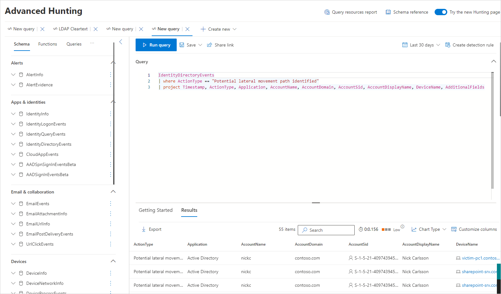

# Understand and investigate Lateral Movement Paths (LMPs) with Microsoft Defender for Identity

Lateral movement is when an attacker uses non-sensitive accounts to gain access to sensitive accounts throughout your network. Lateral movement is used by attackers to identify and gain access to the sensitive accounts and machines in your network that share stored sign-in credentials in accounts, groups and machines. Once an attacker makes successful lateral moves towards your key targets, the attacker can also take advantage and gain access to your domain controllers. Lateral movement attacks are carried out using many of the methods described in [Microsoft Defender for Identity Security Alerts](alerts-overview.md).

A key component of Microsoft Defender for Identity's security insights are Lateral Movement Paths or LMPs. Defender for Identity LMPs are visual guides that help you quickly understand and identify exactly how attackers can move laterally inside your network. The purpose of lateral movements within the cyber-attack kill chain are for attackers to gain and compromise your sensitive accounts using non-sensitive accounts. Compromising your sensitive accounts gets them another step closer to their ultimate goal, domain dominance. To stop these attacks from being successful, Defender for Identity LMPs give you easy to interpret, direct visual guidance on your most vulnerable, sensitive accounts. LMPs help you mitigate and prevent those risks in the future, and close attacker access before they achieve domain dominance.

For example:

:::image type="content" source="media/lmp-new.png" alt-text="Screenshot of a lateral movement path with details showing." lightbox="media/lmp-new.png":::

Lateral movement attacks are typically accomplished using a number of different techniques. Some of the most popular methods used by attackers are credential theft and Pass the Ticket. In both methods, your non-sensitive accounts are used by attackers for lateral moves by exploiting non-sensitive machines that share stored sign-in credentials in accounts, groups and machines with sensitive accounts.

Watch the following video to learn more about reducing lateral movement paths with Defender for Identity:

 

> [!VIDEO https://www.microsoft.com/en-us/videoplayer/embed/RWAOfW]

## Where can I find Defender for Identity LMPs?

Every identity discovered by Defender for Identity to be in an LMP has a **Lateral movement paths** information under the **Observed in organization** tab. For example:

:::image type="content" source="media/view-different-date-new.png" alt-text="Lateral movement paths.":::

The LMP for each entity provides different information depending on the sensitivity of the entity:

- Sensitive users – potential LMP(s) leading to this user are shown.
- Non-sensitive users and computers – potential LMP(s) the entity is related to are shown.

Each time the tab is selected, Defender for Identity displays the most recently discovered LMP. Each potential LMP is saved for 48 hours following discovery. LMP history is available. View older LMPs that were discovered in the past by choosing **Select a date**. You can also choose a different user who initiated the LMP by selecting **Path initiator**.

## LMP discovery using advanced hunting

To proactively discover lateral movement path activities, you can run an advanced hunting query.

Here's an example of such a query:

For instructions on how to run advanced hunting queries, see [Proactively hunt for threats with advanced hunting in Microsoft 365 Defender](/microsoft-365/security/defender/advanced-hunting-overview).

## LMP related entities

LMP can now directly assist with your investigation process. Defender for Identity security alert evidence lists provide the related entities that are involved in each potential lateral movement path. The evidence lists directly help your security response team increase or reduce the importance of the security alert and/or investigation of the related entities. For example, when a Pass the Ticket alert is issued, the source computer, compromised user and destination computer the stolen ticket was used from, are all part of the potential lateral movement path leading to a sensitive user. The existence of the detected LMP makes investigating the alert and watching the suspected user even more important to prevent your adversary from additional lateral moves. Trackable evidence is provided in LMPs to make it easier and faster for you to prevent attackers from moving forward in your network.

## Lateral Movement paths security assessment

Microsoft Defender for Identity continuously monitors your environment to identify sensitive accounts with the riskiest lateral movement paths that expose a security risk, and reports on these accounts to assist you in managing your environment. Paths are considered risky if they have three or more non-sensitive accounts that can expose the sensitive account to credential theft by malicious actors. To discover which of your sensitive accounts have risky lateral movement paths, review the **Riskiest lateral movement paths (LMP)** security assessment. Based on the recommendations, you can remove the entity from the group, or remove the local administrator permissions for the entity from the specified device.

For more information, see [Security assessment: Riskiest lateral movement paths (LMP)](security-assessment-riskiest-lmp.md).

## Preventative best practices

Security insights are never too late to prevent the next attack and remediate damage. For this reason, investigating an attack even during the domain dominance phase provides a different, but important example. Typically, while investigating a security alert such as Remote Code Execution, if the alert is a true positive, your domain controller may already be compromised. But LMPs inform on where the attacker gained privileges, and what path they used into your network. Used this way, LMPs can also offer key insights into how to remediate.

- The best way to prevent lateral movement exposure within your organization is to make sure that sensitive users only use their administrator credentials when logging into hardened computers. In the example, check if admin in the path actually needs access to the shared computer. If they do need access, make sure they sign in to the shared computer with a username and password other than their admin credentials.

- Verify that your users don't have unnecessary administrative permissions. In the example, check if everyone in the shared group actually requires admin rights on the exposed computer.

- Make sure people only have access to necessary resources. In the example, Ron Harper significantly widens Nick Cowley's exposure. Is it necessary for Ron Harper to be included in the group? Are there subgroups that could be created to minimize lateral movement exposure?

> [!TIP]
> When no potential lateral movement path activity is detected for an entity in the past 48 hours, choose **Select a date** and check for previous potential lateral movement paths.

> [!IMPORTANT]
> For instructions on how to set your clients and servers to allow Defender for Identity to perform the SAM-R operations needed for lateral movement path detection, see [Configure Microsoft Defender for Identity to make remote calls to SAM](deploy/remote-calls-sam.md).

## Investigate lateral movement paths

There are multiple ways to use and investigate LMPs. In the Microsoft 365 Defender portal, search by entity and then explore by path or activity.

1. From the portal, search for a user. Under **Observed in organization** (in both the **Overview** and **Observed** tabs) you can see if the user is discovered in a potential LMP.

1. If the user is discovered, select the **Observed in organization** tab and choose **Lateral movement paths**.

1. The graph that is displayed provides a map of the possible paths to the sensitive user during the 48-hour time period. Use the **Select a date** option to display the graph for previous lateral movement path detections for the entity.

1. Review the graph to see what you can learn about exposure of your sensitive user's credentials. For example, in the path, follow the **Logged into by** arrows to see where Nick logged in with their privileged credentials. In this case, Nick's sensitive credentials were saved on the displayed computer. Now, notice which other users logged into which computers that created the most exposure and vulnerability. In this example, Elizabeth King has the ability to access user credentials from that resource.

## Next steps

- [Configure Microsoft Defender for Identity to make remote calls to SAM](deploy/remote-calls-sam.md)
- [Security assessment: Riskiest lateral movement paths (LMP)](security-assessment-riskiest-lmp.md)
- [Working with security alerts](/defender-for-identity/manage-security-alerts)
- [Check out the Defender for Identity forum!](<https://aka.ms/MDIcommunity>)
