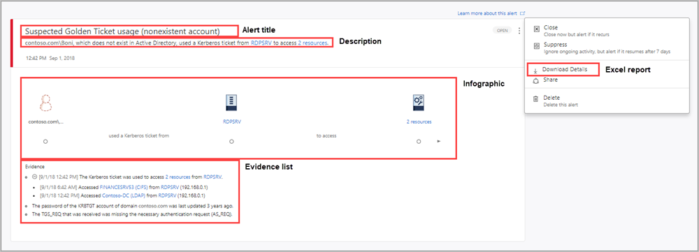
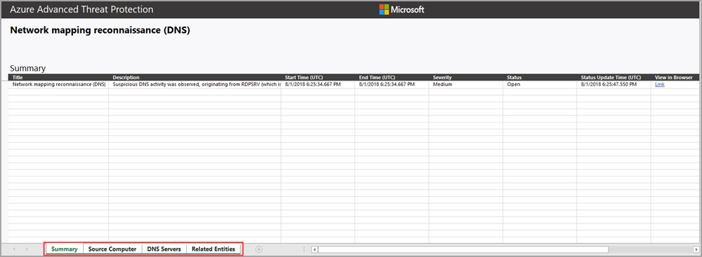
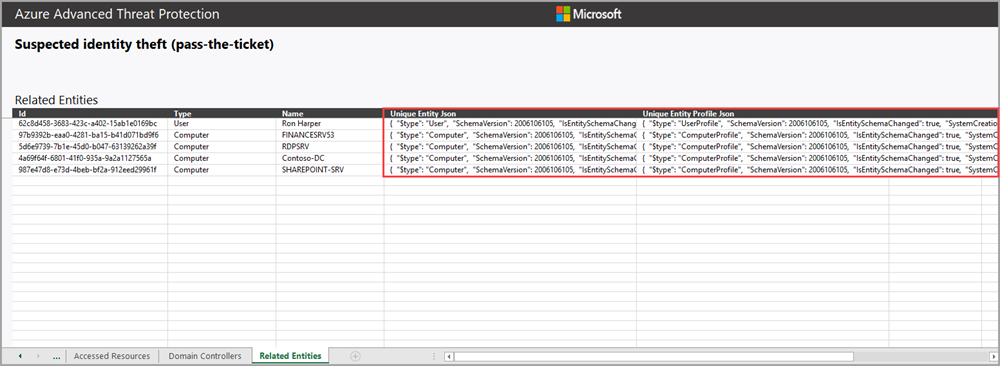
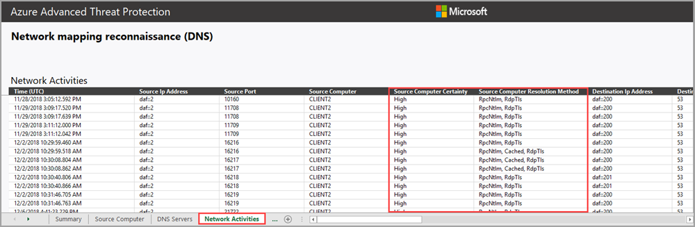

# Understanding security alerts

Microsoft Defender for Identity security alerts explain in clear language and graphics, which suspicious activities were identified on your network and the actors and computers involved in the threats. Alerts are graded for severity, color-coded to make them easy to visually filter, and organized by threat phase. Each alert is designed to help you quickly understand exactly what is happening on your network. Alert evidence lists contain direct links to the involved users and computers, to help make your investigations easy and direct.

In this article, you'll learn the structure of Defender for Identity security alerts, and how to use them.

> [!div class="checklist"]
>
> - Security alert structure
> - Security alert classifications
> - Security alert categories
> - Advanced Security Alert investigation
> - Related entities
> - Defender for Identity and NNR (Network Name Resolution)

## Security alert structure

Each Defender for Identity security alert includes an **Alert story**. This the chain of events  related to this alert in chronological order, and other important information related to the alert.

On the alert page you can:

- **Manage alert** - change the alert's status, assignment, and classification. You can also add a comment here.
- **Export** - download a detailed Excel report for analysis
- **Link alert to another incident** - link an alert to a new existing incident

  

For more information about alerts, see [Investigate alerts in Microsoft 365 Defender](/microsoft-365/security/defender/investigate-alerts).

## Security alert classifications

Following proper investigation, all Defender for Identity security alerts can be classified as one of the following activity types:

- **True positive (TP)**: A malicious action detected by Defender for Identity.

- **Benign true positive (B-TP)**: An action detected by Defender for Identity that is real, but not malicious, such as a penetration test or known activity generated by an approved application.

- **False positive (FP)**: A false alarm, meaning the activity didn't happen.

### Is the security alert a TP, B-TP, or FP

For each alert, ask the following questions to determine the alert classification and help decide what to do next:

1. How common is this specific security alert in your environment?
1. Was the alert triggered by the same types of computers or users?
   For example, servers with the same role or users from the same group/department? If the computers or users were similar, you may decide to exclude it to avoid additional future FP alerts.

Note: An increase of alerts of the exact same type typically reduces the suspicious/importance level of the alert. For repeated alerts, verify configurations, and use security alert details and definitions to understand exactly what is happening that trigger the repeats.

## Security alert categories

Defender for Identity security alerts are divided into the following categories or phases, like the phases seen in a typical cyberattack kill chain. Learn more about each phase and the alerts designed to detect each attack, using the following links:

- [Reconnaissance alerts](reconnaissance-alerts.md)
- [Compromised credential alerts](compromised-credentials-alerts.md)
- [Lateral movement alerts](lateral-movement-alerts.md)
- [Domain dominance alerts](domain-dominance-alerts.md)
- [Exfiltration alerts](exfiltration-alerts.md)

## Advanced security alert investigation

To get more details on a security alert, download the detailed Excel alert report.

1. Select the three dots in the upper right corner of any alert, then select **Download Details**.

Each Defender for Identity alert Excel download provides the following information:

- Summary – the first tab includes the highlights of the alert
  - Title
  - Description
  - Start Time (UTC)
  - End Time (UTC)
  - Severity – Low/Medium/High
  - Status – Open/Closed
  - Status Update Time (UTC)
  - View in browser
- All involved entities (accounts, computers, and resources) are listed, separated by their role.
  - Source, destination, or attacked, depending on the alert.
- Most of the tabs include the following data per entity:
  - Name
  - Details
  - Type
  - SamName
  - Source Computer
  - Source User (if available)
  - Domain Controllers
  - Accessed Resource: Time, Computer, Name, Details, Type, Service.
  - Additional tabs per alert:
    - On attacked accounts when the suspected attack used Brute Force.
    - On Domain Name System (DNS) servers when the suspected attacked involved network mapping reconnaissance (DNS).
  - Related entities: ID, Type, Name, Unique Entity Json, Unique Entity Profile Json
- All raw activities captured by Defender for Identity Sensors related to the alert (network or event activities) including:
  - Network Activities
  - Event Activities

### Related entities

In each alert, the last tab provides the **Related Entities**. Related entities are all entities involved in a suspicious activity, without the separation of the "role" they played in the alert. Each entity has two Json files, the Unique Entity Json and Unique Entity Profile Json. Use these two Json files to learn more about the entity and to help you investigate the alert.

#### Unique Entity Json

Includes the data Defender for Identity learned from Active Directory about the account. This includes all attributes such as *Distinguished Name*, *SID*, *LockoutTime*, and *PasswordExpiryTime*. For user accounts, includes data such as *Department*, *Mail*, and *PhoneNumber*. For computer accounts, includes data such as *OperatingSystem*, *IsDomainController*, and *DnsName*.

#### Unique Entity Profile Json

Includes all data Defender for Identity profiled on the entity. Defender for Identity uses the network and event activities captured to learn about the environment's users and computers. Defender for Identity profiles relevant information per entity. This information contributes Defender for Identity's threat identification capabilities.

### How can I use Defender for Identity information in an investigation?

Investigations can be as detailed as needed. Here are some ideas of ways to investigate using the data provided by Defender for Identity.

- Check if all related users belong to the same group or department.
- Do related users share resources, applications, or computers?
- Is an account active even though its PasswordExpiryTime already passed?

## Defender for Identity and NNR (Network Name Resolution)

Defender for Identity detection capabilities rely on active Network Name Resolution (NNR) to resolve IPs to computers in your organization. Using NNR, Defender for Identity is able to correlate between raw activities (containing IP addresses), and the relevant computers involved in each activity. Based on the raw activities, Defender for Identity profiles entities, including computers, and generates alerts.

NNR data is crucial for detecting the following alerts:

- Suspected identity theft (pass-the-ticket)
- Suspected DCSync attack (replication of directory services)
- Network mapping reconnaissance (DNS)

Use the NNR information provided in the **Network Activities** tab of the alert download report, to determine if an alert is an **FP**. In cases of an **FP** alert, it's common to have the NNR certainty result given with low confidence.

Download report data appears in two columns:

- **Source/Destination computer**

  - *Certainty* – low-resolution certainty may indicate incorrect name resolution.
- **Source/Destination computer**
  - *Resolution method* – provides the NNR methods used to resolve the IP to computer in the organization.

For more information about how to work with Defender for Identity security alerts, see [Working with security alerts](/defender-for-identity/manage-security-alerts).

## See Also

- [Investigate a user](/defender-for-identity/investigate-assets#investigation-steps-for-suspicious-users)
- [Investigate a computer](/defender-for-identity/investigate-assets#investigation-steps-for-suspicious-devices)
- [Working with lateral movement paths](/defender-for-identity/understand-lateral-movement-paths)
- [Check out the Defender for Identity forum!](<https://aka.ms/MDIcommunity>)
