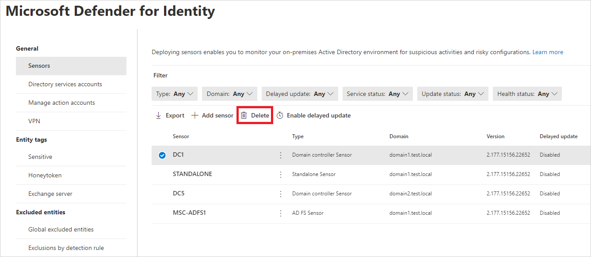

# Uninstall the Microsoft Defender for Identity sensor

This article describes how to uninstall the Microsoft Defender for Identity sensor from domain controllers for the following scenarios:

1. Uninstall a sensor from a domain controller
1. Remove an orphaned sensor
1. Remove a duplicate sensor

## Uninstall a sensor from a domain controller

The following steps describe how to uninstall a sensor from a domain controller.

1. Sign in to the domain controller with administrative privileges.
1. From the Windows **Start** menu, select **Settings** > **Control Panel** > **Add/ Remove Programs**.
1. Select the sensor installation, select **Uninstall**, and follow the instructions to remove the sensor.

> [!IMPORTANT]
> We recommend removing the sensor from the domain controller before demoting the domain controller.

## Remove an orphaned sensor

This scenario can occur when a domain controller was deleted without first uninstalling the sensor, and the sensor still appears in the Microsoft 365 Defender portal.

1. In [Microsoft 365 Defender](https://security.microsoft.com), go to **Settings** and then **Identities**. Select the **Sensors** tab, which displays all your Defender for Identity sensors.
1. Locate the orphaned sensor and select **Delete** (trash can icon).

    

## Remove a duplicate sensor

This scenario may occur after an in-place sensor upgrade, and the sensor appears twice in the Microsoft 365 Defender portal.

1. In [Microsoft 365 Defender](https://security.microsoft.com), go to **Settings** and then **Identities**. Select the **Sensors** tab, which displays all your Defender for Identity sensors.
1. Locate the duplicate sensor. It will be the one whose status is set to **Unknown**. Then, at the end of the row, select **Delete** (trash can icon).

## Uninstall the Defender for Identity sensor silently

Use the following command to perform a silent uninstall of the Defender for Identity sensor:

**Syntax**:

```cmd
"Azure ATP sensor Setup.exe" [/quiet] [/Uninstall] [/Help]
```

**Installation options**:

> [!div class="mx-tableFixed"]
>
> |Name|Syntax|Mandatory for silent uninstallation?|Description|
> |-------------|----------|---------|---------|
> |Quiet|/quiet|Yes|Runs the uninstaller displaying no UI and no prompts.|
> |Uninstall|/uninstall|Yes|Runs the silent uninstallation of the Defender for Identity sensor from the server.|
> |Help|/help|No|Provides help and quick reference. Displays the correct use of the setup command including a list of all options and behaviors.|

**Examples**:

To silently uninstall the Defender for Identity sensor from the server:

```cmd
"Azure ATP sensor Setup.exe" /quiet /uninstall
```

## Next steps

- [Manage and update Microsoft Defender for Identity sensors](sensor-settings.md)
