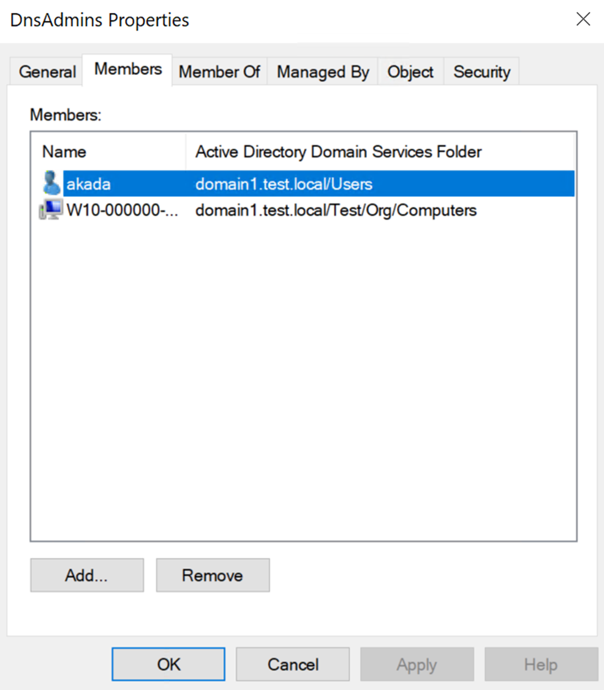

---
# Required metadata
# For more information, see https://review.learn.microsoft.com/en-us/help/platform/learn-editor-add-metadata?branch=main
# For valid values of ms.service, ms.prod, and ms.topic, see https://review.learn.microsoft.com/en-us/help/platform/metadata-taxonomies?branch=main

title: 'Security assessment: Unsafe permissions on the DnsAdmins group'
description: 'This recommendation lists any Group policy objects in your environment that contains password data. '
author:      LiorShapiraa # GitHub alias
ms.author: liorshapira
ms.service: microsoft-defender-for-identity
ms.topic: article
ms.date:     10/05/2024
---

# Security assessment: Unsafe permissions on the DnsAdmins group

This recommendation lists any member of the DNS Admins group that is not a privileged user. Privileged accounts are accounts that are being members of a privileged group such as Domain admins, Schema admins, Read only domain controllers and so on. 

### Why is it important to review the members of the DnsAdmins group? 

In AD, the DnsAdmins group is a privileged group that has administrative control over the DNS Server service within a domain. Members of this group have the ability to manage DNS servers, which includes tasks like configuring DNS zones, managing records, and modifying DNS settings.  
The DnsAdmins group can be delegated to non-AD administrators, like those managing networking functions such as DNS or DHCP, making these accounts attractive targets for compromise.

### How do I use this security assessment to improve my organizational security posture?

1. Review the list of exposed entities to identify non-privileged accounts with risky permissions.

1. Take appropriate action on those accounts by removing the accounts from the DnsAdmins group. If some accounts require these permissions, grant them only the specific access needed.  
  
For example:  

### Next steps

[Learn more about Microsoft Secure Score](/microsoft-365/security/defender/microsoft-secure-score)

