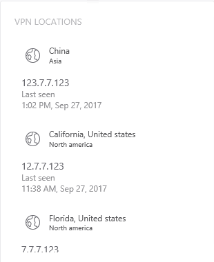

---
# required metadata

title: Install Azure Threat Protection - Step 7 | Microsoft Docs
description: In this step of installing ATP, you integrate your VPN.
keywords:
author: rkarlin
ms.author: rkarlin
manager: mbaldwin
ms.date: 1/21/2018
ms.topic: get-started-article
ms.prod:
ms.service: advanced-threat-analytics
ms.technology:
ms.assetid: e0aed853-ba52-46e1-9c55-b336271a68e7

# optional metadata

#ROBOTS:
#audience:
#ms.devlang:
ms.reviewer: bennyl
ms.suite: ems
#ms.tgt_pltfrm:
#ms.custom:

---

*Applies to: Azure Threat Protection *

# Install ATP - Step 7

>[!div class="step-by-step"]
[« Step 5](install-ata-step5.md)
[Step 8 »](install-ata-step7.md)

## Step 7. Integrate VPN

Microsoft Azure Threat Protection (ATP)  can collect accounting information from VPN solutions. When configured, the user's profile page includes information from the VPN connections, such as the IP addresses and locations where connections originated. This complements the investigation process by providing additional information on user activity. The call to resolve an external IP address to a location is anonymous. No personal identifier is sent in this call.

ATP integrates with your VPN solution by listening to RADIUS accounting events forwarded to the ATP Gateways. This mechanism is based on standard RADIUS Accounting ([RFC 2866](https://tools.ietf.org/html/rfc2866)), and the following VPN vendors are supported:

-	Microsoft
-	F5
-	Check Point
-	Cisco ASA

## Prerequisites

To enable VPN integration, make sure you set the following parameters:

-	Open port UDP 1813 on your ATP Gateways and ATP Lightweight Gateways.

-	Connect the ATP Center to the Internet so that it can query the location of incoming IP addresses.

The example below uses Microsoft Routing and Remote Access Server (RRAS) to describe the VPN configuration process.

If you’re using a third party VPN solution, consult their documentation for instructions on how to enable RADIUS Accounting.

## Configure RADIUS Accounting on the VPN system

Perform the following steps on your RRAS server.
 
1.	Open the Routing and Remote Access console.
2.	Right-click the server name and click **Properties**.
3.	In the **Security** tab, under **Accounting provider**, select **RADIUS Accounting** and click **Configure**.

    

4.	In the **Add RADIUS Server** window, type the **Server name** of the closest ATP Gateway or ATP Lightweight Gateway. Under **Port**, make sure the default of 1813 is configured. Click **Change** and type a new shared secret string of alphanumeric characters that you can remember. You need to fill it out later in your ATP Configuration. Check the **Send RADIUS Account On and Accounting Off messages** box and then click **OK** on all open dialog boxes.
 
     
     
### Configure VPN in ATP

ATP collects VPN data that helps profile the locations from which computers connect to the network and to be able to detect abnormal VPN connections.

To configure VPN data in ATP:

1.	In the ATP console, open the ATP Configuration page and go to **VPN**.
 
  

2.	Turn on **Radius Accounting**, and type the **Shared Secret** you configured previously on your RRAS VPN Server. Then click **Save**.
 

  

After this is enabled, all ATP Gateways and Lightweight Gateways listen on port 1813 for RADIUS accounting events. 

Your setup is complete, and you can now see VPN activity in the users' profile page:
 
   

After the ATP Gateway receives the VPN events and sends them to the ATP Center for processing, the ATP Center needs Internet connectivity for HTTPS port 443 to be able to resolve the external IP addresses in the VPN events to their geolocation.

>[!div class="step-by-step"]
[« Step 6](install-ata-step5.md)
[Step 8 »](install-ata-step7.md)

## Related Videos
- [ATP Deployment Overview](https://channel9.msdn.com/Shows/Microsoft-Security/Overview-of-ATP-Deployment-in-10-Minutes)
- [Choosing the right ATP Gateway type](https://channel9.msdn.com/Shows/Microsoft-Security/ATP-Deployment-Choose-the-Right-Gateway-Type)

## See Also
- [ATP POC deployment guide](http://aka.ms/atapoc)
- [ATP sizing tool](http://aka.ms/atasizingtool)
- [Check out the ATP forum!](https://social.technet.microsoft.com/Forums/security/home?forum=mata)
- [Configure event collection](configure-event-collection.md)
- [ATP prerequisites](ata-prerequisites.md)

