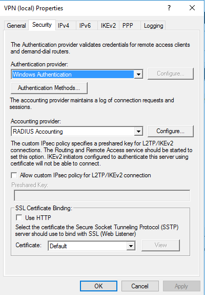
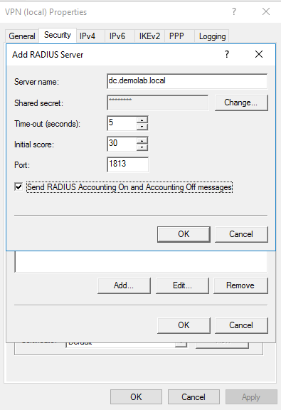

# Defender for Identity VPN integration in Microsoft 365 Defender

Microsoft Defender for Identity can integrate with your VPN solution by listening to RADIUS accounting events forwarded to Defender for Identity sensors, such as the IP addresses and locations where connections originated. VPN accounting data can help your investigations by providing more information about user activity, such as the locations from where computers are connecting to the network, and an extra detection for abnormal VPN connections.

Defender for Identity's VPN integration is based on standard RADIUS Accounting ([RFC 2866](https://tools.ietf.org/html/rfc2866)), and supports the following VPN vendors:

- Microsoft
- F5
- Check Point
- Cisco ASA

VPN integration is not supported in environments adhering to Federal Information Processing Standards (FIPS)

Defender for Identity's VPN integration supports both primary UPNs and alternate user principal names. Calls to resolve external IP addresses to a location are anonymous and no personal identifier is sent in the call.

## Prerequisites

Before you start, make sure that you have:

- [Microsoft Defender for Identity deployed](deploy-defender-identity.md)
- Access to the **Settings** area in Microsoft 365 Defender. For more information, see [Microsoft Defender for Identity role groups](role-groups.md).
- The ability to configure RADIUS on your VPN system. 

    This article provides an example of how to configure Microsoft Defender for Identity to collect accounting information from VPN solutions, using Microsoft Routing and Remote Access Server (RRAS). If you're using a third-party VPN solution, consult their documentation for instructions on how to enable RADIUS Accounting.

> [!NOTE]
> When you [configure the VPN integration](#configure-vpn-in-defender-for-identity), the Defender for Identity sensor enables a pre-provisioned Windows firewall policy called **Microsoft Defender for Identity Sensor**. This policy allows incoming RADIUS Accounting on port UDP 1813.
>

## Configure RADIUS accounting on your VPN system

This procedure describes how to configure RADIUS accounting on an RRAS server for integrating a VPN system with Defender for Identity. Your system's instructions may differ.

**On your RRAS server**:

1. Open the **Routing and Remote Access** console.
1. Right-click the server name and select **Properties**.
1. In the **Security** tab, under **Accounting provider**, select **RADIUS Accounting** > **Configure**. For example:

    

1. In the **Add RADIUS Server** dialog, enter the **Server name** of the closest Defender for Identity sensor with network connectivity. For high availability, you can add more Defender for Identity sensors as RADIUS Servers. 

1. Under **Port**, make sure the default value of `1813` is configured. 

1. Select **Change** and enter a new shared secret string of alphanumeric characters. Take note of the new shared secret string, as you'll need it later when configuring the VPN integration in Defender for Identity. 

1. Check the **Send RADIUS Account On and Accounting Off messages** box and select **OK** on all open dialog boxes. For example:

    

## Configure VPN in Defender for Identity

This procedure describes how to configure Defender for Identity's VPN integration in Microsoft 365 Defender.

1. Sign into [Microsoft 365 Defender](https://security.microsoft.com) and select **Settings** > **Identities** > **VPN**.

1. Select **Enable radius accounting** and enter the **Shared Secret** you'd previously configured on your RRAS VPN server. For example:

    

1. Select **Save** to continue.

After you've saved your selection, your Defender for Identity sensors start listening on port 1813 for RADIUS accounting events, and your VPN setup is complete.

When the Defender for Identity sensor receives VPN events and sends them to the Defender for Identity cloud service for processing, the entity profile indicates distinct VPN locations that were accessed, and profile activities indicate locations.

## Related content

For more information, see [Configure event collection](configure-event-collection.md).
