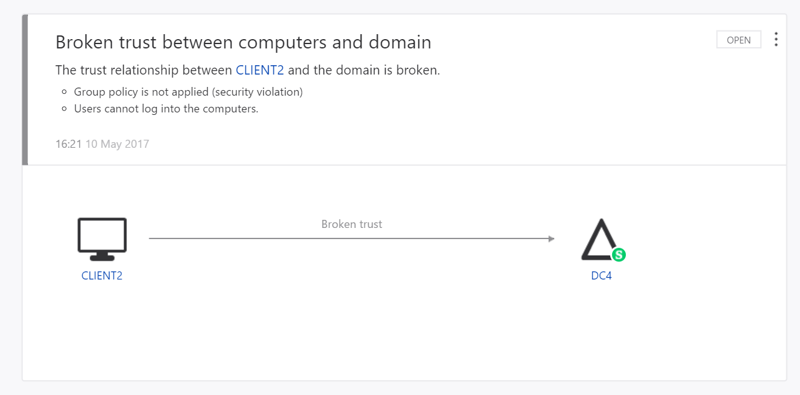

---
# required metadata

title: What is Microsoft Azure Threat Protection (ATP)? | Microsoft Docs
description: Explains what Microsoft Azure Threat Protection (ATP) is and what kinds of suspicious activities it can detect
keywords:
author: rkarlin
ms.author: rkarlin
manager: mbaldwin
ms.date: 11/7/2017
ms.topic: article
ms.prod:
ms.service: advanced-threat-analytics
ms.technology:
ms.assetid: 2d14d0e9-1b03-4bcc-ae97-8fd41526ffc5

# optional metadata

#ROBOTS:
#audience:
#ms.devlang:
ms.reviewer: bennyl
ms.suite: ems
#ms.tgt_pltfrm:
#ms.custom:

---

*Applies to: Azure Threat Protection*

# What is Azure Threat Protection?
Azure Threat Protection (ATP) is an on-premises platform that helps protect your enterprise from multiple types of advanced targeted cyber attacks and insider threats.

## How ATP works

ATP leverages a proprietary network parsing engine to capture and parse network traffic of multiple protocols (such as Kerberos, DNS, RPC, NTLM, and others) for authentication, authorization, and information gathering. This information is collected by ATP via either:

- 	Port mirroring from Domain Controllers and DNS servers to the ATP Standalone Sensor and/or
- 	Deploying an ATP Sensor (LGW) directly on Domain Controllers

ATP takes information from multiple data-sources, such as logs and events in your network, to learn the behavior of users and other entities in the organization and build a behavioral profile about them.
ATP can receive events and logs from:

- 	SIEM Integration
- 	Windows Event Forwarding (WEF)
-   Directly from the Windows Event Collector (for the Sensor)

For more information on ATP architecture, see [ATP Architecture](ata-architecture.md).

## What does ATP do?

ATP technology detects multiple suspicious activities, focusing on several phases of the cyber-attack kill chain including:

- 	Reconnaissance, during which attackers gather information on how the environment is built, what the different assets are, and which entities exist. They generally building their plan for the next phases of the attack.
- 	Lateral movement cycle, during which an attacker invests time and effort in spreading their attack surface inside your network.
- 	Domain dominance (persistence), during which an attacker captures the information allowing them to resume their campaign using various sets of entry points, credentials, and techniques. 

These phases of a cyber attack are similar and predictable, no matter what type of company is under attack or what type of information is being targeted.
ATP searches for three main types of attacks: Malicious attacks, abnormal behavior, and security issues and risks.

**Malicious attacks** are detected deterministically, by looking for the full list of known attack types including:

- 	Pass-the-Ticket (PtT)
- 	Pass-the-Hash (PtH)
- 	Overpass-the-Hash
- 	Forged PAC (MS14-068)
- 	Golden Ticket
- 	Malicious replications
- 	Reconnaissance
- 	Brute Force
- 	Remote execution

For a complete list of the detections and their descriptions, see [What Suspicious Activities Can ATP detect?](ata-threats.md). 

ATP detects these suspicious activities and surfaces the information in the ATP Console including a clear view of Who, What, When and How. As you can see, by monitoring this simple, user-friendly dashboard, you are alerted that ATP suspects that a Pass-the-Ticket attack was attempted on Client 1 and Client 2 computers in your network.

 

**Abnormal behavior** is detected by ATP using behavioral analytics and leveraging Machine Learning to uncover questionable activities and abnormal behavior in users and devices in your network, including:

- 	Anomalous logins
- 	Unknown threats
- 	Password sharing
- 	Lateral movement
-   Modification of sensitive groups

You can view suspicious activities of this type in the ATP Dashboard. In the following example, ATP alerts you when a user accesses four computers that are not ordinarily accessed by this user, which could be a cause for alarm.

  

ATP also detects **security issues and risks**, including:

- 	Broken trust
- 	Weak protocols
- 	Known protocol vulnerabilities

You can view suspicious activities of this type in the ATP Dashboard. In the following example, ATP is letting you know that there is a broken trust relationship between a computer in your network and the domain.

  

# What threats does ATP look for?

ATP provides detection for the following various phases of an advanced attack: reconnaissance, credential compromise, lateral movement, privilege escalation, domain dominance, and others. These detections are aimed at detecting advanced attacks and insider threats before they cause damage to your organization.
The detection of each phase results in several suspicious activities relevant for the phase in question, where each suspicious activity correlates to different flavors of possible attacks.
These phases in the kill-chain where ATP currently provides detections are highlighted in the following image:

For more information, see [Working with suspicious activities](working-with-suspicious-activities.md) and the [ATP suspicious activity guide](suspicious-activity-guide.md).

## Known issues

- If you update to ATP 1.7 and immediately to ATP 1.8, without first updating the ATP Standalone Sensors, you cannot migrate to ATP 1.8. It is necessary to first update all of the Standalone Sensors to version 1.7.1 or 1.7.2 before updating the Azure ATP cloud service to .

- If you select the option to perform a full migration, it may take a very long time, depending on the database size. When you are selecting your migration options, the estimated time is displayed - make note of this before you decide which option to select. 

## What's next?

-   For more information about how ATP fits into your network: [ATP architecture](ata-architecture.md)

-   To get started deploying ATP: [Install ATP](install-ata-step1.md)

## Related Videos
- [Joining the security community](https://channel9.msdn.com/Shows/Microsoft-Security/Join-the-Security-Community)
- [ATP Deployment Overview](https://channel9.msdn.com/Shows/Microsoft-Security/Overview-of-ATP-Deployment-in-10-Minutes)

## See Also
[ATP suspicious activity playbook](http://aka.ms/ataplaybook)
[Check out the ATP forum!](https://social.technet.microsoft.com/Forums/security/home?forum=mata)
