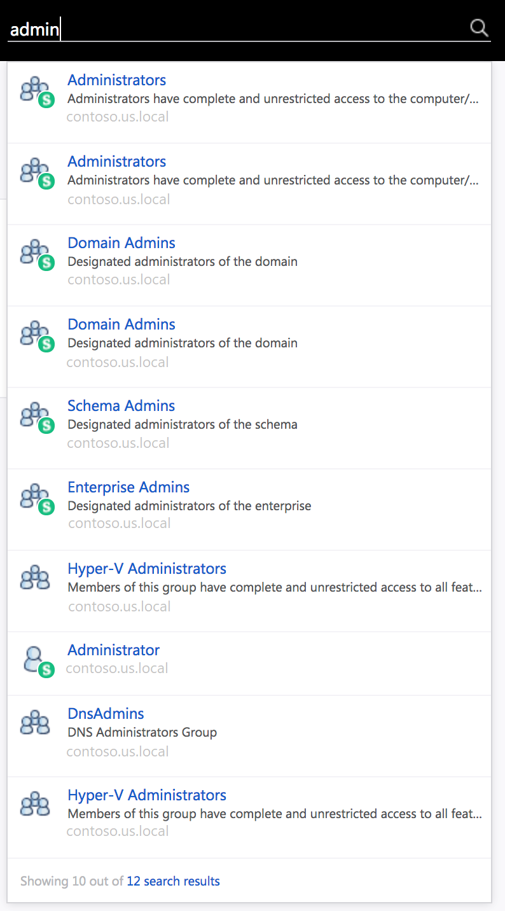
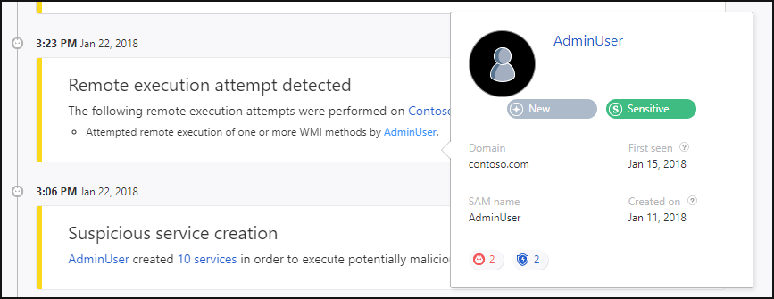

---
# required metadata

title: Understanding the Azure Advanced Threat Protection portal | Microsoft Docs
description: Describes how to log into the Azure ATP portal and the components of the portal
keywords:
author: mlottner
ms.author: mlottner
manager: rkarlin
ms.date: 11/05/2019
ms.topic: conceptual
ms.collection: M365-security-compliance
ms.service: azure-advanced-threat-protection
ms.assetid: 4ba46d60-3a74-480e-8f0f-9a082d62f343

# optional metadata

#ROBOTS:
#audience:
#ms.devlang:
ms.reviewer: itargoet
ms.suite: ems
#ms.tgt_pltfrm:
#ms.custom:

---
# Working with the Azure ATP portal

> [!NOTE]
> All Azure ATP features explained on this page are also accessible using the new [Cloud App Security portal](https://portal.cloudappsecurity.com).

Use the Azure ATP portal to monitor and respond to suspicious activity detected by ATP.

Typing the `?` key provides keyboard shortcuts for Azure ATP portal accessibility. 

The Azure ATP portal provides a quick view of all suspicious activities in chronological order. It enables you to drill into details of any activity and perform actions based on those activities. The Azure ATP portal also displays alerts and notifications to highlight problems seen by Azure ATP or new activities that are deemed suspicious.

This article describes how to work with the key elements of the Azure ATP portal.

## Enabling access to the Azure ATP portal
To successfully log in to the Azure ATP portal, you have to log in with a user assigned to an Azure Active Directory security group with access to the Azure ATP portal. 
For more information about role-based access control (RBAC) in Azure ATP, see [Working with Azure ATP role groups](atp-role-groups.md).

## Logging into the Azure ATP portal

1. You can enter the Azure ATP portal either by logging in to the portal [https://portal.atp.azure.com](https://portal.atp.azure.com) and selecting your instance, or browsing to the instance URL: [https://*instancename*.atp.azure.com](https://*instancename*.atp.azure.com).

2. Azure ATP supports single sign-on integrated with Windows authentication - if you've already logged on to your computer, Azure ATP uses that token to log you into the Azure ATP portal. You can also log in using a smartcard. Your permissions in Azure ATP correspond with your [administrator role](atp-role-groups.md).

   > [!NOTE]
   > Make sure to log on to the computer from which you want to access the Azure ATP portal using your Azure ATP admin username and password. Alternatively, run your browser as a different user or log out of Windows and log on with your Azure ATP admin user. Unlike the Azure ATP portal, the new [Cloud App Security portal](https://portal.cloudappsecurity.com) offers multi-user login and requires no additional license to use with Azure ATP.  

### Attack time line

The Attack time line is the default landing page you are taken to when you log in to the Azure ATP portal. By default, all open suspicious activities are shown on the attack time line. You can filter the attack time line to show All, Open, Dismissed or Suppressed suspicious activities. You can also see the severity assigned to each activity.

For more information, see [Working with security alerts](working-with-suspicious-activities.md).

### What's new

After a new version of Azure ATP is released, the **What's new** window appears in the top right to let you know what was added in the latest version. It also provides you with a link to the version download.

### Filtering panel

You can filter which suspicious activities are displayed in the attack time line or displayed in the entity profile suspicious activities tab based on Status and Severity.

### Search bar 

In the top menu, you can find a search bar. You can search for a specific user, computer, or groups in Azure ATP. To give it a try, just start typing. At the bottom of the search bar, the number of search results found is indicated. 

If you click the number, you can access the search results page in which you can filter results by entity type for further investigation.

### Health center

The Health center provides you with alerts when something isn't working properly in your Azure ATP instance.

Any time your system encounters a problem, such as a connectivity error or a disconnected Azure ATP standalone sensor, the Health Center icon lets you know by displaying a red dot. 

### Sensitive groups

For information on sensitive groups in Azure ATP, see [Working with sensitive groups](sensitive-accounts.md).

### Mini profile

If you hover your mouse over an entity, anywhere in the Azure ATP portal where there is a single entity presented, such as a user, or a computer, a mini profile automatically opens displaying the following information, if available and relevant:

- Name
- Title
- Department
- AD tags
- Email
- Office
- Phone number
- Domain
- SAM name
- Created on – When the entity was created in the Active Directory. If was created before Azure ATP started monitoring, it will not be displayed.
- First seen – The first time Azure ATP observed an activity from this entity.
- Last seen - The last time Azure ATP observed an activity from this entity.
- SA badge - Is displayed if there are suspicious activities associated with this entity.
- WD ATP badge- Will be displayed if there are suspicious activities in Windows Defender ATP associated with this entity.
- Lateral movement paths badge - Will be displayed if there have been lateral movement paths detected for this entity within the last two days.

## See Also

- [Creating Azure ATP instances](install-atp-step1.md)
- [Check out the Azure ATP forum!](https://aka.ms/azureatpcommunity)
